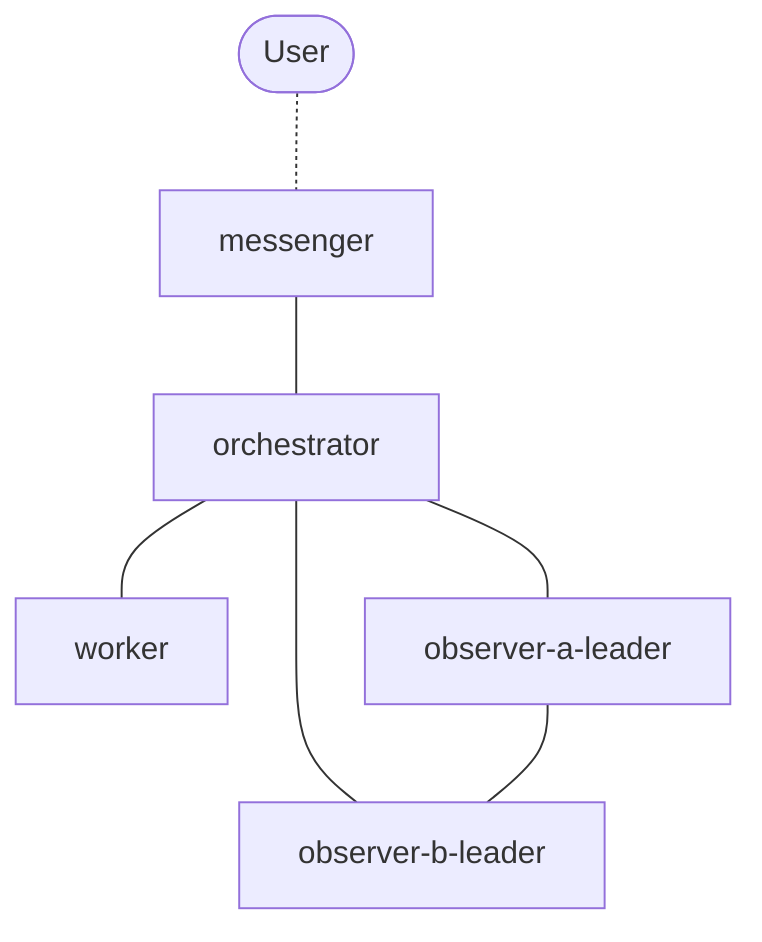

# tmux-a2a-postman

tmux agent-to-agent message delivery daemon.

## 1. Installation

```sh
go install github.com/i9wa4/tmux-a2a-postman@latest
```

### 1.1. Version Handling

This project uses git tags as the single source of truth for versions.

**Version format depends on build context:**

| Build Type     | Version Format   | Example     |
| -------------- | ---------------- | ----------- |
| GitHub release | Semantic version | v0.2.0      |
| Local clean    | Commit hash      | git-cb6db3c |
| Local dirty    | Generic dev      | dev         |

**Technical limitation:** Nix flakes don't expose git tag information to local builds.

- Running `nix build` locally will show commit hash, even if a tag exists
- To verify release versions: `nix build github:i9wa4/tmux-a2a-postman?ref=v0.2.0`

This is a constraint of Nix's architecture, not a design choice.

**Check your version:**

```sh
# From official release (shows semantic version)
tmux-a2a-postman --version
# Output: tmux-a2a-postman v0.2.0

# From local nix build (shows commit hash)
nix build
./result/bin/tmux-a2a-postman --version
# Output: tmux-a2a-postman git-abc1234
```

## 2. How it Works

tmux-a2a-postman automatically discovers and connects agents running in the same tmux session:

1. Detects panes with `A2A_NODE` environment variable set (e.g., `A2A_NODE=worker`)
2. Sends PING messages to discovered nodes to establish communication
3. Routes messages between nodes based on configured edges

**Current limitation**: Communication works within a single tmux session only. Cross-session messaging is planned for future releases.

**Note**: The TUI displays all tmux sessions (including those without A2A nodes) for monitoring purposes, even though message routing is limited to the active session.

## 3. Quick Start

Start the postman daemon:

```sh
# Interactive mode with TUI (default)
tmux-a2a-postman

# The TUI allows you to:
# - View all tmux sessions (including those without A2A nodes)
# - Toggle sessions enabled/disabled for automatic PING
# - Send PING to nodes (press 'p')
# - View message events in real-time
```

## 4. Session Management

Sessions can be toggled between enabled and disabled states in the TUI. This controls automatic PING behavior:

### 4.1. Session States

- **Enabled**: Session receives automatic PING when new nodes are detected
- **Disabled**: Session does NOT receive automatic PING (default for new sessions)

### 4.2. Automatic PING Paths

Automatic PING is sent to new nodes at three detection points:

1. **New node detection** (message delivery): When a node is discovered during message routing
2. **Periodic discovery scan**: When the daemon detects a new node during its scan interval
3. **Pane restart detection**: When a pane restart is detected for an existing node

All three paths respect the session enabled state. Disabled sessions will not receive automatic PING at any of these paths.

### 4.3. Manual PING

Manual PING (via 'p' key in TUI) always works regardless of session state. This allows you to manually initialize nodes in disabled sessions if needed.

## 5. Directory Structure (XDG Base Directory)

postman uses XDG Base Directory Specification:

- **Config**: `$XDG_CONFIG_HOME/tmux-a2a-postman/postman.toml` (default: `~/.config/tmux-a2a-postman/`)
- **State**: `$XDG_STATE_HOME/tmux-a2a-postman/` (default: `~/.local/state/tmux-a2a-postman/`)

### 5.1. Session Directory Structure

```text
$XDG_STATE_HOME/tmux-a2a-postman/
└── session-{contextId}/
    ├── inbox/{node}/   # Incoming messages per node
    ├── post/           # Outgoing messages
    ├── draft/          # Message drafts
    ├── read/           # Processed messages
    └── dead-letter/    # Undeliverable messages
```

## 6. Environment Variables

### 6.1. A2A_NODE

**Required** for agent nodes to be discovered by postman.

Set the node name for the current agent process. postman discovers nodes by scanning tmux panes for this environment variable.

**Examples**:

```sh
# Set node name for orchestrator
export A2A_NODE=orchestrator

# Set node name for worker
export A2A_NODE=worker
```

### 6.2. Other Variables

Additional environment variables (`POSTMAN_HOME`, `A2A_CONTEXT_ID`, etc.) are available for advanced configuration. See `internal/config/postman.default.toml` for details.

## 7. Configuration

postman reads configuration from `$XDG_CONFIG_HOME/tmux-a2a-postman/postman.toml` (or use `--config` flag).

Configuration files define:

- **Routing rules** (edges): Which nodes can communicate with each other
- **Node templates**: Instructions shown to each node when they join
- **Message templates**: Format for notifications and drafts

### 7.1. Flexible Routing with Edges

Edges define bidirectional communication paths between nodes. You can build any topology by combining edge definitions.

**Example topology**:



Each edge creates bidirectional routes. For example, `"A -- B"` allows both A→B and B→A communication.

Nodes can only communicate when an edge exists between them. If only "messenger -- orchestrator" is defined, `worker` cannot send messages directly to `messenger`.

### 7.2. Complete Configuration Example

File: `$XDG_CONFIG_HOME/tmux-a2a-postman/postman.toml`

```toml
[postman]
# Routing edges (bidirectional)
edges = [
  "messenger -- orchestrator",
  "orchestrator -- worker",
  "orchestrator -- observer-a-leader",
  "orchestrator -- observer-b-leader",
  "observer-a-leader -- observer-b-leader",
]

# Reply command template (expanded with {context_id})
reply_command = "tmux-a2a-postman create-draft --context-id {context_id} --to <recipient>"

# Notification template (shown when messages arrive)
notification_template = """
Message from {from_node}

File: {filename}
Inbox: {session_dir}/inbox/{node}/

Reply:
1. {reply_command}
2. Edit content
3. mv from draft/ to post/
"""

# Node configurations
[orchestrator]
role = "coordination, delegation"
template = """
# ORCHESTRATOR (READONLY)

- Delegate tasks to workers
- Never edit files directly
"""

[worker]
role = "implementation"
template = """
# WORKER (WRITABLE)

- Execute assigned tasks
- Report issues to orchestrator
"""
```

**Key features**:

- **`{reply_command}`**: Automatically expands to include the current context ID, so recipients know exactly how to reply
- **Template variables**: `{from_node}`, `{filename}`, `{session_dir}`, `{node}`, and `{reply_command}` are automatically filled when messages arrive
  - `{session_dir}/inbox/{node}/`: Incoming messages directory
  - `{session_dir}/read/`: Processed messages directory
  - `{session_dir}/draft/`: Message drafts directory
  - `{session_dir}/post/`: Outgoing messages directory
- **Configuration files**: Supports both single file (`postman.toml`) and split files (`postman.toml` + `nodes/*.toml`)

### 7.3. Routing Management

**NOTE:** Editing edges via TUI will remove comments from postman.toml.
Manual editing is recommended for preserving comments.

## 8. Usage

```sh
# Start daemon
tmux-a2a-postman start --context-id <session-id> [--config path/to/config.toml]

# Create draft message
tmux-a2a-postman create-draft --to <recipient> --context-id <session-id> --from <sender>

# Show version
tmux-a2a-postman version
```

### 8.1. Session Status at a Glance

Show all tmux sessions' pane status in a single line:

```sh
tmux-a2a-postman get-session-status-oneline
```

**Requirements:**
- Daemon must be running (uses daemon's idle tracking state)
- Pane capture must be enabled in config (default: enabled)

**Output format:** `[SessionName:window_panes:window_panes:...]`

Example:
```
[session-20260215-140445-17d0:🟢🟢🟢🔴:🟢🔴] [my-session:🔴🔴🔴🔴:🔴🔴]
```

**Status indicators:**
- 🟢 = Active pane (2+ content changes within 120-second window)
- 🔴 = Inactive pane (no recent content changes)
- Sessions ordered by name
- Windows separated by `:` within each session

**Note:** Uses time-based activity detection from `internal/idle/idle.go` rather than keyboard focus. A pane is considered active when its content has changed at least twice within a 120-second window, indicating real activity rather than just cursor focus.
