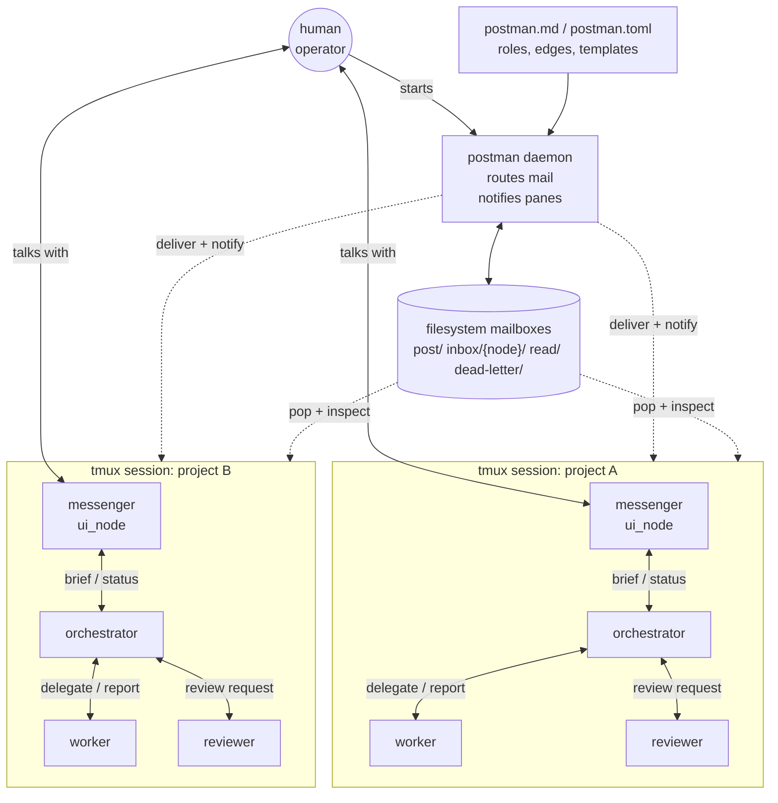
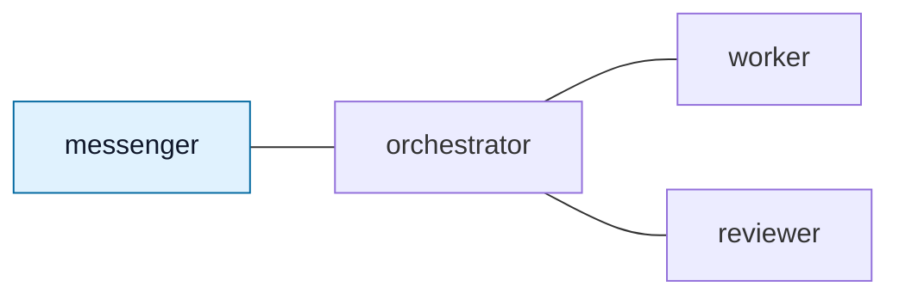
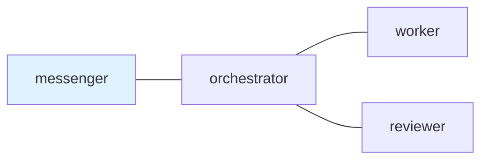

# tmux-a2a-postman

[](https://deepwiki.com/i9wa4/tmux-a2a-postman)

`tmux-a2a-postman` turns tmux panes into a coordinated agent team.

Reliable handoffs for AI coding agents, configured in Markdown.

Define roles and handoff edges in `postman.md`; the daemon routes local mail
between matching tmux pane titles and keeps inbox/read state visible with CLI
commands.

Any AI coding agent that can run commands in a tmux pane can participate;
postman keeps handoffs local with filesystem-backed inboxes.

## Concept


```mermaid
graph TD
    operator((human\noperator))
    config["postman.md / postman.toml\nroles, edges, templates"]
    daemon["postman daemon\nroutes mail\nnotifies panes"]
    mailbox[("filesystem mailboxes\npost/ inbox/{node}/ read/ dead-letter/")]

    subgraph project_a["tmux session: project A"]
        a_messenger["messenger\nui_node"]
        a_orchestrator["orchestrator"]
        a_worker["worker"]
        a_reviewer["reviewer"]

        a_messenger <--> |brief / status| a_orchestrator
        a_orchestrator <--> |delegate / report| a_worker
        a_orchestrator <--> |review request| a_reviewer
    end

    subgraph project_b["tmux session: project B"]
        b_messenger["messenger\nui_node"]
        b_orchestrator["orchestrator"]
        b_worker["worker"]
        b_reviewer["reviewer"]

        b_messenger <--> |brief / status| b_orchestrator
        b_orchestrator <--> |delegate / report| b_worker
        b_orchestrator <--> |review request| b_reviewer
    end

    operator --> |starts| daemon
    operator <--> |talks with| a_messenger
    operator <--> |talks with| b_messenger
    config --> daemon
    daemon <--> mailbox
    daemon -.->|deliver + notify| project_a
    daemon -.->|deliver + notify| project_b
    mailbox -.->|pop + inspect| project_a
    mailbox -.->|pop + inspect| project_b
```

`postman.md` names the agent roles and the allowed conversation edges. The
daemon discovers tmux panes by title, routes messages through local files, and
keeps an archive that agents can inspect later.

Each tmux session is a separate project workspace. `ui_node` marks the role
the human talks to first, while the daemon keeps routing, delivery, and
archived mail outside the agent panes.

## Why Use It

- Shape agent work in Markdown: `postman.md` is a soft harness for roles,
  conversation edges, local instructions, escalation rules, and checklists.
- Keep the hard dependency small: if an AI coding agent can run in a tmux pane
  and execute commands, it can participate in principle.
- Trust explicit local state: the daemon tracks delivery, unread/read archives,
  dead letters, and reply-required slots through files and status commands
  instead of a hidden workflow engine.
- Avoid missed handoffs: pending replies, status views, and archived Markdown
  messages help operators and agents catch unresolved tasks before they drift.

## Install

Prerequisites:

- macOS or Linux
- tmux 3.0 or newer

Install with Go:

```sh
go install github.com/i9wa4/tmux-a2a-postman@latest
```

Or run with Nix:

```sh
nix run github:i9wa4/tmux-a2a-postman
```

## Quick Start

After installing the binary, optionally install the packaged agent skills so
assistants can discover postman commands while working:

For Codex CLI:

```sh
gh skill install i9wa4/tmux-a2a-postman postman-send-message \
  --agent codex --scope user
gh skill install i9wa4/tmux-a2a-postman postman-session-operator \
  --agent codex --scope user
gh skill install i9wa4/tmux-a2a-postman postman-config-auditor \
  --agent codex --scope user
```

For Claude Code:

```sh
gh skill install i9wa4/tmux-a2a-postman postman-send-message \
  --agent claude-code --scope user
gh skill install i9wa4/tmux-a2a-postman postman-session-operator \
  --agent claude-code --scope user
gh skill install i9wa4/tmux-a2a-postman postman-config-auditor \
  --agent claude-code --scope user
```

The daemon works without these skills; they only help assistants send first
messages, inspect live session state, and audit config.

Create tmux panes for a small conversation topology:


```mermaid
graph LR
    messenger --- orchestrator
    orchestrator --- worker
    orchestrator --- reviewer
    class messenger ui_node
    classDef ui_node fill:#e0f2fe,stroke:#0369a1,color:#0f172a
```

For repeatable agent teams, use
[yuki-yano/vde-layout](https://github.com/yuki-yano/vde-layout) presets to
recreate the tmux pane and window layout after starting tmux. Keep vde-layout
YAML responsible for panes and commands; keep `postman.md` responsible for
role names, conversation edges, and local instructions. vde-layout is setup
tooling; tmux remains the hard runtime dependency.

Use this as a complete, copyable `postman.md`. The optional skill catalog YAML
stays in the same frontmatter header; leave paths commented until the matching
skill tree exists. Postman treats `~/.codex/skills` and `~/.claude/skills` as
explicit skill trees; it does not select catalogs by runtime. Omit `inject` for
a normal role-context catalog. Use a YAML list to reuse one path for both
daemon PING catalog targets. Markdown under
`common_template` and node sections is free-form role guidance, so short
sections can cover identity, boundaries, local conventions, escalation rules,
or checklists. Only the backtick-wrapped H2 section names and Mermaid edges are
structural; `### role` sets the short role summary, and other H3 headings are
ordinary Markdown:

````markdown
---
# Optional: after installing packaged skills, uncomment only paths that exist.
# For PING catalogs, use explicit user-level skill tree paths; postman does not
# select skill catalogs by runtime. `inject` may be a scalar or YAML list.
# skill_path:
#   - path: ~/.codex/skills
#     inject:
#       - ping
#       - compaction_ping
#     skills:
#       - postman-send-message
#       - postman-session-operator
#       - postman-config-auditor
#   - path: ~/.claude/skills
#     inject:
#       - ping
#       - compaction_ping
#     skills:
#       - postman-send-message
#       - postman-session-operator
#       - postman-config-auditor
---

## `edges`


```mermaid
graph LR
    messenger --- orchestrator
    orchestrator --- worker
    orchestrator --- reviewer
    class messenger ui_node
    classDef ui_node fill:#e0f2fe
```

## `common_template`

You are one role in this local tmux-a2a-postman session.

- Read inbox mail with `tmux-a2a-postman pop`.
- Send role-to-role mail with `tmux-a2a-postman send-heredoc --to <node>`.
- Use `DONE` only when assigned work is complete. Use `BLOCKED` when it is not.

## `messenger`

### `role`

Human-facing intake and status relay.

### Intake

Receive the human request, send implementation work to `orchestrator`, and
relay final DONE or BLOCKED status back to the human. Do not implement code
locally.

## `orchestrator`

### `role`

Task coordinator for this session.

### Responsibilities

Break work into clear requests, delegate implementation to `worker`, request
review from `reviewer` when useful, and report final DONE or BLOCKED status to
`messenger`.

## `worker`

### `role`

Primary implementation role.

### Reply Contract

Execute tasks from `orchestrator`. Report DONE with evidence, or BLOCKED with
the missing requirement or external blocker.

### Boundaries

Keep edits scoped to the request. Report BLOCKED before changing unrelated
files or expanding scope.

## `reviewer`

### `role`

Implementation reviewer.

### Quality Bar

Review work requested by `orchestrator`. Report APPROVED when the change is
ready, or BLOCKED with concrete findings.
````

Save the file at `$XDG_CONFIG_HOME/tmux-a2a-postman/postman.md`, or the
`~/.config/tmux-a2a-postman/postman.md` fallback.

Start the daemon after writing `postman.md`:

```sh
tmux-a2a-postman start
```

After changing `postman.md`, `postman.toml`, or `nodes/*` later, restart the
daemon so topology, role templates, daemon defaults, and skill catalogs are
reloaded:

```sh
tmux-a2a-postman stop
tmux-a2a-postman start
```

Send a message from an agent pane whose title matches a configured role:

```sh
tmux-a2a-postman send-heredoc --to worker <<'POSTMAN_BODY'
Implement the requested change and report DONE or BLOCKED.
POSTMAN_BODY
```

Read the next inbox message:

```sh
tmux-a2a-postman pop
```

Recipients usually run `pop` after a pane notification or message footer says
mail is waiting. After every successful `pop` with `status=message`, read the
complete archived Markdown body before any handling, routing, reply, status
decision, or no-action or no-op decision. `messageType: ping`,
`replyPolicy: none`, and other metadata do not allow skipping the body.
Truncated output from bounded stdout does not count as a complete read. To
inspect archived mail later, use `inspect-message --id <message_id>`.

Inspect live session state:

```sh
tmux-a2a-postman get-status
tmux-a2a-postman get-status-oneline
```

Use explicit subcommands. Running `tmux-a2a-postman` without a subcommand only
prints usage.

## Messaging Rules

Use `send-heredoc` with a quoted delimiter for agent-safe messages. The quotes
keep shell-sensitive text literal, including backticks, variables, quotes, code
fences, and multiline commands.

Use `--reply-required` only when the recipient must answer:

```sh
tmux-a2a-postman send-heredoc --to reviewer --reply-required <<'POSTMAN_BODY'
Review the implementation and reply with DONE or BLOCKED.
POSTMAN_BODY
```

Reply-required messages carry an `input_request_id`. Exact replies should fill
that request:

```sh
tmux-a2a-postman send-heredoc \
  --to orchestrator \
  --reply-to <message-id> \
  --fills-input-request-id <input-request-id> <<'POSTMAN_BODY'
DONE: Requirements satisfied.
Task artifact: <artifact-reference>
Original checklist: PASS
Evidence: <commands or links>
Remaining blockers: none
POSTMAN_BODY
```

Filling an input request closes transport, not task acceptance. For required
work, send `DONE` only after checking the original requirements against
evidence. Receivers verify the checklist status, durable references, evidence,
and blockers before relaying, approving, or closing work.

`DONE`, `ACK`, `PING`, and `HEARTBEAT_OK` are terminal no-reply messages.

## Configuration

Most users only maintain `postman.md` under the global config directory:

- `$XDG_CONFIG_HOME/tmux-a2a-postman/`
- `~/.config/tmux-a2a-postman/` fallback when `XDG_CONFIG_HOME` is unset

`postman.toml` is optional. Embedded defaults are enough for the daemon to run;
add TOML only when you need to change daemon-level defaults.

The daemon reads global configuration once at startup. Restart it after editing
`postman.md`, `postman.toml`, or `nodes/*`; runtime watchers continue to handle
mail delivery, read/archive moves, and daemon submit queues.

In `postman.md`, keep conversation edges in the Mermaid `edges` graph, durable
role guidance under role headings, and optional `skill_path` catalogs in the
frontmatter. Every node named in the graph is materialized automatically; mark
the human-facing role with the Mermaid `ui_node` class.

Detailed configuration references:

- [postman.md syntax](skills/postman-config-auditor/references/postman-md.md)
- [configuration defaults and merge policy](docs/design/config-ssot.md)
- [PING event timing](docs/ping-events.md)
- [daemon session ownership](docs/design/daemon-session-model.md)

Command help lives in the binary: `tmux-a2a-postman help`,
`tmux-a2a-postman help commands`, and `tmux-a2a-postman help config`. Claude
Code and Codex CLI have different runtime surfaces outside postman; see
[docs/agent-runtime-feature-differences.md](docs/agent-runtime-feature-differences.md).
