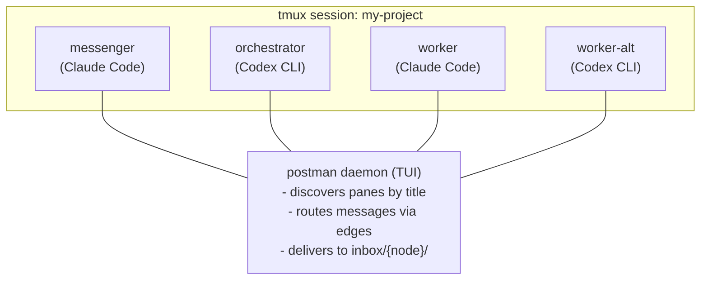
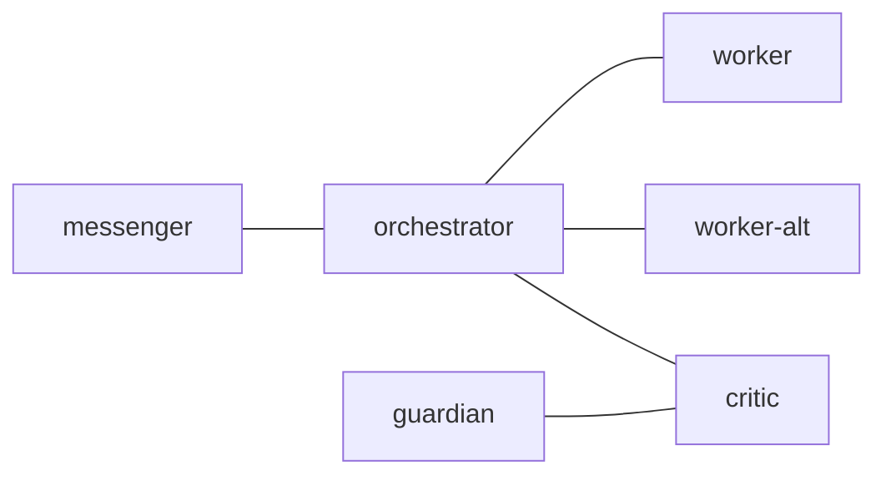

# tmux-a2a-postman

tmux agent-to-agent message delivery daemon.

## 1. Prerequisites

- tmux >= 3.0

## 2. Installation

```sh
go install github.com/i9wa4/tmux-a2a-postman@latest
```

Or with Nix:

```sh
nix run github:i9wa4/tmux-a2a-postman
```

## 3. Concept

tmux-a2a-postman is a **daemon** that discovers AI agents running in tmux
panes and routes messages between them via filesystem-based inboxes.


```mermaid
graph TD
    subgraph "tmux session: my-project"
        messenger["messenger\n(Claude Code)"]
        orchestrator["orchestrator\n(Codex CLI)"]
        worker["worker\n(Claude Code)"]
        worker-alt["worker-alt\n(Codex CLI)"]
    end
    daemon["postman daemon (TUI)\n- discovers panes by title\n- routes messages via edges\n- delivers to inbox/{node}/"]
    messenger --- daemon
    orchestrator --- daemon
    worker --- daemon
    worker-alt --- daemon
```

### 3.1. Message Flow

Example: orchestrator delegates a task to worker.

1. orchestrator sends:
   `tmux-a2a-postman send --to worker --body "implement X"`
2. Daemon routes the message (edge rules enforced)
3. worker is notified in their pane
4. worker reads: `tmux-a2a-postman pop`
5. worker replies:
   `tmux-a2a-postman send --to orchestrator --body "DONE: ..."`

### 3.2. ui_node

Set `ui_node` to designate a node as the human-facing interface.
The daemon sends alerts (inbox stagnation, node inactivity, etc.)
to this node automatically.

```toml
[postman]
ui_node = "messenger"
```

### 3.3. Node Discovery

Agents are discovered by their **tmux pane title**. Set titles to match node
names defined in the configuration:

```sh
tmux select-pane -T orchestrator
tmux select-pane -T worker
```

## 4. Configuration

Configuration uses two file formats: TOML for structural settings and Markdown
for templates. Both live in `$XDG_CONFIG_HOME/tmux-a2a-postman/`.

### 4.1. Edges and Node Topology

Define which nodes can communicate using edges:


```mermaid
graph LR
    messenger --- orchestrator
    orchestrator --- worker
    orchestrator --- worker-alt
    orchestrator --- critic
    guardian --- critic
```

In `postman.md`:

````markdown
## `edges`


```mermaid
graph LR
    messenger --- orchestrator
    orchestrator --- worker
    orchestrator --- worker-alt
    orchestrator --- critic
    guardian --- critic
```
````

Or in `postman.toml`:

```toml
[postman]
edges = [
  "messenger -- orchestrator",
  "orchestrator -- worker",
  "orchestrator -- worker-alt",
  "orchestrator -- critic",
  "guardian -- critic",
]
```

Messages sent to nodes without a valid edge are moved to `dead-letter/`.

### 4.2. Node Role Templates

Define each node's role and template in `postman.md`:

````markdown
## `worker`

### `role`

Primary task executor.

### Workflow

Execute tasks from orchestrator. Report DONE or BLOCKED.
````

Or as separate files in `nodes/worker.md`.

### 4.3. File Layout

```text
$XDG_CONFIG_HOME/tmux-a2a-postman/
  postman.toml          # structural config (timing, thresholds)
  postman.md            # templates, edges (Mermaid), node definitions
  nodes/
    worker.md           # per-node template (optional, overrides postman.md)
    orchestrator.md
```

### 4.4. Project-Local Override

Place config files in `.tmux-a2a-postman/` inside your project directory
to override XDG config:

```text
your-project/
  .tmux-a2a-postman/
    postman.toml        # structural overrides
    postman.md          # template overrides
    nodes/
      worker.md
```

**Nix/home-manager users:** if your XDG config is read-only Nix store
symlinks, use project-local overrides.

### 4.5. Unified state + notification model

get-health, get-health-oneline, and the default TUI are three views over the
same canonical contract. The per-node visible states are `ready`,
`pending`, `user_input`, `composing`, `spinning`, and `stalled`. Session-level
`unavailable` is a fallback that means the current daemon is not authoritative
for canonical health; it is not a per-node state.

Public knobs for this model live in `postman.toml`:

- `ui_node`
- `reminder_interval_messages`
- `inbox_unread_threshold`
- `[node].idle_timeout_seconds`
- `[node].dropped_ball_timeout_seconds`
- `node_spinning_seconds`
- `[heartbeat].enabled`

Advanced dampening and rendering-shaping fields remain documented in
`docs/design/notification.md` and `docs/guides/alert-config.md`.

### 4.6. Priority Order (highest to lowest)

1. Project-local `postman.md`
2. Project-local `nodes/*.md`
3. Project-local `nodes/*.toml`
4. Project-local `postman.toml`
5. XDG `postman.md`
6. XDG `nodes/*.md`
7. XDG `nodes/*.toml`
8. XDG `postman.toml`
9. Embedded defaults (`internal/config/postman.default.toml`)

All default values are defined in `postman.default.toml` (SSOT).

## 5. Running the Daemon

```sh
# Start daemon (interactive single-column TUI)
tmux-a2a-postman start

# Headless mode (no TUI surface; for CI or automated environments)
tmux-a2a-postman start --no-tui

# Stop daemon
tmux-a2a-postman stop
```

The default operator loop is `send`, `pop`, `bind`, `get-health`, and
`get-health-oneline`. Lifecycle and recovery commands such as `start`, `stop`,
and `get-context-id` remain available, but they are no longer the main
beginner/operator surface.

## 6. Directory Structure

Base directory resolution, in priority order

1. `$POSTMAN_HOME`
2. `base_dir` in config
3. `$XDG_STATE_HOME/tmux-a2a-postman`

Falls back to `~/.local/state/tmux-a2a-postman` when `XDG_STATE_HOME` is unset

```text
{baseDir}/
  {contextId}/
    {sessionName}/
      draft/            # internal: draft staging area (use send instead)
      post/             # internal: outbox queue managed by postman daemon
      inbox/{node}/     # daemon delivers messages here
      read/             # agent moves messages here after reading
      dead-letter/      # unroutable messages land here
      waiting/          # per-node waiting state files
```

## 7. Deployment Model

The default operator model is one daemon per observed tmux session. Start the
daemon for the session you are operating and treat that daemon as the canonical
health and alert authority for the session.

Only one live daemon may own a given tmux session at a time. Running additional
daemons elsewhere is an advanced/internal topology detail, not part of the
normal operator workflow or the reduced beginner surface.

See `docs/design/daemon-session-model.md` for the full daemon/session model.

## 8. CLI Reference

See [docs/COMMANDS.md](docs/COMMANDS.md) for the full command reference,
including flag tables, `--json` output shapes, and `--params` usage.

Default operator surface:

```text
tmux-a2a-postman send --to worker --body "hello"
tmux-a2a-postman pop
tmux-a2a-postman bind <subcommand> ...
tmux-a2a-postman get-health
tmux-a2a-postman get-health-oneline --json
```

Lifecycle and recovery:

```text
tmux-a2a-postman start
tmux-a2a-postman stop
tmux-a2a-postman get-context-id
tmux-a2a-postman help [TOPIC]       # built-in help (topics: messaging, directories, config, commands)
tmux-a2a-postman schema [COMMAND]   # JSON Schema for the public config surface or a command's --params scope
```

Migration from older names:

| Older name                      | Current path              | Note |
| ------------------------------- | ------------------------- | ---- |
| `send-message`                  | `send`                    | Use `send` in the default operator loop |
| `get-session-health`            | `get-health`              | `get-health` is the canonical JSON payload |
| `get-session-status-oneline`    | `get-health-oneline`      | `get-health-oneline` is the compact all-session formatter over canonical health |

## 9. Skills

The `skills/` directory contains reusable agent skill files for AI coding
assistants (Claude Code, Codex CLI, etc.). Each skill lives at
`skills/{skill-name}/SKILL.md`.

- send: Sends messages to another node using tmux-a2a-postman send.
- a2a-role-auditor: Audits node role templates to diagnose and fix
  node-to-node interaction breakdowns.
