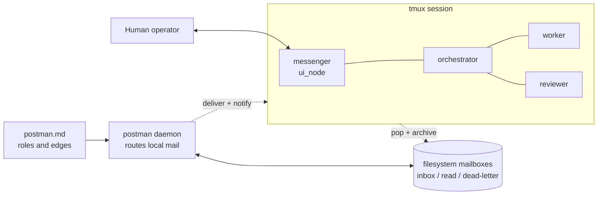
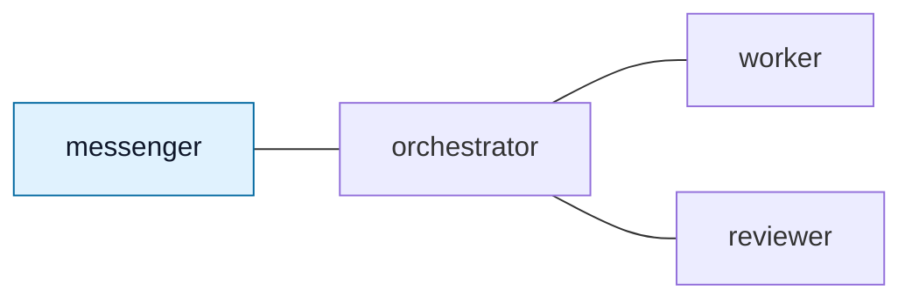
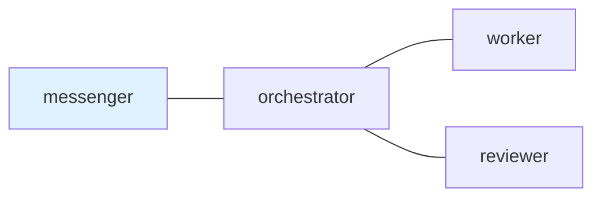

# tmux-a2a-postman

[](https://deepwiki.com/i9wa4/tmux-a2a-postman)

`tmux-a2a-postman` is a local message delivery daemon for AI coding agents
running in tmux panes.

Any AI coding agent can occupy a configured role. The postman daemon keeps the
handoff surface local, durable, and visible to the human operator.

It treats tmux pane titles as role names, routes messages according to your
`postman.md` topology, and stores mail in filesystem-backed inboxes. Agents
send messages with `send-heredoc`, read them with `pop`, and inspect shared
state with `get-status` or `get-status-oneline`.

## Concept


```mermaid
flowchart LR
    human["Human operator"]
    config["postman.md\nroles and edges"]
    daemon["postman daemon\nroutes local mail"]
    mailbox[("filesystem mailboxes\ninbox / read / dead-letter")]

    subgraph tmux["tmux session"]
        messenger["messenger\nui_node"]
        orchestrator["orchestrator"]
        worker["worker"]
        reviewer["reviewer"]
    end

    human <--> messenger
    config --> daemon
    daemon <--> mailbox
    messenger --- orchestrator
    orchestrator --- worker
    orchestrator --- reviewer
    daemon -.->|deliver + notify| tmux
    tmux -.->|pop + archive| mailbox
```

`postman.md` names the agent roles and the allowed conversation edges. The
daemon discovers tmux panes by title, routes messages through local files, and
keeps an archive that agents can inspect later.

## Why It Is Predictable

- Local-first: normal operation uses tmux panes and filesystem mailboxes, not a
  hosted service or remote broker.
- Simple routing: `postman.md` edges decide who can talk. The daemon delivers
  messages; it is not a hidden workflow engine.
- Inspectable traces: mail is stored as Markdown and moves through `post/`,
  `inbox/`, `read/`, and `dead-letter/`; use `inspect-message`,
  `inspect-input`, and `get-status` to see what happened.
- Explicit automation: reply-required work, status checks, dead-letter
  handling, stop/start, and skills are visible operator surfaces. Reminders or
  escalation rules should be designed explicitly, not assumed.
- Reproducible checks: CI runs `nix flake check`, `nix build`, skill
  validation, and vulnerability scanning. Local changes can run the same Nix
  checks plus targeted Go tests.

## Install

Prerequisites:

- macOS or Linux
- tmux 3.0 or newer

Install with Go:

```sh
go install github.com/i9wa4/tmux-a2a-postman@latest
```

Or run with Nix:

```sh
nix run github:i9wa4/tmux-a2a-postman
```

## Quick Start

Start with a small conversation topology:


```mermaid
graph LR
    messenger --- orchestrator
    orchestrator --- worker
    orchestrator --- reviewer
    class messenger ui_node
    classDef ui_node fill:#e0f2fe,stroke:#0369a1,color:#0f172a
```

Write those edges in `postman.md`:

````markdown
## `edges`


```mermaid
graph LR
    messenger --- orchestrator
    orchestrator --- worker
    orchestrator --- reviewer
    class messenger ui_node
    classDef ui_node fill:#e0f2fe
```
````

Add only the role guidance agents need to act on messages:

````markdown
## `worker`

### `role`

Primary task executor.

### Workflow

Execute tasks from orchestrator. Report DONE or BLOCKED.
````

Start the daemon after writing `postman.md`:

```sh
tmux-a2a-postman start
```

After changing `postman.md` later, restart the daemon so topology, role
templates, and skill catalogs are reloaded:

```sh
tmux-a2a-postman stop
tmux-a2a-postman start
```

Send a message from an agent pane whose title matches a configured role:

```sh
tmux-a2a-postman send-heredoc --to worker <<'POSTMAN_BODY'
Implement the requested change and report DONE or BLOCKED.
POSTMAN_BODY
```

Read the next inbox message:

```sh
tmux-a2a-postman pop
```

Recipients usually run `pop` after a pane notification or message footer says
mail is waiting. To inspect archived mail later, use
`inspect-message --id <message_id>`.

Inspect live session state:

```sh
tmux-a2a-postman get-status
tmux-a2a-postman get-status-oneline
```

Use explicit subcommands. Running `tmux-a2a-postman` without a subcommand only
prints usage.

## Messaging Rules

Use `send-heredoc` with a quoted delimiter for agent-safe messages. The quotes
keep shell-sensitive text literal, including backticks, variables, quotes, code
fences, and multiline commands.

Use `--reply-required` only when the recipient must answer:

```sh
tmux-a2a-postman send-heredoc --to reviewer --reply-required <<'POSTMAN_BODY'
Review the implementation and reply with DONE or BLOCKED.
POSTMAN_BODY
```

Reply-required messages carry an `input_request_id`. Exact replies should fill
that request:

```sh
tmux-a2a-postman send-heredoc \
  --to orchestrator \
  --reply-to <message-id> \
  --fills-input-request-id <input-request-id> <<'POSTMAN_BODY'
DONE: Requirements satisfied.
Task artifact: <artifact-reference>
Original checklist: PASS
Evidence: <commands or links>
Remaining blockers: none
POSTMAN_BODY
```

Filling an input request closes transport, not task acceptance. For required
work, send `DONE` only after checking the original requirements against
evidence. Receivers verify the checklist status, durable references, evidence,
and blockers before relaying, approving, or closing work.

`DONE`, `ACK`, `PING`, and `HEARTBEAT_OK` are terminal no-reply messages.

## Configuration

`postman.toml` is optional. Embedded defaults from
`internal/config/postman.default.toml` are enough for the daemon to run.

Place config files in either location:

- `$XDG_CONFIG_HOME/tmux-a2a-postman/`
- project-local `.tmux-a2a-postman/`

`postman.md` is the file humans maintain as panes, roles, and operating rules
change. It defines three things:

- conversation edges in the Mermaid `edges` graph
- role instructions under role headings, such as the `worker` example above
- optional `skill_path` catalogs for assistant-specific skills

Every node named in the Mermaid graph is materialized automatically. Write
`a --- b` when two roles can exchange mail, and mark the human-facing role with
the Mermaid `ui_node` class so startup PINGs route to the operator's entry
point.

Grow role sections by adding concise recipient instructions under the role
heading, using short sections such as `role`, `Workflow`, and
`Operating rules`.
Keep task-specific direction in messages; keep durable routing, role, and
coordination rules in `postman.md`.

Optional `skill_path` frontmatter injects compact skill catalogs into role
context:

```markdown
---
skill_path:
  - path: skills
    skills:
      - github
      - markdown
  - path: ~/.claude/skills
    inject: ping
    runtime: claude
  - path: ~/.codex/skills
    inject: ping
    runtime: codex
---
```

Detailed configuration references:

- [postman.md syntax](skills/postman-config-auditor/references/postman-md.md)
- [configuration defaults and merge policy](docs/design/config-ssot.md)
- [daemon session ownership](docs/design/daemon-session-model.md)

## Agent Skills

The binary works without bundled skills. The optional skills help AI assistants
discover commands, operate live message state, and audit configuration:

- `postman-send-message`
- `postman-session-operator`
- `postman-config-auditor`

Install them with GitHub CLI 2.90.0 or newer:

```sh
gh skill install i9wa4/tmux-a2a-postman postman-send-message --agent codex --scope user
gh skill install i9wa4/tmux-a2a-postman postman-session-operator --agent codex --scope user
gh skill install i9wa4/tmux-a2a-postman postman-config-auditor --agent codex --scope user
```

Replace `--agent codex` with `--agent claude-code` for Claude Code.

Use the skills as a maintenance loop:

- run `postman-config-auditor` after editing `postman.md` to check topology,
  role templates, skill catalogs, and deprecated references
- restart the daemon after config changes so the running session reflects the
  updated topology and templates
- use `postman-session-operator` to inspect pending replies, inbox state, and
  archived messages while work is live
- use `postman-send-message` when starting a new role-to-role conversation

Claude Code and Codex CLI have different runtime surfaces outside postman; see
[docs/agent-runtime-feature-differences.md](docs/agent-runtime-feature-differences.md).

## Help

The binary contains the command reference:

```sh
tmux-a2a-postman help
tmux-a2a-postman help commands
tmux-a2a-postman help config
tmux-a2a-postman help directories
tmux-a2a-postman help messaging
```

Additional design notes live under [docs/design](docs/design).
