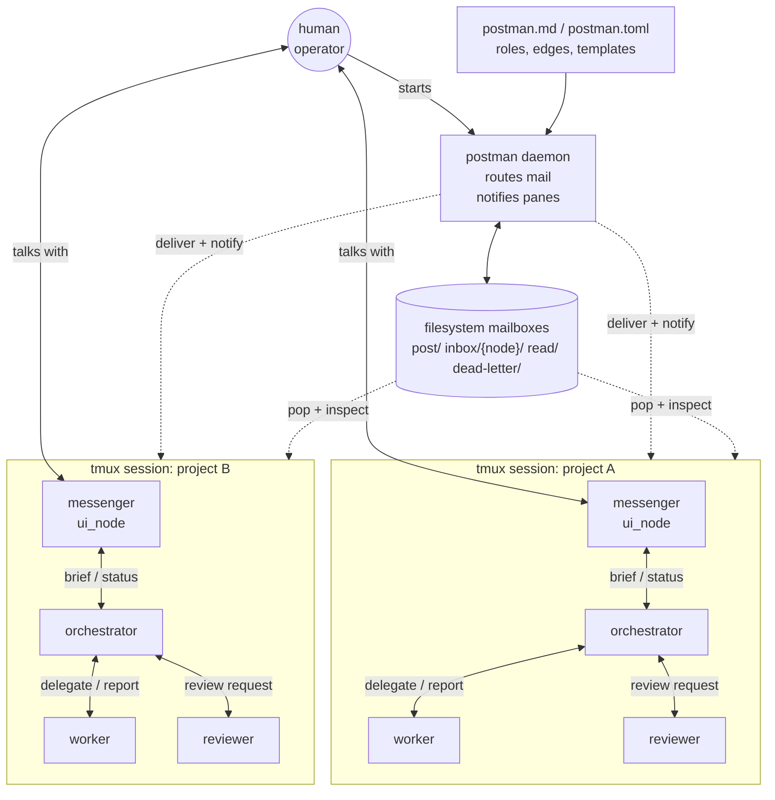
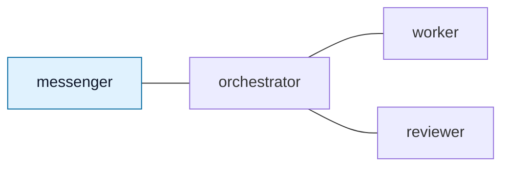
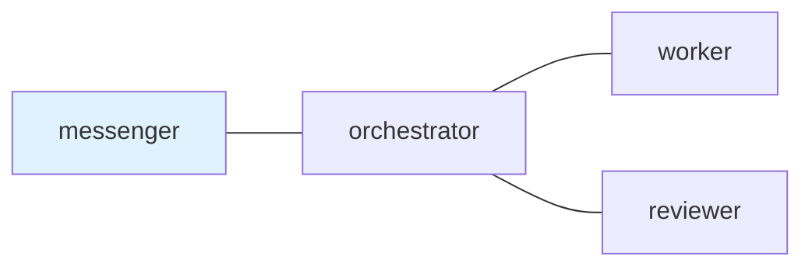

# tmux-a2a-postman

[](https://deepwiki.com/i9wa4/tmux-a2a-postman)

`tmux-a2a-postman` is a local message delivery daemon for AI coding agents
running in tmux panes.

Any AI coding agent can occupy a configured role. The postman daemon keeps the
handoff surface local, durable, and visible to the human operator.

It treats tmux pane titles as role names, routes messages according to your
`postman.md` topology, and stores mail in filesystem-backed inboxes. Agents
send messages with `send-heredoc`, read them with `pop`, and inspect shared
state with `get-status` or `get-status-oneline`.

## Concept


```mermaid
graph TD
    operator((human\noperator))
    config["postman.md / postman.toml\nroles, edges, templates"]
    daemon["postman daemon\nroutes mail\nnotifies panes"]
    mailbox[("filesystem mailboxes\npost/ inbox/{node}/ read/ dead-letter/")]

    subgraph project_a["tmux session: project A"]
        a_messenger["messenger\nui_node"]
        a_orchestrator["orchestrator"]
        a_worker["worker"]
        a_reviewer["reviewer"]

        a_messenger <--> |brief / status| a_orchestrator
        a_orchestrator <--> |delegate / report| a_worker
        a_orchestrator <--> |review request| a_reviewer
    end

    subgraph project_b["tmux session: project B"]
        b_messenger["messenger\nui_node"]
        b_orchestrator["orchestrator"]
        b_worker["worker"]
        b_reviewer["reviewer"]

        b_messenger <--> |brief / status| b_orchestrator
        b_orchestrator <--> |delegate / report| b_worker
        b_orchestrator <--> |review request| b_reviewer
    end

    operator --> |starts| daemon
    operator <--> |talks with| a_messenger
    operator <--> |talks with| b_messenger
    config --> daemon
    daemon <--> mailbox
    daemon -.->|deliver + notify| project_a
    daemon -.->|deliver + notify| project_b
    mailbox -.->|pop + inspect| project_a
    mailbox -.->|pop + inspect| project_b
```

`postman.md` names the agent roles and the allowed conversation edges. The
daemon discovers tmux panes by title, routes messages through local files, and
keeps an archive that agents can inspect later.

Each tmux session is a separate project workspace. `ui_node` marks the role
the human talks to first, while the daemon keeps routing, delivery, and
archived mail outside the agent panes.

## Why Use It

- Keep coordination local: agents talk through tmux panes and Markdown
  mailboxes on your machine, not a hosted broker.
- Control the handoff: `postman.md` edges are the routing table; the daemon
  delivers mail and does not run a hidden workflow engine.
- Inspect what happened: mail moves through `post/`, `inbox/`, `read/`, and
  `dead-letter/`; `get-status`, `inspect-message`, and `inspect-input` show
  live and archived state.
- Make agent work auditable: reply-required tasks use explicit IDs and close
  with DONE/BLOCKED evidence.
- Verify the same way locally: CI runs `nix flake check`, `nix build`, skill
  validation, and vulnerability scanning; local changes can run those checks
  plus targeted Go tests.

## Install

Prerequisites:

- macOS or Linux
- tmux 3.0 or newer

Install with Go:

```sh
go install github.com/i9wa4/tmux-a2a-postman@latest
```

Or run with Nix:

```sh
nix run github:i9wa4/tmux-a2a-postman
```

## Quick Start

Start with a small conversation topology:


```mermaid
graph LR
    messenger --- orchestrator
    orchestrator --- worker
    orchestrator --- reviewer
    class messenger ui_node
    classDef ui_node fill:#e0f2fe,stroke:#0369a1,color:#0f172a
```

Use this as a complete, copyable `postman.md`. The optional skill catalog YAML
stays in the same frontmatter header; uncomment only paths that exist after
installing skills. Markdown under `common_template` and node sections is
free-form role guidance, so short sections can cover identity, boundaries,
local conventions, escalation rules, or checklists. Only the backtick-wrapped
H2 section names and Mermaid edges are structural; `### role` sets the short
role summary, and other H3 headings are ordinary Markdown:

````markdown
---
# Optional: after installing packaged skills, uncomment only paths that exist.
# skill_path:
#   - path: ~/.codex/skills
#     inject: ping
#     runtime: codex
#     skills:
#       - postman-send-message
#       - postman-session-operator
#       - postman-config-auditor
#   - path: ~/.claude/skills
#     inject: ping
#     runtime: claude
#     skills:
#       - postman-send-message
#       - postman-session-operator
#       - postman-config-auditor
---

## `edges`


```mermaid
graph LR
    messenger --- orchestrator
    orchestrator --- worker
    orchestrator --- reviewer
    class messenger ui_node
    classDef ui_node fill:#e0f2fe
```

## `common_template`

You are one role in this local tmux-a2a-postman session.

- Read inbox mail with `tmux-a2a-postman pop`.
- Send role-to-role mail with `tmux-a2a-postman send-heredoc --to <node>`.
- Use `DONE` only when assigned work is complete. Use `BLOCKED` when it is not.

## `messenger`

### `role`

Human-facing intake and status relay.

### Intake

Receive the human request, send implementation work to `orchestrator`, and
relay final DONE or BLOCKED status back to the human. Do not implement code
locally.

## `orchestrator`

### `role`

Task coordinator for this session.

### Responsibilities

Break work into clear requests, delegate implementation to `worker`, request
review from `reviewer` when useful, and report final DONE or BLOCKED status to
`messenger`.

## `worker`

### `role`

Primary implementation role.

### Reply Contract

Execute tasks from `orchestrator`. Report DONE with evidence, or BLOCKED with
the missing requirement or external blocker.

### Boundaries

Keep edits scoped to the request. Report BLOCKED before changing unrelated
files or expanding scope.

## `reviewer`

### `role`

Implementation reviewer.

### Quality Bar

Review work requested by `orchestrator`. Report APPROVED when the change is
ready, or BLOCKED with concrete findings.
````

Save the file at `$XDG_CONFIG_HOME/tmux-a2a-postman/postman.md`, or the
`~/.config/tmux-a2a-postman/postman.md` fallback.

Start the daemon after writing `postman.md`:

```sh
tmux-a2a-postman start
```

After changing `postman.md` later, restart the daemon so topology, role
templates, and skill catalogs are reloaded:

```sh
tmux-a2a-postman stop
tmux-a2a-postman start
```

Send a message from an agent pane whose title matches a configured role:

```sh
tmux-a2a-postman send-heredoc --to worker <<'POSTMAN_BODY'
Implement the requested change and report DONE or BLOCKED.
POSTMAN_BODY
```

Read the next inbox message:

```sh
tmux-a2a-postman pop
```

Recipients usually run `pop` after a pane notification or message footer says
mail is waiting. To inspect archived mail later, use
`inspect-message --id <message_id>`.

Inspect live session state:

```sh
tmux-a2a-postman get-status
tmux-a2a-postman get-status-oneline
```

Use explicit subcommands. Running `tmux-a2a-postman` without a subcommand only
prints usage.

## Messaging Rules

Use `send-heredoc` with a quoted delimiter for agent-safe messages. The quotes
keep shell-sensitive text literal, including backticks, variables, quotes, code
fences, and multiline commands.

Use `--reply-required` only when the recipient must answer:

```sh
tmux-a2a-postman send-heredoc --to reviewer --reply-required <<'POSTMAN_BODY'
Review the implementation and reply with DONE or BLOCKED.
POSTMAN_BODY
```

Reply-required messages carry an `input_request_id`. Exact replies should fill
that request:

```sh
tmux-a2a-postman send-heredoc \
  --to orchestrator \
  --reply-to <message-id> \
  --fills-input-request-id <input-request-id> <<'POSTMAN_BODY'
DONE: Requirements satisfied.
Task artifact: <artifact-reference>
Original checklist: PASS
Evidence: <commands or links>
Remaining blockers: none
POSTMAN_BODY
```

Filling an input request closes transport, not task acceptance. For required
work, send `DONE` only after checking the original requirements against
evidence. Receivers verify the checklist status, durable references, evidence,
and blockers before relaying, approving, or closing work.

`DONE`, `ACK`, `PING`, and `HEARTBEAT_OK` are terminal no-reply messages.

## Configuration

`postman.toml` is optional. Embedded defaults from
`internal/config/postman.default.toml` are enough for the daemon to run.

Place user-maintained config files under the global config directory:

- `$XDG_CONFIG_HOME/tmux-a2a-postman/`
- `~/.config/tmux-a2a-postman/` fallback when `XDG_CONFIG_HOME` is unset

`postman.md` is the file humans maintain as panes, roles, and operating rules
change. It defines three things:

- conversation edges in the Mermaid `edges` graph
- role instructions under role headings, such as the `worker` example above
- optional `skill_path` catalogs for assistant-specific skills

Every node named in the Mermaid graph is materialized automatically. Write
`a --- b` when two roles can exchange mail, and mark the human-facing role with
the Mermaid `ui_node` class so startup PINGs route to the operator's entry
point.

Grow role sections by adding concise recipient instructions under the role
heading, using short sections such as `role`, `Workflow`, and
`Operating rules`.
Keep task-specific direction in messages; keep durable routing, role, and
coordination rules in `postman.md`.

Optional `skill_path` frontmatter adds compact skill catalogs later. Most
configs omit `inject`; omitted `inject` and `inject: context` add catalogs to
normal role context. `inject: ping` is for compaction-triggered PING catalogs;
the compatibility `compaction_skill_path` form is covered in the syntax
reference.

Detailed configuration references:

- [postman.md syntax](skills/postman-config-auditor/references/postman-md.md)
- [configuration defaults and merge policy](docs/design/config-ssot.md)
- [daemon session ownership](docs/design/daemon-session-model.md)

## Agent Skills

The binary works without bundled skills. The optional skills help AI assistants
discover commands, operate live message state, and audit configuration:

- `postman-send-message`
- `postman-session-operator`
- `postman-config-auditor`

Install them with GitHub CLI 2.90.0 or newer:

```sh
gh skill install i9wa4/tmux-a2a-postman postman-send-message --agent codex --scope user
gh skill install i9wa4/tmux-a2a-postman postman-session-operator --agent codex --scope user
gh skill install i9wa4/tmux-a2a-postman postman-config-auditor --agent codex --scope user
```

Replace `--agent codex` with `--agent claude-code` for Claude Code.

Use the skills as a maintenance loop:

- run `postman-config-auditor` after editing `postman.md` to check topology,
  role templates, skill catalogs, and deprecated references
- restart the daemon after config changes so the running session reflects the
  updated topology and templates
- use `postman-session-operator` to inspect pending replies, inbox state, and
  archived messages while work is live
- use `postman-send-message` when starting a new role-to-role conversation

Claude Code and Codex CLI have different runtime surfaces outside postman; see
[docs/agent-runtime-feature-differences.md](docs/agent-runtime-feature-differences.md).

## Help

The binary contains the command reference:

```sh
tmux-a2a-postman help
tmux-a2a-postman help commands
tmux-a2a-postman help config
tmux-a2a-postman help directories
tmux-a2a-postman help messaging
```

Additional design notes live under [docs/design](docs/design).
