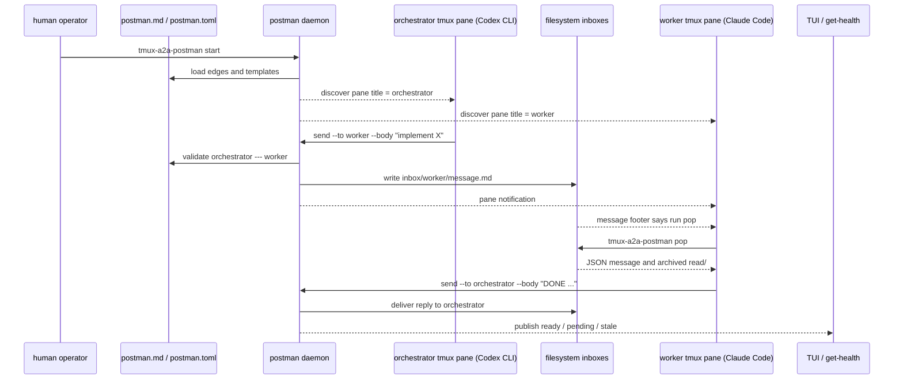
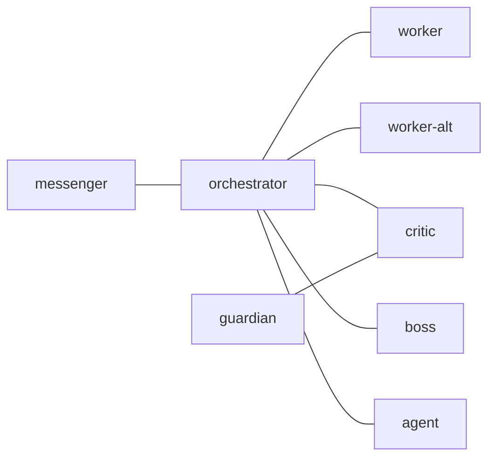

# tmux-a2a-postman

[](https://deepwiki.com/i9wa4/tmux-a2a-postman)

tmux agent-to-agent message delivery daemon.

It runs one daemon per Unix user, treats tmux pane titles as agent node names,
and delivers `send` messages to filesystem-backed inboxes. Agents read mail with
`pop` and inspect shared health with `get-health` or `get-health-oneline`.

## 1. Concept


```mermaid
sequenceDiagram
    participant Human as human operator
    participant Config as postman.md / postman.toml
    participant Daemon as postman daemon
    participant Orchestrator as orchestrator tmux pane (Codex CLI)
    participant Inbox as filesystem inboxes
    participant Worker as worker tmux pane (Claude Code)
    participant Health as TUI / get-health

    Human->>Daemon: tmux-a2a-postman start
    Daemon->>Config: load edges and templates
    Daemon-->>Orchestrator: discover pane title = orchestrator
    Daemon-->>Worker: discover pane title = worker
    Orchestrator->>Daemon: send --to worker --body "implement X"
    Daemon->>Config: validate orchestrator --- worker
    Daemon->>Inbox: write inbox/worker/message.md
    Daemon-->>Worker: pane notification
    Inbox-->>Worker: message footer says run pop
    Worker->>Inbox: tmux-a2a-postman pop
    Inbox-->>Worker: JSON message and archived read/
    Worker->>Daemon: send --to orchestrator --body "DONE ..."
    Daemon->>Inbox: deliver reply to orchestrator
    Daemon-->>Health: publish ready / pending / stale
```

## 2. Prerequisites

- tmux >= 3.0

## 3. Installation

```sh
go install github.com/i9wa4/tmux-a2a-postman@latest
```

Or with Nix:

```sh
nix run github:i9wa4/tmux-a2a-postman
```

### 3.1. (Optional) Agent Skills

The postman binary works without the `skills/` directory. These AI assistant
skills help agents discover the first command and audit configuration:

- `postman-send-message`: minimal entry point for sending the first postman
  message.
- `postman-config-auditor`: audits `postman.md`, `postman.toml`, `nodes/*`,
  topology, and node templates.

These skills are published through GitHub Releases; no separate skill registry
is required. Install GitHub CLI 2.90.0 or newer first; see the
[GitHub CLI installation guide](https://github.com/cli/cli#installation). Then
install all bundled skills for Codex:

```sh
gh skill install i9wa4/tmux-a2a-postman postman-send-message --agent codex --scope user
gh skill install i9wa4/tmux-a2a-postman postman-config-auditor --agent codex --scope user
```

See the
[GitHub CLI `gh skill install` manual](https://cli.github.com/manual/gh_skill_install)
for supported agents and scopes.

## 4. Usage

The human operator starts one daemon for their Unix user:

```sh
tmux-a2a-postman start
```

Agents then run commands from their own tmux panes. The pane title identifies
the sending node:

```sh
tmux-a2a-postman send --to worker --body "implement X"
```

The daemon discovers panes by title and routes messages through
filesystem-backed inboxes. A recipient agent usually runs `pop` after the pane
notification or message footer tells it mail is waiting.

Use explicit subcommands; bare `tmux-a2a-postman` prints usage and does not
start the daemon. The exact CLI reference is built into the binary:

```sh
tmux-a2a-postman help
tmux-a2a-postman help commands
tmux-a2a-postman help config
tmux-a2a-postman help directories
```

`get-health`, `get-health-oneline`, and the default TUI are views over the same
canonical contract. Agents should prefer `get-health` for structured session
JSON and `get-health-oneline` for compact coordination.

## 5. Configuration

`postman.toml` is optional; embedded defaults from
`internal/config/postman.default.toml` are enough to run the daemon. A minimal
`postman.md` can contain only Mermaid edges:


```mermaid
graph LR
    messenger --- orchestrator
    orchestrator --- worker
    orchestrator --- worker-alt
    orchestrator --- critic
    orchestrator --- boss
    guardian --- critic
    orchestrator --- agent
```

````markdown
## `edges`


```mermaid
graph LR
    messenger --- orchestrator
    orchestrator --- worker
    orchestrator --- worker-alt
    orchestrator --- critic
    orchestrator --- boss
    guardian --- critic
    orchestrator --- agent
```
````

Every node referenced by `edges` is materialized automatically. Define node
templates only when you need role-specific instructions:

````markdown
## `worker`

### `role`

Primary task executor.

### Workflow

Execute tasks from orchestrator. Report DONE or BLOCKED.
````

Place config files under `$XDG_CONFIG_HOME/tmux-a2a-postman/`, or under
project-local `.tmux-a2a-postman/` for overrides. Detailed `postman.md` syntax
lives in
[skills/postman-config-auditor/references/postman-md.md](skills/postman-config-auditor/references/postman-md.md).
Configuration defaults and merge policy live in
[docs/design/config-ssot.md](docs/design/config-ssot.md), and daemon ownership
details live in
[docs/design/daemon-session-model.md](docs/design/daemon-session-model.md).
