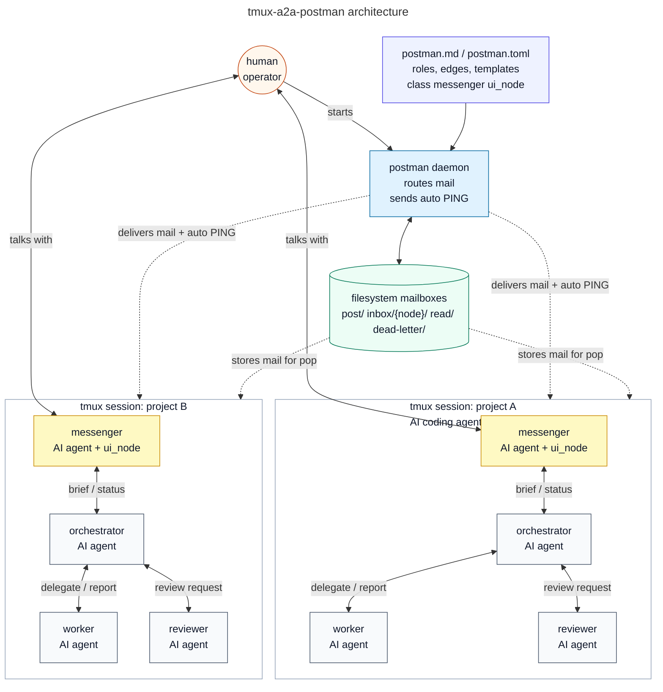
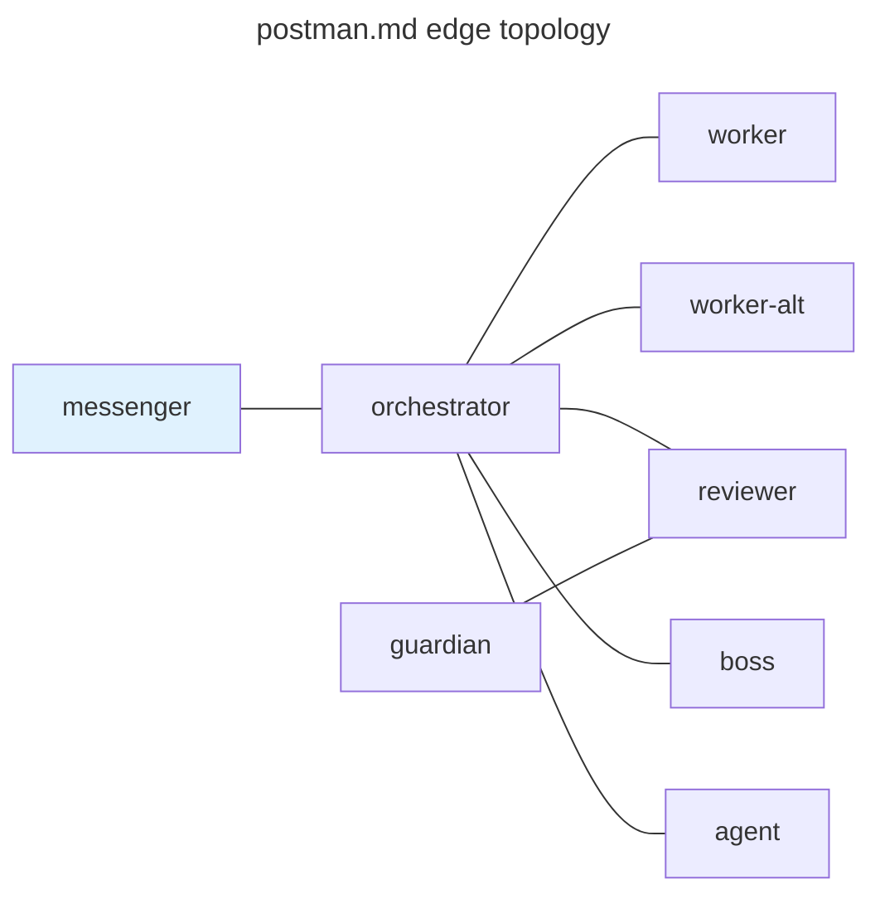
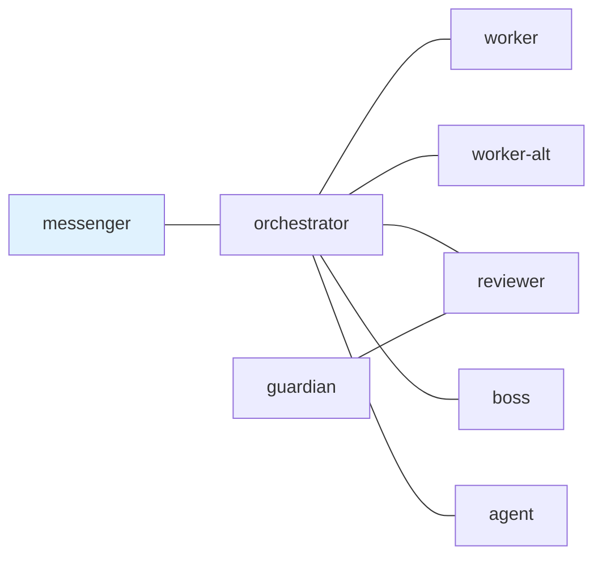

# tmux-a2a-postman

[](https://deepwiki.com/i9wa4/tmux-a2a-postman)

tmux agent-to-agent message delivery daemon.

Any AI coding agent can occupy the roles you define, turning tmux sessions into
durable workspaces for human-directed handoffs, delegation, and review.

It runs one daemon per local user account, treats tmux pane titles as role/node
names, and delivers `send` messages to filesystem-backed inboxes. Agents read
mail with `pop` and inspect shared health with `get-health` or
`get-health-oneline`.

## 1. Concept


```mermaid
---
title: tmux-a2a-postman architecture
---
graph TD
    operator((human\noperator))
    config["postman.md / postman.toml\nroles, edges, templates\nclass messenger ui_node"]
    daemon["postman daemon\nroutes mail\nsends auto PING"]
    mailbox[("filesystem mailboxes\npost/ inbox/{node}/ read/ dead-letter/")]

    subgraph project_a["tmux session: project A\nAI coding agents"]
        a_messenger["messenger\nAI agent + ui_node"]
        a_orchestrator["orchestrator\nAI agent"]
        a_worker["worker\nAI agent"]
        a_reviewer["reviewer\nAI agent"]

        a_messenger <--> |brief / status| a_orchestrator
        a_orchestrator <--> |delegate / report| a_worker
        a_orchestrator <--> |review request| a_reviewer
    end

    subgraph project_b["tmux session: project B\nAI coding agents"]
        b_messenger["messenger\nAI agent + ui_node"]
        b_orchestrator["orchestrator\nAI agent"]
        b_worker["worker\nAI agent"]
        b_reviewer["reviewer\nAI agent"]

        b_messenger <--> |brief / status| b_orchestrator
        b_orchestrator <--> |delegate / report| b_worker
        b_orchestrator <--> |review request| b_reviewer
    end

    operator --> |starts| daemon
    operator <--> |talks with| a_messenger
    operator <--> |talks with| b_messenger
    config --> daemon
    daemon <--> mailbox
    daemon -.->|delivers mail + auto PING| project_a
    daemon -.->|delivers mail + auto PING| project_b
    mailbox -.->|stores mail for pop| project_a
    mailbox -.->|stores mail for pop| project_b

    classDef operatorType fill:#fff7ed,stroke:#c2410c,color:#111827
    classDef configType fill:#eef2ff,stroke:#4f46e5,color:#111827
    classDef daemonType fill:#e0f2fe,stroke:#0369a1,color:#0f172a
    classDef storageType fill:#ecfdf5,stroke:#047857,color:#0f172a
    classDef agentType fill:#f8fafc,stroke:#475569,color:#0f172a
    classDef uiNodeType fill:#fef9c3,stroke:#ca8a04,color:#0f172a

    class operator operatorType
    class config configType
    class daemon daemonType
    class mailbox storageType
    class a_orchestrator,a_worker,a_reviewer,b_orchestrator,b_worker,b_reviewer agentType
    class a_messenger,b_messenger uiNodeType
    style project_a fill:#ffffff,stroke:#94a3b8,color:#0f172a
    style project_b fill:#ffffff,stroke:#94a3b8,color:#0f172a
```

Each tmux session is a separate project workspace. Every role/node inside the
session is an AI coding agent pane; `ui_node` is the agent role that the human
operator talks to first. Roles can share the same names across sessions; normal
agent collaboration stays inside a project session.

## 2. Prerequisites

- macOS or Linux
- tmux >= 3.0

## 3. Installation

```sh
go install github.com/i9wa4/tmux-a2a-postman@latest
```

Or with Nix:

```sh
nix run github:i9wa4/tmux-a2a-postman
```

### 3.1. (Optional) Agent Skills

The postman binary works without the `skills/` directory. These AI assistant
skills help agents discover the first command, read live session state, and
audit configuration:

- `postman-send-message`: minimal entry point for sending the first postman
  message.
- `postman-session-operator`: interprets live health state and helps decide
  when to pop, reply, wait, retry, or restart.
- `postman-config-auditor`: audits `postman.md`, `postman.toml`, `nodes/*`,
  topology, and node templates.

These skills are published through GitHub Releases; no separate skill registry
is required. Install GitHub CLI 2.90.0 or newer first; see the
[GitHub CLI installation guide](https://github.com/cli/cli#installation). Then
install all bundled skills for your agent.

For Claude Code:

```sh
gh skill install i9wa4/tmux-a2a-postman postman-send-message --agent claude-code --scope user
gh skill install i9wa4/tmux-a2a-postman postman-session-operator --agent claude-code --scope user
gh skill install i9wa4/tmux-a2a-postman postman-config-auditor --agent claude-code --scope user
```

For Codex CLI:

```sh
gh skill install i9wa4/tmux-a2a-postman postman-send-message --agent codex --scope user
gh skill install i9wa4/tmux-a2a-postman postman-session-operator --agent codex --scope user
gh skill install i9wa4/tmux-a2a-postman postman-config-auditor --agent codex --scope user
```

See the
[GitHub CLI `gh skill install` manual](https://cli.github.com/manual/gh_skill_install)
for supported agents and scopes.

## 4. Usage

The human operator starts one daemon for their local user account:

```sh
tmux-a2a-postman start
```

After `start`, each discovered node receives an auto PING. A node pane opened
later receives the same PING when discovered; if the same role reappears with a
new pane ID, it is treated as a replacement pane and receives another PING. A
PING is normal inbox mail: the recipient sees the pane notification, runs
`pop`, and reads its role plus reply guidance. Discovery runs on
`scan_interval_seconds`; tmux session-list refresh runs on
`session_scan_interval_seconds`; auto PING waits for
`auto_ping_delay_seconds` (20 seconds by default), so startup commands can
finish before the notification is pasted.

Agents then run commands from their own tmux panes. The pane title identifies
the sending role/node, independent of whether the pane is Claude Code, Codex
CLI, or another AI coding agent:

```sh
tmux-a2a-postman send --to worker --body 'implement X'
```

For arbitrary Markdown, command examples, variables, mixed quotes, or multiline
content, avoid putting the body directly inside shell quotes. Use a file or
standard input so the body is read as text:

```sh
tmux-a2a-postman send --to worker --body-file request.md
tmux-a2a-postman send --to worker --body-stdin < request.md
```

The daemon discovers panes by title and routes messages through
filesystem-backed inboxes. A recipient agent usually runs `pop` after the pane
notification or message footer tells it mail is waiting.

Use explicit subcommands; bare `tmux-a2a-postman` prints usage and does not
start the daemon. The exact CLI reference is built into the binary:

```sh
tmux-a2a-postman help
tmux-a2a-postman help commands
tmux-a2a-postman help config
tmux-a2a-postman help directories
```

`get-health`, `get-health-oneline`, and the default TUI are views over the same
reply-aware contract. Use `--reply-required` only for messages that need an
answer; reply-required messages carry `obligation_id`, and exact replies should
include `--satisfies-obligation-id <obligation-id>`. The default footer also
keeps `--reply-to <message-id>` as traceability; legacy messages may still use
`--reply-to` for closure. `DONE`, `ACK`, `PING`, and `HEARTBEAT_OK` are
terminal no-reply messages. Agents should prefer `get-health` for structured
session JSON and `get-health-oneline` for compact coordination.
`get-health` includes `nodes[*].screen_progress` with non-content evidence
such as last capture time, last screen-change time, and an opaque screen
fingerprint; raw pane text is not exposed. The oneline view stays compact and
omits those details.

Pane capture also scans recent scrollback for Claude/Codex context-compaction
markers so recovery PINGs are not limited to the visible screen. Configure the
depth with `pane_capture_tail_lines` in `postman.toml`; the embedded default is
`100`, and `0` restores visible-pane-only scanning.

## 5. Configuration

`postman.toml` is optional; embedded defaults from
`internal/config/postman.default.toml` are enough to run the daemon. A minimal
`postman.md` can contain only Mermaid edges:

Default values shown in docs and help text are references to the embedded
TOML. Changing a public default means updating `postman.default.toml`, docs,
and tests together.


```mermaid
---
title: postman.md edge topology
---
graph LR
    messenger --- orchestrator
    orchestrator --- worker
    orchestrator --- worker-alt
    orchestrator --- reviewer
    orchestrator --- boss
    guardian --- reviewer
    orchestrator --- agent
    class messenger ui_node
    classDef ui_node fill:#e0f2fe
```

````markdown
## `edges`


```mermaid
graph LR
    messenger --- orchestrator
    orchestrator --- worker
    orchestrator --- worker-alt
    orchestrator --- reviewer
    orchestrator --- boss
    guardian --- reviewer
    orchestrator --- agent
    class messenger ui_node
    classDef ui_node fill:#e0f2fe
```
````

Every node referenced by `edges` is materialized automatically. Define node
templates only when you need role-specific instructions:

````markdown
## `worker`

### `role`

Primary task executor.

### Workflow

Execute tasks from orchestrator. Report DONE or BLOCKED.
````

Mark the human-facing node with the Mermaid `ui_node` class. That node receives
startup PINGs for the human operator. To expose an agent skill catalog without
inlining full skill bodies, add frontmatter to `postman.md`:

```markdown
---
skill_path:
  - path: ~/ghq/github.com/i9wa4/dotfiles/skills
    skills:
      - repo-local
      - bash
      - github
      - markdown
  - path: ~/.claude/skills
    skills:
      - postman-config-auditor
      - postman-session-operator
---
```

Frontmatter `ui_node` is still supported as an explicit override, but the
Mermaid `ui_node` class keeps the normal case in the topology diagram. Relative
`skill_path` values are resolved from the `postman.md` directory,
`~/...` expands to the current user's home directory, and symlinked skill
directories are followed. The catalog is generated as a compact Markdown list
from selected `SKILL.md` frontmatter `name` and `description` values. Use
`skills: all` to include every skill under a source path. Glob patterns are not
supported; list skill names explicitly.

Place config files under `$XDG_CONFIG_HOME/tmux-a2a-postman/`, or under
project-local `.tmux-a2a-postman/` for overrides. Detailed `postman.md` syntax
lives in
[skills/postman-config-auditor/references/postman-md.md](skills/postman-config-auditor/references/postman-md.md).
Configuration defaults and merge policy live in
[docs/design/config-ssot.md](docs/design/config-ssot.md), and daemon ownership
details live in
[docs/design/daemon-session-model.md](docs/design/daemon-session-model.md).
