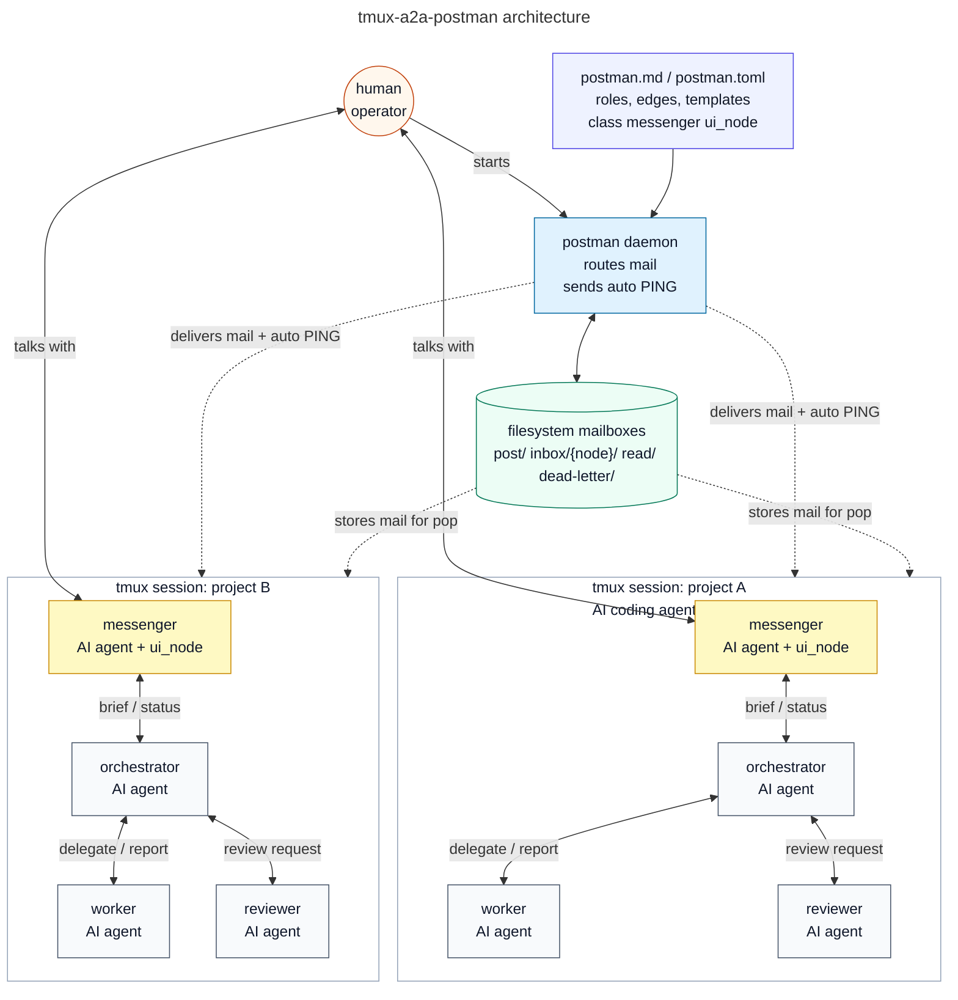
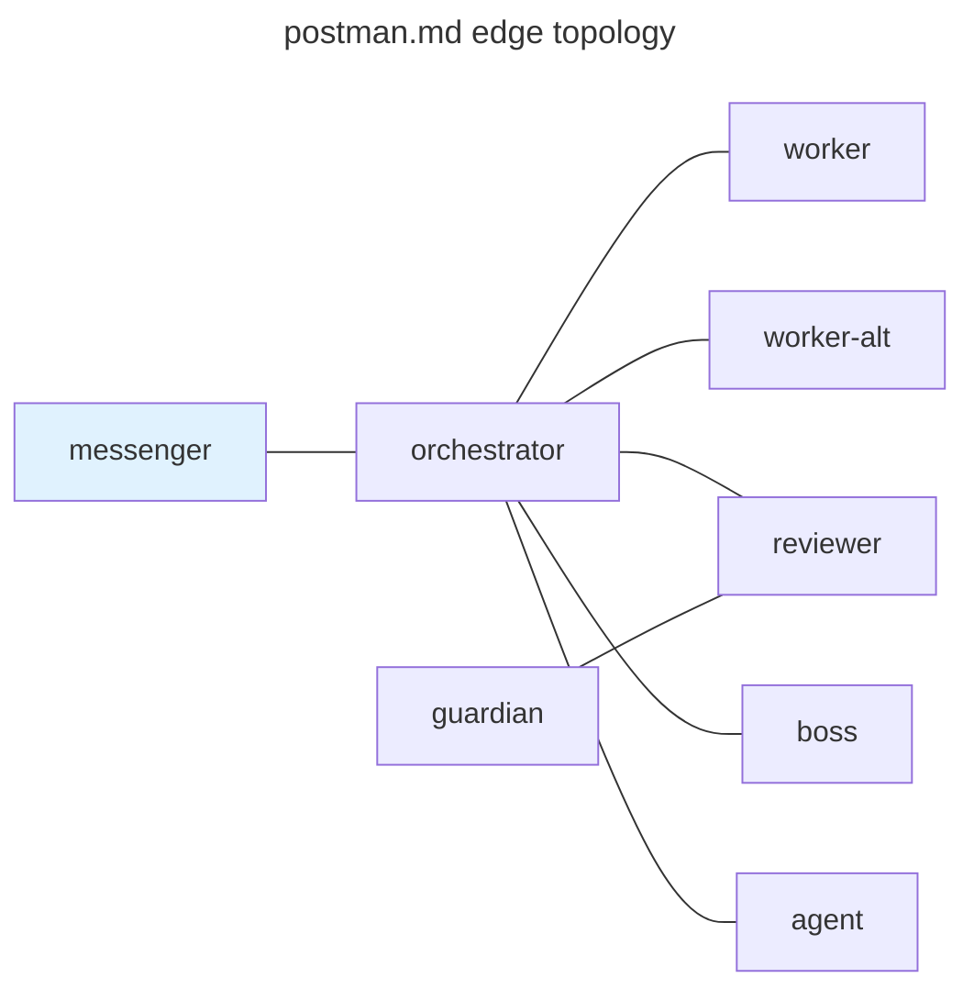
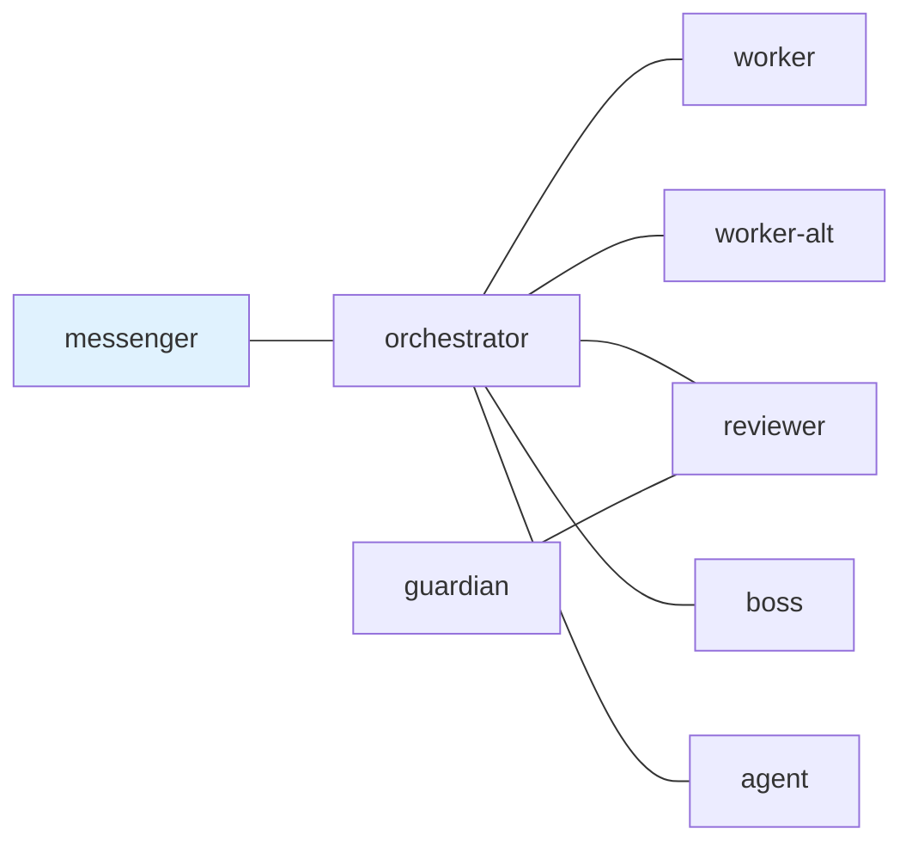

# tmux-a2a-postman

[](https://deepwiki.com/i9wa4/tmux-a2a-postman)

tmux agent-to-agent message delivery daemon.

Any AI coding agent can occupy the roles you define, turning tmux sessions into
durable workspaces for human-directed handoffs, delegation, and review.

It runs one daemon per local user account, treats tmux pane titles as role/node
names, and delivers `send-heredoc` messages to filesystem-backed inboxes.
Agents read mail with `pop` and inspect shared health with `get-status` or
`get-status-oneline`.

## 1. Concept


```mermaid
---
title: tmux-a2a-postman architecture
---
graph TD
    operator((human\noperator))
    config["postman.md / postman.toml\nroles, edges, templates\nclass messenger ui_node"]
    daemon["postman daemon\nroutes mail\nsends auto PING"]
    mailbox[("filesystem mailboxes\npost/ inbox/{node}/ read/ dead-letter/")]

    subgraph project_a["tmux session: project A\nAI coding agents"]
        a_messenger["messenger\nAI agent + ui_node"]
        a_orchestrator["orchestrator\nAI agent"]
        a_worker["worker\nAI agent"]
        a_reviewer["reviewer\nAI agent"]

        a_messenger <--> |brief / status| a_orchestrator
        a_orchestrator <--> |delegate / report| a_worker
        a_orchestrator <--> |review request| a_reviewer
    end

    subgraph project_b["tmux session: project B\nAI coding agents"]
        b_messenger["messenger\nAI agent + ui_node"]
        b_orchestrator["orchestrator\nAI agent"]
        b_worker["worker\nAI agent"]
        b_reviewer["reviewer\nAI agent"]

        b_messenger <--> |brief / status| b_orchestrator
        b_orchestrator <--> |delegate / report| b_worker
        b_orchestrator <--> |review request| b_reviewer
    end

    operator --> |starts| daemon
    operator <--> |talks with| a_messenger
    operator <--> |talks with| b_messenger
    config --> daemon
    daemon <--> mailbox
    daemon -.->|delivers mail + auto PING| project_a
    daemon -.->|delivers mail + auto PING| project_b
    mailbox -.->|stores mail for pop| project_a
    mailbox -.->|stores mail for pop| project_b

    classDef operatorType fill:#fff7ed,stroke:#c2410c,color:#111827
    classDef configType fill:#eef2ff,stroke:#4f46e5,color:#111827
    classDef daemonType fill:#e0f2fe,stroke:#0369a1,color:#0f172a
    classDef storageType fill:#ecfdf5,stroke:#047857,color:#0f172a
    classDef agentType fill:#f8fafc,stroke:#475569,color:#0f172a
    classDef uiNodeType fill:#fef9c3,stroke:#ca8a04,color:#0f172a

    class operator operatorType
    class config configType
    class daemon daemonType
    class mailbox storageType
    class a_orchestrator,a_worker,a_reviewer,b_orchestrator,b_worker,b_reviewer agentType
    class a_messenger,b_messenger uiNodeType
    style project_a fill:#ffffff,stroke:#94a3b8,color:#0f172a
    style project_b fill:#ffffff,stroke:#94a3b8,color:#0f172a
```

Each tmux session is a separate project workspace. Every role/node inside the
session is an AI coding agent pane; `ui_node` is the agent role that the human
operator talks to first. Roles can share the same names across sessions; normal
agent collaboration stays inside a project session.

## 2. Prerequisites

- macOS or Linux
- tmux >= 3.0

## 3. Installation

```sh
go install github.com/i9wa4/tmux-a2a-postman@latest
```

Or with Nix:

```sh
nix run github:i9wa4/tmux-a2a-postman
```

### 3.1. (Optional) Agent Skills

The postman binary works without the `skills/` directory. These AI assistant
skills help agents discover the first command, read live session state, and
audit configuration:

- `postman-send-message`: minimal entry point for sending the first postman
  message.
- `postman-session-operator`: interprets live health state and helps decide
  when to pop, reply, wait, retry, or restart.
- `postman-config-auditor`: audits `postman.md`, `postman.toml`, `nodes/*`,
  topology, and node templates.

These skills are published through GitHub Releases; no separate skill registry
is required. Install GitHub CLI 2.90.0 or newer first; see the
[GitHub CLI installation guide](https://github.com/cli/cli#installation). Then
install all bundled skills for your agent.

For Claude Code:

```sh
gh skill install i9wa4/tmux-a2a-postman postman-send-message --agent claude-code --scope user
gh skill install i9wa4/tmux-a2a-postman postman-session-operator --agent claude-code --scope user
gh skill install i9wa4/tmux-a2a-postman postman-config-auditor --agent claude-code --scope user
```

For Codex CLI:

```sh
gh skill install i9wa4/tmux-a2a-postman postman-send-message --agent codex --scope user
gh skill install i9wa4/tmux-a2a-postman postman-session-operator --agent codex --scope user
gh skill install i9wa4/tmux-a2a-postman postman-config-auditor --agent codex --scope user
```

See the
[GitHub CLI `gh skill install` manual](https://cli.github.com/manual/gh_skill_install)
for supported agents and scopes. Claude Code and Codex CLI have different
runtime surfaces outside postman; the canonical comparison lives in
[docs/agent-runtime-feature-differences.md](docs/agent-runtime-feature-differences.md).

## 4. Usage

The human operator starts one daemon for their local user account:

```sh
tmux-a2a-postman start
```

After `start`, each discovered node receives an auto PING. A node pane opened
later receives the same PING when discovered; if the same role reappears with a
new pane ID, it is treated as a replacement pane and receives another PING. A
PING is normal inbox mail: the recipient sees the pane notification, runs
`pop`, and reads its role plus reply guidance. Discovery runs on
`scan_interval_seconds`; tmux session-list refresh runs on
`session_scan_interval_seconds`; auto PING waits for
`auto_ping_delay_seconds` (20 seconds by default), so startup commands can
finish before the notification is pasted.

Agents then run commands from their own tmux panes. The pane title identifies
the sending role/node, independent of whether the pane is Claude Code, Codex
CLI, or another AI coding agent. For agent-safe non-interactive messages, use
the heredoc-explicit command with a quoted delimiter:

```sh
tmux-a2a-postman send-heredoc --to worker <<'POSTMAN_BODY'
implement X
POSTMAN_BODY
```

The single quotes around `POSTMAN_BODY` matter. They keep shell-sensitive text
inside the body literal, including command substitutions, backticks, variables,
mixed quotes, code fences, and multiline shell examples. Do not pass message
text as a CLI argument, file-body shortcut, or generic pipe-oriented body.

The daemon discovers panes by title and routes messages through
filesystem-backed inboxes. A recipient agent usually runs `pop` after the pane
notification or message footer tells it mail is waiting; `pop` is the receiver
claim/open step and returns metadata plus an archived body path.

Use explicit subcommands; bare `tmux-a2a-postman` prints usage and does not
start the daemon. The exact CLI reference is built into the binary:

```sh
tmux-a2a-postman help
tmux-a2a-postman help commands
tmux-a2a-postman help config
tmux-a2a-postman help directories
```

`get-status`, `get-status-oneline`, and the default TUI are views over the
same reply-aware contract. Use `--reply-required` only for messages that need
an answer; reply-required messages carry `input_request_id`, and exact replies
should include `--fills-input-request-id <input-request-id>`. The default
footer also keeps `--reply-to <message-id>` as traceability and fallback
message-link closure.
Filling an input request closes transport, not task acceptance. For required
work, send `DONE` only after checking the original requirements against
evidence, and include a compact proof shape: `Task artifact`,
`Original checklist: PASS`, `Evidence`, and `Remaining blockers: none`. Send
`BLOCKED` with `Original checklist: FAIL` when any requested item is unresolved
or unverified. Receivers verify the checklist status, durable references,
evidence, and blockers before relaying, approving, or closing work.
`DONE`, `ACK`, `PING`, and `HEARTBEAT_OK` are terminal no-reply messages.
Agents should prefer `get-status` for
structured session JSON, `inspect-input --id <message_id-or-input_request_id>`
to identify a specific open reply-required item without popping inbox mail,
`inspect-message --id <message_id>` to inspect a persisted message after it is
read or archived, and `get-status-oneline` for compact coordination.
`inspect-message` is read-only and can print focused output with `--path` or
`--body` when a single stored message matches.
`get-status` uses `schema_version: 3`; `visible_state` and `compact` are
compact operator fields, while detailed contextual fields carry the semantic
explanation. The severity fields include `severity`, `severity_source`,
`severity_reason`, `compact_severity`, `delivery`, `nodes[*].node_local`,
`nodes[*].flow`, and `nodes[*].queues`. Severity distinguishes expected waits
from actionable conditions such as `needs_action`, `blocked`,
`delivery_stuck`, and `delivery_failure`. Pending post delivery is considered
stuck after 180 seconds. Open reply-required work appears under
`nodes[*].flow.input_requests.input_required` and `waiting_on_input` with
`direction`, `message_id`, `input_request_id`, `sender`, `recipient`,
`reply_policy`, and available open/read timestamps.
`get-status-oneline` keeps compact visible-state marks by default; add
`--severity` for ASCII `compact_severity` tokens. A `?` suffix marks inferred
evidence, for example an exact first-line `BLOCKED:` report without structured
blocked-report metadata. `get-status` also includes
`nodes[*].screen_progress` with non-content evidence such as last capture time,
last screen-change time, and an opaque screen fingerprint; raw pane text is
not exposed. The default oneline view stays compact and omits those details.

Pane capture also scans recent scrollback for Claude/Codex context-compaction
markers so recovery PINGs are not limited to the visible screen. Configure the
depth with `pane_capture_tail_lines` in `postman.toml`; the embedded default is
`100`, and `0` restores visible-pane-only scanning. When `postman.md`
frontmatter has `skill_path` entries with `inject: ping`, those recovery PINGs
can include a full skill catalog for the detected runtime without adding that
catalog to normal messages, startup PINGs, or manual PINGs.

## 5. Configuration

`postman.toml` is optional; embedded defaults from
`internal/config/postman.default.toml` are enough to run the daemon. A minimal
`postman.md` can contain only Mermaid edges:

Default values shown in docs and help text are references to the embedded
TOML. Changing a public default means updating `postman.default.toml`, docs,
and tests together.


```mermaid
---
title: postman.md edge topology
---
graph LR
    messenger --- orchestrator
    orchestrator --- worker
    orchestrator --- worker-alt
    orchestrator --- reviewer
    orchestrator --- boss
    guardian --- reviewer
    orchestrator --- agent
    class messenger ui_node
    classDef ui_node fill:#e0f2fe
```

````markdown
## `edges`


```mermaid
graph LR
    messenger --- orchestrator
    orchestrator --- worker
    orchestrator --- worker-alt
    orchestrator --- reviewer
    orchestrator --- boss
    guardian --- reviewer
    orchestrator --- agent
    class messenger ui_node
    classDef ui_node fill:#e0f2fe
```
````

Every node referenced by `edges` is materialized automatically. Define node
templates only when you need role-specific instructions:

````markdown
## `worker`

### `role`

Primary task executor.

### Workflow

Execute tasks from orchestrator. Report DONE or BLOCKED.
````

Mark the human-facing node with the Mermaid `ui_node` class. That node receives
startup PINGs for the human operator. To expose an agent skill catalog without
inlining full skill bodies, add frontmatter to `postman.md`:

```markdown
---
skill_path:
  - path: skills
    skills:
      - repo-local
      - bash
      - github
      - markdown
  - path: ~/.claude/skills
    inject: ping
    runtime: claude
  - path: ~/.codex/skills
    inject: ping
    runtime: codex
---
```

Frontmatter `ui_node` is still supported as an explicit override, but the
Mermaid `ui_node` class keeps the normal case in the topology diagram. For
normal context catalogs, relative `skill_path` values are resolved from the
`postman.md` directory, `~/...` expands to the current user's home directory,
and symlinked skill directories are followed. Each catalog is generated as a
compact Markdown list from
selected `SKILL.md` frontmatter `name` and `description` values. Omit `skills`
to include every skill under a source path. When `skills` is present, it must
be a YAML list of explicit skill directory names, so a real skill named `all`
is selected with `skills: [all]`. The scalar `skills: all` remains accepted as
a legacy shorthand for existing configs, but new examples should omit
`skills` for all-skills catalogs. Glob patterns are not supported; list skill
names explicitly.

`skill_path` entries with omitted `inject` or `inject: context` append to
normal role context, so reserve them for compact catalogs that are safe to
inject on every turn. Entries with `inject: ping` are held separately and
appended only to compaction-triggered daemon PING role content; use this for
larger and runtime-specific catalogs. Runtime selectors are allowed only with
`inject: ping` and currently target Claude Code (`runtime: claude`) and Codex
CLI (`runtime: codex`), matching the pane compaction markers postman detects
today. Entries without `runtime` are shared catalogs included in every
runtime-specific catalog and in the fallback catalog used when no exact
runtime-specific catalog matches. Ping-injected catalog paths, including
compatibility `compaction_skill_path`, must be global/user-level paths:
`~/...` or absolute. Repo-local relative paths are invalid for ping catalogs
because compaction PINGs may target panes whose working directory differs from
the config file. Prefer the conventional home-level paths
`$HOME/.claude/skills` for Claude Code and `$HOME/.codex/skills` for Codex CLI.

Rendered catalogs contain at most one entry per skill `name`. Later
`skill_path` entries override earlier entries with the same rendered name; for
runtime-specific ping catalogs, shared entries are evaluated before the
matching runtime entries, so runtime-specific entries override shared entries.
The final catalog is sorted by skill name. Existing `compaction_skill_path`
frontmatter continues to work as a compatibility form for ping-injected
catalogs.

Place config files under `$XDG_CONFIG_HOME/tmux-a2a-postman/`, or under
project-local `.tmux-a2a-postman/` for overrides. Detailed `postman.md` syntax
lives in
[skills/postman-config-auditor/references/postman-md.md](skills/postman-config-auditor/references/postman-md.md).
Configuration defaults and merge policy live in
[docs/design/config-ssot.md](docs/design/config-ssot.md), and daemon ownership
details live in
[docs/design/daemon-session-model.md](docs/design/daemon-session-model.md).
