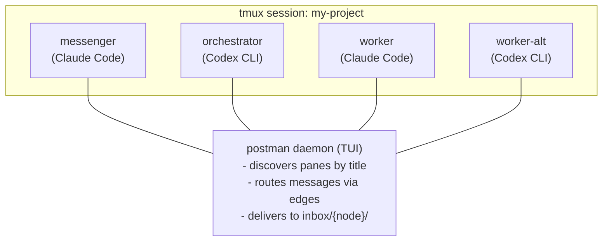
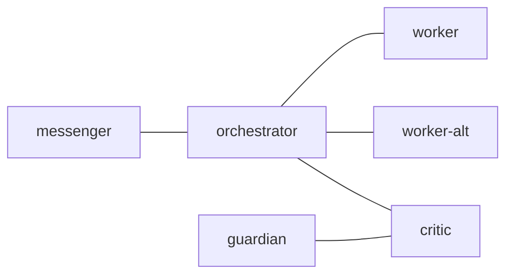

# tmux-a2a-postman

tmux agent-to-agent message delivery daemon.

## 1. Prerequisites

- tmux >= 3.0

## 2. Installation

```sh
go install github.com/i9wa4/tmux-a2a-postman@latest
```

Or with Nix:

```sh
nix run github:i9wa4/tmux-a2a-postman
```

## 3. Concept

tmux-a2a-postman is a **daemon** that discovers AI agents running in tmux
panes and routes messages between them via filesystem-based inboxes.


```mermaid
graph TD
    subgraph "tmux session: my-project"
        messenger["messenger\n(Claude Code)"]
        orchestrator["orchestrator\n(Codex CLI)"]
        worker["worker\n(Claude Code)"]
        worker-alt["worker-alt\n(Codex CLI)"]
    end
    daemon["postman daemon (TUI)\n- discovers panes by title\n- routes messages via edges\n- delivers to inbox/{node}/"]
    messenger --- daemon
    orchestrator --- daemon
    worker --- daemon
    worker-alt --- daemon
```

### 3.1. Message Flow

1. Agent sends: `tmux-a2a-postman send-message --to worker --body "implement X"`
2. Daemon picks up the message from `post/`
3. Daemon checks edge rules (is sender allowed to talk to recipient?)
4. Message delivered to `inbox/worker/`
5. Daemon injects notification into worker's pane via `tmux send-keys`
6. Worker reads with `tmux-a2a-postman next`
7. Footer is appended with reply command and `can_talk_to` list

### 3.2. Node Discovery

Agents are discovered by their **tmux pane title**. Set titles to match node
names defined in the configuration:

```sh
tmux rename-pane orchestrator
tmux rename-pane worker
```

## 4. Configuration

Configuration uses two file formats: TOML for structural settings and Markdown
for templates. Both live in `$XDG_CONFIG_HOME/tmux-a2a-postman/`.

### 4.1. Edges and Node Topology

Define which nodes can communicate using edges:


```mermaid
graph LR
    messenger --- orchestrator
    orchestrator --- worker
    orchestrator --- worker-alt
    orchestrator --- critic
    guardian --- critic
```

In `postman.md`, define edges with the same Mermaid syntax inside an
`` ## `edges` `` section. Or in `postman.toml`:

```toml
[postman]
edges = [
  "messenger -- orchestrator",
  "orchestrator -- worker",
  "orchestrator -- worker-alt",
  "orchestrator -- critic",
  "guardian -- critic",
]
```

Messages sent to nodes without a valid edge are moved to `dead-letter/`.

### 4.2. Node Role Templates

Define each node's role, on_join message, and template in `postman.md`:

````markdown
## `worker`

### `role`

Primary task executor.

### `on_join`

You are worker. Execute assigned tasks.

### Workflow

Execute tasks from orchestrator. Report DONE or BLOCKED.
````

Or as separate files in `nodes/worker.md`.

### 4.3. File Layout

```text
$XDG_CONFIG_HOME/tmux-a2a-postman/
  postman.toml          # structural config (timing, thresholds)
  postman.md            # templates, edges (Mermaid), node definitions
  nodes/
    worker.md           # per-node template (optional, overrides postman.md)
    orchestrator.md
```

### 4.4. Project-Local Override

Place config files in `.tmux-a2a-postman/` inside your project directory
to override XDG config:

```text
your-project/
  .tmux-a2a-postman/
    postman.toml        # structural overrides
    postman.md          # template overrides
    nodes/
      worker.md
```

**Nix/home-manager users:** if your XDG config is read-only Nix store
symlinks, use project-local overrides.

### 4.5. Priority Order (highest to lowest)

1. Project-local `postman.md`
2. Project-local `nodes/*.md`
3. Project-local `nodes/*.toml`
4. Project-local `postman.toml`
5. XDG `postman.md`
6. XDG `nodes/*.md`
7. XDG `nodes/*.toml`
8. XDG `postman.toml`
9. Embedded defaults (`internal/config/postman.default.toml`)

All default values are defined in `postman.default.toml` (SSOT).

## 5. Running the Daemon

```sh
# Start daemon (interactive TUI)
tmux-a2a-postman start

# Headless mode (no TUI; for CI or automated environments)
tmux-a2a-postman start --no-tui

# Stop daemon
tmux-a2a-postman stop
```

## 6. Directory Structure

```text
$XDG_STATE_HOME/tmux-a2a-postman/
  session-{contextId}/
    {sessionName}/
      inbox/{node}/     # incoming messages per node
      post/             # outgoing messages (daemon picks up)
      draft/            # message drafts
      read/             # archived messages
      dead-letter/      # undeliverable messages
```

## 7. Deployment Topology

| Topology                    | tmux servers | Daemons | Machines |
| --------------------------- | ------------ | ------- | -------- |
| Single daemon               | 1            | 1       | 1        |
| Multi-daemon, same machine  | 1            | N       | 1        |
| Multi-daemon, cross-machine | N            | N       | N        |

Each daemon maintains its own `{base_dir}/{contextId}/` state directory.
Only one daemon may have a given tmux session set to ON at a time.

See `docs/design/daemon-session-model.md` for the full daemon/session model.

## 8. CLI Reference

Run `tmux-a2a-postman --help` for the full command list.

## 9. Skills

The `skills/` directory contains reusable agent skill files for AI coding
assistants (Claude Code, Codex CLI, etc.). Each skill lives at
`skills/{skill-name}/SKILL.md`.

- **a2a-role-auditor**: Audits node role templates to diagnose and fix
  node-to-node interaction breakdowns.
