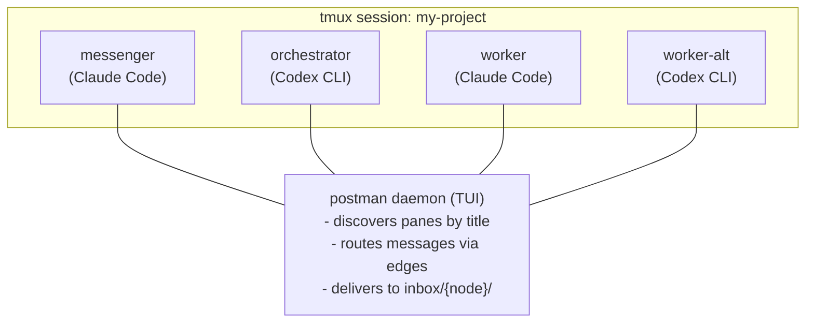
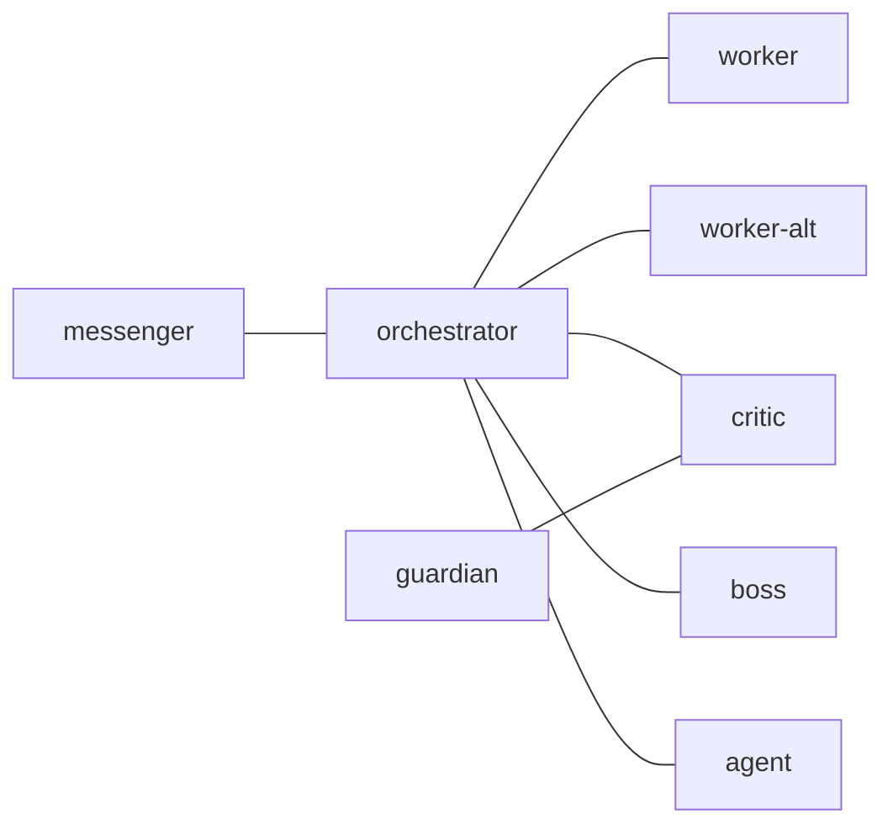

# tmux-a2a-postman

tmux agent-to-agent message delivery daemon.

## 1. Prerequisites

- tmux >= 3.0

## 2. Installation

```sh
go install github.com/i9wa4/tmux-a2a-postman@latest
```

Or with Nix:

```sh
nix run github:i9wa4/tmux-a2a-postman
```

## 3. Concept

tmux-a2a-postman is a **daemon** that discovers AI agents running in tmux
panes and routes messages between them via filesystem-based inboxes.


```mermaid
graph TD
    subgraph "tmux session: my-project"
        messenger["messenger\n(Claude Code)"]
        orchestrator["orchestrator\n(Codex CLI)"]
        worker["worker\n(Claude Code)"]
        worker-alt["worker-alt\n(Codex CLI)"]
    end
    daemon["postman daemon (TUI)\n- discovers panes by title\n- routes messages via edges\n- delivers to inbox/{node}/"]
    messenger --- daemon
    orchestrator --- daemon
    worker --- daemon
    worker-alt --- daemon
```

### 3.1. Message Flow

Example: orchestrator delegates a task to worker.

1. orchestrator sends:
   `tmux-a2a-postman send --to worker --body "implement X"`
2. Daemon routes the message (edge rules enforced)
3. worker is notified in their pane
4. worker reads: `tmux-a2a-postman pop`
5. worker replies:
   `tmux-a2a-postman send --to orchestrator --body "DONE: ..."`

For thread-bound review or approval traffic, add a durable `thread_id` inside
the message `params:` block. Non-thread traffic can omit it. When present, the
daemon preserves that `thread_id` in journal-backed mailbox shadow and
mailbox events, and approval projection only materializes from events that carry
the durable thread identity.

### 3.2. ui_node

`ui_node` is an optional target filter for startup auto-PING. Leave it empty to
PING every discovered node, or set it when only one human-facing node should
receive the daemon's startup PING.

```toml
[postman]
ui_node = "messenger"
```

### 3.3. Node Discovery

Agents are discovered by their **tmux pane title**. Set titles to match node
names referenced by the topology edges:

```sh
tmux select-pane -T orchestrator
tmux select-pane -T worker
```

## 4. Configuration

Configuration uses two file formats: TOML for structural settings and Markdown
for templates and topology notes. Both live in
`$XDG_CONFIG_HOME/tmux-a2a-postman/`. `postman.toml` is optional; without it,
embedded defaults from `internal/config/postman.default.toml` are used.

### 4.1. Edges and Node Topology

Define which nodes can communicate using edges:


```mermaid
graph LR
    messenger --- orchestrator
    orchestrator --- worker
    orchestrator --- worker-alt
    orchestrator --- critic
    orchestrator --- boss
    guardian --- critic
    orchestrator --- agent
```

In `postman.md`:

````markdown
## `edges`


```mermaid
graph LR
    messenger --- orchestrator
    orchestrator --- worker
    orchestrator --- worker-alt
    orchestrator --- critic
    orchestrator --- boss
    guardian --- critic
    orchestrator --- agent
```
````

Or in `postman.toml`:

```toml
[postman]
edges = [
  "messenger --- orchestrator",
  "orchestrator --- worker",
  "orchestrator --- worker-alt",
  "orchestrator --- critic",
  "orchestrator --- boss",
  "guardian --- critic",
  "orchestrator --- agent",
]
```

Every node referenced by `edges` is materialized automatically. Define node
templates only when you need role-specific instructions.

Messages sent to nodes without a valid edge are moved to `dead-letter/`.

### 4.2. Node Role Templates

Define each node's role and template in `postman.md`:

````markdown
## `worker`

### `role`

Primary task executor.

### Workflow

Execute tasks from orchestrator. Report DONE or BLOCKED.
````

Or as separate files in `nodes/worker.md`.

Markdown frontmatter uses a small explicit subset. It is not real YAML.

Supported syntax:

- A leading `---` frontmatter block
- One single-line `key: value` pair per non-empty line
- Leading or trailing whitespace around a top-level `key: value` entry is
  trimmed
- Values may contain extra `:` characters because parsing splits on the first
  `:`
- Quotes are treated as literal characters

Unsupported syntax:

- List items such as `- worker`
- Nested mappings or indented continuation lines
- Multi-line values
- Comment lines inside frontmatter
- Unclosed frontmatter blocks

Unsupported frontmatter fails at load time with a precise error instead of being
silently ignored.

### 4.3. File Layout

```text
$XDG_CONFIG_HOME/tmux-a2a-postman/
  postman.toml          # optional structural overrides (timing, thresholds)
  postman.md            # templates, edges (Mermaid), node definitions
  nodes/
    worker.md           # per-node template (optional, overrides postman.md)
    orchestrator.md
```

### 4.4. Project-Local Override

Place config files in `.tmux-a2a-postman/` inside your project directory
to override XDG config:

```text
your-project/
  .tmux-a2a-postman/
    postman.toml        # structural overrides
    postman.md          # template overrides
    nodes/
      worker.md
```

**Nix/home-manager users:** if your XDG config is read-only Nix store
symlinks, use project-local overrides.

### 4.5. Runtime status model

`get-health`, `get-health-oneline`, and the default TUI are views over the same
canonical contract. Agents should prefer `get-health` for structured session
JSON and `get-health-oneline` for compact coordination. The per-node visible
states are `ready`, `pending`, and `stale`. Session-level `unavailable` is a
fallback that means the current daemon is not authoritative for canonical
status; it is not a per-node state.

`get-health` includes queue counts, node-level visible states, and window
grouping for the current tmux session.

Quick reading guide:

- Canonical visible state for a node right now: `pending` means the node has
  unread inbox mail.
- `stale` means the pane is missing, stale, or otherwise not currently ready.
- A pane hint telling a node to run `tmux-a2a-postman pop` means delivery
  reached that node's inbox; this is a pane notification, not a new state.
  Read `docs/design/notification.md`.

Core public knobs for this model live in embedded defaults and optional
`postman.toml` overrides:

- `ui_node`
- `retention_period_days`
- `message_footer`
- `notification_template`
- `min_delivery_gap_seconds`

For stored messages written by `send`, reply guidance comes from
`message_footer` in `internal/config/postman.default.toml`. TOML config and XDG
`postman.md` can replace that footer; project-local `postman.md` appends its
`message_footer` to the effective base footer. `pop` returns JSON that includes
the stored message content as written and does not add a second hard-coded reply
footer.

### 4.6. Priority Order (highest to lowest)

1. Project-local `postman.md`
2. Project-local `nodes/*.md`
3. Project-local `nodes/*.toml`
4. Project-local `postman.toml`
5. XDG `postman.md`
6. XDG `nodes/*.md`
7. XDG `nodes/*.toml`
8. XDG `postman.toml`
9. Embedded defaults (`internal/config/postman.default.toml`)

All user-configurable default values are defined in `postman.default.toml`
(SSOT). See [docs/design/config-ssot.md](docs/design/config-ssot.md).

## 5. Running the Daemon

```sh
# Start daemon (interactive single-column TUI)
tmux-a2a-postman start

# Stop daemon
tmux-a2a-postman stop
```

The default operator loop is `send`, `pop`, and `get-health-oneline`. Agent
coordination can use `get-health` when it needs structured runtime state.
Lifecycle and recovery commands such as `start` and `stop` are also public.
Legacy and diagnostic helpers are internal, not CLI commands. Use explicit
subcommands; bare `tmux-a2a-postman` prints usage and does not start the
daemon.

## 6. Directory Structure

Base directory resolution, in priority order

1. `$POSTMAN_HOME`
2. `base_dir` in config
3. `$XDG_STATE_HOME/tmux-a2a-postman`

Falls back to `~/.local/state/tmux-a2a-postman` when `XDG_STATE_HOME` is unset

```text
{baseDir}/
  lock/                 # preserved: session locks for live-daemon ownership
  {contextId}/
    postman.log         # disposable: startup retention may prune inactive contexts
    pane-activity.json  # disposable: startup retention may prune inactive contexts
    {sessionName}/
      postman.pid       # live-daemon marker for this tmux session
      draft/            # internal: draft staging area (use send instead)
      post/             # internal: outbox queue managed by postman daemon
      inbox/{node}/     # daemon delivers messages here
      read/             # agent moves messages here after reading
      dead-letter/      # unroutable messages land here
```

Runtime lifecycle classes

| Path | Lifecycle | Startup retention behavior |
| ---- | --------- | -------------------------- |
| `{baseDir}/lock/` | Active coordination state | Always preserved |
| `{baseDir}/{contextId}/{sessionName}/` | Session runtime state | Eligible only when the context has no live `postman.pid` anywhere under it |
| `{baseDir}/{contextId}/postman.log` | Context-local log | Eligible only when the context is inactive |
| `{baseDir}/{contextId}/pane-activity.json` | Context-local pane snapshot cache | Eligible only when the context is inactive |

`retention_period_days` controls that startup cleanup window. The embedded
default is `90`. Set it to `0` to disable the broader inactive-context sweep.
Cleanup keeps base directory and XDG resolution unchanged, skips any context
with a live daemon, and preserves unknown entries by default instead of
guessing.

## 7. Deployment Model

The default operator model is one daemon process per Unix user. Start one
daemon and treat it as the canonical status authority for the tmux sessions it
observes.

Only one live daemon may own a given tmux session at a time, and `start`
rejects a second daemon for the same Unix user. A different Unix user's daemon
is not treated as the current user's owner.

See `docs/design/daemon-session-model.md` for the full daemon/session model.

## 8. CLI Reference

The README teaches the beginner/operator loop. Use
[docs/commands.md](docs/commands.md) as the exact CLI reference for flag
tables, JSON output shapes, and canonical command names.

Default operator surface:

```text
tmux-a2a-postman send --to worker --body "hello"
tmux-a2a-postman pop
tmux-a2a-postman get-health
tmux-a2a-postman get-health-oneline
tmux-a2a-postman version
```

Lifecycle and recovery:

```text
tmux-a2a-postman start
tmux-a2a-postman stop
tmux-a2a-postman help [TOPIC]       # built-in help
tmux-a2a-postman send --help        # subcommand help
```

## 9. Skills

The `skills/` directory contains reusable agent skill files for AI coding
assistants (Claude Code, Codex CLI, etc.). Each skill lives at
`skills/{skill-name}/SKILL.md`.

- send: Sends messages to another node using tmux-a2a-postman send.
- a2a-role-auditor: Audits node role templates to diagnose and fix
  node-to-node interaction breakdowns.
