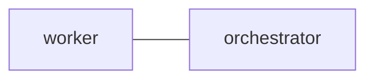

# Command Approvals

`execute-bash` is a wrapper for lightweight command approval choreography. It
records command metadata, asks for approval through a durable approval thread,
and applies the configured mode before running `bash -lc`.

## 1. Policy

Policies live in `postman.toml` under `[[postman.command_approval]]`.

```toml
[[postman.command_approval]]
requester = "worker"
label = "nix-build"
category = "verification"
reviewer = "orchestrator"
mode = "blocking"
approval_ttl_seconds = 900
```

`requester`, `label`, and `category` are match keys. Empty values and `*`
match any value. CLI flags may override `reviewer`, `mode`, and expiry for a
single command.

`reviewer` is a plain audit label with no topology meaning.
`command_approver_node` is different: it names one real, configured node (same
family as `ui_node`) by marking that node in the `postman.md` Mermaid graph:

````markdown
## `edges`


````

It is global for the whole configuration and is what makes a mode restrictive
at all — see the fail-open rule below. Per-policy approver routing is not
supported; every execute-bash policy shares the single class-designated
approver.

Migration note: legacy `[postman] command_approver_node` and
`[[postman.command_approval]] command_approver_node` keys in `postman.toml` are
ignored with a deprecation warning. Move the approver marker to `postman.md`
before relying on `blocking`; until the Mermaid class resolves to a configured
node, command approval intentionally fails open and records
`auto_approved_no_reviewer`. `get-status` also reports ignored legacy TOML
approver keys under `command_approval.deprecated_command_approvers`; a migration
is complete only when both `command_approval.unresolved_command_approvers` and
`command_approval.deprecated_command_approvers` are absent.

### 1.1. Fail-open rule (#626)

Unless a VALID `command_approver_node` is configured — the Mermaid class is set
AND resolves to a node that actually exists in this config — every command is
treated as approved, in every mode, including `blocking`. This covers both an
unconfigured `command_approver_node` and one that names a node that doesn't
exist (a typo). Approval only becomes restrictive once a valid
`command_approver_node` exists.

Such commands are recorded with the decision `auto_approved_no_reviewer`,
distinct from a real recorded approval, so the audit trail never confuses the
two. A configured-but-unresolvable `command_approver_node` also produces a
load-time warning and a visible `command_approval.unresolved_command_approvers`
marker in `get-status`, so a typo that silently disables blocking mode is loud
rather than a silent no-op.

Ignored legacy TOML `command_approver_node` values produce
`command_approval.deprecated_command_approvers` markers in `get-status`. Treat
that status field as a migration failure: the TOML key is ignored, and approval
remains fail-open unless the Mermaid `command_approver_node` resolves to a
configured node.

## 2. Running Commands

```sh
tmux-a2a-postman execute-bash \
  --label nix-build \
  --category verification \
  --reason "verify release build" \
  --command "nix build"
```

The wrapper stores requester, reviewer, label, category, mode, command digest,
reason, expiry, approval thread id, decision, and exit status. Full command
text is omitted by default. Add `--store-command-text` only when the command
body is safe to keep in the local audit log.

## 3. Modes

`advisory` records the request and audit metadata, warns when approval is not
present, and continues.

`warn-only` records the request and refuses execution unless
`--override-approval` is supplied. The override is recorded in the audit event.

`blocking` refuses wrapper-mediated execution unless the matching approval
thread has a non-expired approved decision from the configured reviewer for the
exact command digest. Missing, stale, rejected, expired, wrong-reviewer, and
changed-digest approvals do not run.

## 4. Decisions

When `execute-bash` requests approval, it prints the approval thread id in the
wrapper metadata. The configured `command_approver_node`, running
`--record-decision` from its own pane, can decide the thread explicitly:

```sh
tmux-a2a-postman execute-bash \
  --thread-id command-approval-... \
  --record-decision approved \
  --reason "digest reviewed"
```

The decision's reviewer identity always comes from the calling process's own
tmux pane title, never from a flag; a `--reviewer` flag passed here has no
effect on the outcome. A caller whose pane identity is not the thread's
`command_approver_node` is refused with an error and no decision is recorded
(#626 B1-residual).

Use `--record-decision rejected` to reject a pending command.

### 4.1. Delivery to a valid command_approver_node (#626)

When a valid `command_approver_node` is configured and a command needs approval,
`execute-bash` also delivers a reply-required postman message to that node
directly, carrying the command hash, label, mode, and the approval thread id
— so the reviewer does not have to poll `inspect-command-approvals`. To
record a decision by replying instead of running `--record-decision`
directly, start the reply body with `APPROVED: <reason>` or
`NOT APPROVED: <reason>` and keep the given `thread_id` in the reply's own
frontmatter; the daemon records the decision automatically on delivery. A
reply on a command approval thread whose body does not start with one of
those two prefixes is logged as a warning and not recorded as a decision at
all — use `--record-decision` directly if you need to attach a reply body
that doesn't fit that convention. Delivery itself is best-effort — a
delivery failure (for example, the command_approver_node is not currently
discoverable) is logged but never blocks or duplicates the already-journaled
approval request.

Only a reply whose sender matches the request's config-resolved
`command_approver_node` is ever honored; a reply from anyone else is recorded as
`wrong_reviewer` and has no effect on the command, regardless of what the
policy's `reviewer` audit label says (#626 B1) — the `reviewer` label itself
is a plain, requester-influenceable string and has no bearing on this check.

The same authenticated-caller requirement applies to `--record-decision` (#626
B1-residual): the decision's reviewer identity is always the calling process's
own tmux pane title, never the `--reviewer` flag. A caller whose pane identity
is not the thread's `command_approver_node` is refused outright, with no
decision recorded — passing `--reviewer <command_approver_node_name>` on the
command line has no effect on this check, since that name is a plain, readable
config value, not proof of who is actually calling.

## 5. Inspection

Command approval state is inspectable without re-running the command:

```sh
tmux-a2a-postman inspect-command-approvals
```

The output shows each approval thread with requester, reviewer, label,
category, digest, reason, expiry, timestamps, and status.

## 6. Boundary

This is coordination, not enforcement. `execute-bash` does not sandbox bash,
prevent direct shell execution, prevent another process from running the same
command, or enforce OS-level policy. Use it to make agent command review
explicit and auditable inside a Postman session.
