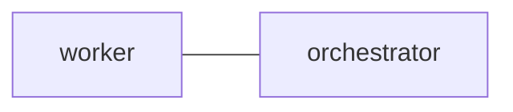

# Command Approvals

`execute-bash` is a wrapper for lightweight command approval choreography. It
records command metadata, asks for approval through a durable approval thread,
and applies the configured mode before running `bash -lc`.

## 1. Policy

Policies live in `postman.toml` under `[[postman.command_approval]]`.

```toml
[[postman.command_approval]]
requester = "worker"
label = "nix-build"
category = "verification"
reviewer = "orchestrator"
mode = "blocking"
approval_ttl_seconds = 900
```

`requester`, `label`, and `category` are match keys. Empty values and `*`
match any value. CLI flags may override `reviewer`, `mode`, and expiry for a
single command.

`reviewer` is a plain audit label with no topology meaning.
`command_approver_node` is different: it names one real, configured node (same
family as `ui_node`) by marking that node in the `postman.md` Mermaid graph:

````markdown
## `edges`


```mermaid
graph LR
    worker --- orchestrator
    class orchestrator command_approver_node
```
````

It is global for the whole configuration. An absent approver leaves every mode
fail-open; a configured-but-unresolvable approver makes `blocking` fail closed.
See the rule below. Per-policy approver routing is not supported; every
execute-bash policy shares the single class-designated approver.

Migration note: legacy `[postman] command_approver_node` and
`[[postman.command_approval]] command_approver_node` keys in `postman.toml` are
ignored with a deprecation warning. Move the approver marker to `postman.md`
before relying on `blocking`; without a Mermaid approver, command approval
intentionally fails open and records `auto_approved_no_reviewer`. `get-status`
also reports ignored legacy TOML approver keys under
`command_approval.deprecated_command_approvers`; a migration is complete only
when both `command_approval.unresolved_command_approvers` and
`command_approval.deprecated_command_approvers` are absent.

### 1.1. Fail-open rule (#626)

An absent `command_approver_node` makes every command treated as approved, in
every mode, including `blocking`. Such commands are recorded with the decision
`auto_approved_no_reviewer`, distinct from a real recorded approval, so the
audit trail never confuses the two.

A configured-but-unresolvable `command_approver_node` is different. In
`blocking` mode the wrapper fails closed and does not run the command. In
`advisory` and `warn-only` modes, the existing nonblocking semantics remain:
`advisory` continues after recording and `warn-only` still requires an explicit
override. The unresolved name also produces a load-time warning and a visible
`command_approval.unresolved_command_approvers` marker in `get-status`.

Ignored legacy TOML `command_approver_node` values produce
`command_approval.deprecated_command_approvers` markers in `get-status`. Treat
that status field as a migration failure: the TOML key is ignored, so approval
remains fail-open unless a Mermaid `command_approver_node` is configured.

## 2. Running Commands

```sh
tmux-a2a-postman execute-bash \
  --label nix-build \
  --category verification \
  --reason "verify release build" \
  --command "nix build"
```

The wrapper stores requester, reviewer, label, category, mode, command digest,
reason, expiry, approval thread id, decision, and exit status. Full command
text is omitted by default. Add `--store-command-text` only when the command
body is safe to keep in the local audit log.

## 3. Modes

`advisory` records the request and audit metadata, warns when approval is not
present, and continues.

`warn-only` records the request and refuses execution unless
`--override-approval` is supplied. The override is recorded in the audit event.

`blocking` refuses wrapper-mediated execution unless the matching approval
thread has a non-expired approved decision from the configured reviewer for the
exact command digest. Missing, stale, rejected, expired, wrong-reviewer, and
changed-digest approvals do not run. Missing, stale, rejected, expired, and
wrong-reviewer threads are retryable (#823 F-012): repeating the identical
command mints a fresh request instead of resurfacing the old terminal
diagnosis forever — see
[3.1](#31-waiting-for-the-decision-synchronously-823) below. A changed-digest
mismatch is a refusal, not a retryable state: it never mints a new request.

`blocking` is the default mode (#753) when neither a matching policy nor
`--mode` sets one explicitly. A configured `command_approver_node` that never
answers now halts the calling agent's work by default, where it previously
only produced an `advisory` warning; see
[3.2. Recovering when a blocking approval never lands](#32-recovering-when-a-blocking-approval-never-lands-753)
for how to get unstuck.

### 3.1. Waiting for the decision synchronously (#823)

With a trusted, resolvable `command_approver_node`, `blocking` mode keeps the
`execute-bash` call open by default and polls the local approval projection
(every 500ms) until the matching thread reaches a decision, a bounded
deadline passes, or the process is interrupted. On approval it runs the
command in the *same invocation* — the requester never has to inspect a
separate decision message and reconstruct or resubmit the original command.

```sh
tmux-a2a-postman execute-bash \
  --label nix-build \
  --category verification \
  --reason "verify release build" \
  --command "nix build"
# blocks here, polling, until the reviewer decides (or the wait times out)
```

- `--wait-timeout-seconds <n>` bounds how long the wait can run; the default
  is 300 (5 minutes). Waiting is never indefinite.
- `--no-wait` opts back into the SAME IMMEDIACY guarantee `execute-bash` had
  before #823: it returns the current pending/blocked result right away,
  never polling. It is not otherwise identical to pre-#823 behavior (#823
  F-007): a blocked outcome's `--json` `status` and process exit code now
  follow the same distinguishable-outcomes contract described below
  (`rejected`/`expired`/... and exit codes 10+) instead of the old generic
  `"blocked"` status and exit code 1. This status/exit-code change is
  intentional and applies whether or not `--no-wait` is set — `--no-wait`
  only controls whether the call waits, not which status/exit code a given
  outcome reports.
- Fail-open (#626, no `command_approver_node` configured) and fail-closed (a
  configured but unresolvable `command_approver_node`) are unaffected by
  waiting — those decisions are made before the wait loop is ever
  considered, so an absent or unresolvable approver still behaves exactly as
  in [1.1. Fail-open rule](#11-fail-open-rule-626).
- Rejection, expiry, a wait timeout, cancellation (SIGINT/SIGTERM), a
  requester mismatch on a reused `--thread-id`, a failed or lost delivery to
  the approver, a context/session-generation change mid-wait, a repeated
  claim on an already-executed approval, a changed command digest, no live
  current session writer, and a few other terminal outcomes each surface a
  distinct `--json` `status` field and a distinct process exit code (10-23:
  rejected=10, expired=11, wait_timeout=12, cancelled=13, digest_mismatch=14,
  wrong_reviewer=15, stale=16, historical_only=17, requester_mismatch=18,
  delivery_failed=19, approver_lost=20, session_changed=21,
  already_executed=22, session_unavailable=23), so a caller scripting
  against `execute-bash` can distinguish "the approver said no" from
  "nobody answered in time" from "I was interrupted" without parsing the
  reason string.
- **#823 F-006 — read this before scripting against exit codes.** These
  exit codes are NOT guaranteed distinct from an executed command's own
  exit status: a command that itself exits 10 is numerically
  indistinguishable, on the bare exit code alone, from a rejected approval
  (also exit 10). The wrapper does not remap or reserve a code range the
  target command can never produce. The authoritative way to tell the two
  apart is the `--json` wrapper metadata's `status` field — one of the
  decision names above (the command never ran) versus `"exited"` with
  `exit_status` set (the command ran and exited with that status). Do not
  rely on the bare numeric exit code alone when that distinction matters.
- One approval is single-use (#823 F-001): once a real, thread-backed
  blocking-mode approval executes the command, an atomic claim event
  (`command_execution_claimed`) is journaled for that exact
  thread/input-request/command-digest. Every other invocation racing for
  the same approval — concurrent waiters, or a repeated call while the
  approval is still within its TTL — observes the existing claim and
  refuses with `already_executed` instead of running the command again.
  This changes the pre-#823 semantics, where a still-valid approved thread
  could authorize the command any number of times within its TTL. Fail-open
  (`auto_approved_no_reviewer`) and non-blocking-mode executions are not
  claimed — there is no scarce human decision to consume there.
- The wait binds itself to its starting correlation and re-checks it on
  every poll, and again immediately before accepting an approval or
  claiming it (#823 F-002/F-004/F-005): a retry against a still-pending
  thread reuses the thread's existing request instead of overwriting its
  correlation (which used to be able to strand the first waiter's approval
  reply), a decision on a thread belonging to a different requester is
  never accepted even when `--thread-id` and the command digest both
  match, and a context or session-generation change — even one landing in
  the narrow window right before the command is claimed and run — ends the
  wait with a distinct `session_changed` outcome instead of silently
  polling toward a generic timeout or claiming anyway.
- Retrying the identical command is safe and converges instead of
  permanently sticking on an old outcome (#823 rework-2, F-012/F-013). One
  unified rule governs every call: no request yet → a fresh one is created
  (two truly concurrent first callers still converge on exactly one
  request); a still-pending request → the exact same request is reused and
  re-delivered (this also recovers a request whose earlier delivery
  attempt failed, #823 F-013, without minting a duplicate); a request that
  ended rejected, expired, stale, historical-only, or wrong-reviewer → the
  next call atomically mints a fresh request superseding it, so none of
  those outcomes can block a future retry forever; a requester mismatch,
  digest mismatch, or unresolvable approver is a refusal and never mints
  anything; and an approved-and-already-executed thread stays
  `already_executed` until its own TTL expires, only then becoming
  retryable like any other expired thread. See
  [3.2](#32-recovering-when-a-blocking-approval-never-lands-753) for how to
  recover `already_executed` sooner than the TTL, if needed.
- Cancellation and the deadline always win over a late approval (#823
  F-005): both are checked before the wait loop accepts any decision on
  each iteration, again immediately before claiming, and again immediately
  after the claim succeeds and before the command actually runs — so a
  SIGINT/SIGTERM caught at any of these points, including precisely during
  the claim itself, still stops the command; the approval stays consumed
  (single-use either way) but never executes.
- A concurrent race for the same thread never lets the loser deliver a
  misleading prompt (#823 rework-3 F-015): when two callers race to mint or
  replace a request for the same thread id (for example two concurrent
  explicit `--thread-id` calls with different `--label`/`--category`), the
  loser validates its own requester, trusted approver, command digest, and
  policy against the request that actually won the race. On a mismatch it
  refuses with `requester_mismatch` and sends no prompt at all, rather than
  delivering a prompt built from its own policy under the winner's
  thread/input-request correlation.
- Blocking mode never falls back to a shadow-bootstrapped session for
  minting a request or claiming an approval (#823 rework-3 F-002): if there
  is no live current session writer yet (a genuine cold start, before this
  session has any daemon-owned or previously-bootstrapped state), the call
  refuses immediately with `session_unavailable` instead of racing a
  session bootstrap that could otherwise land two first-ever calls in two
  different generations. Advisory and warn-only modes are unaffected and
  keep their prior behavior. A later call in the same, now-bootstrapped
  session proceeds normally.
- Delivery failure and mid-wait approver loss are distinct, fast outcomes
  (#823 F-003): a request that fails to deliver to the approver returns
  `delivery_failed` immediately rather than waiting out the full timeout on
  a request the approver never saw, and the wait periodically re-verifies
  the approver is still discoverable, returning `approver_lost` if it
  disappears mid-wait.

### 3.2. Recovering when a blocking approval never lands (#753)

A `blocking` command that has requested approval but received no decision
by the time `--wait-timeout-seconds` elapses (or immediately, with
`--no-wait`) leaves a `pending` thread and refuses to run. To recover:

1. Inspect the pending thread without re-running the command:

   ```sh
   tmux-a2a-postman inspect-command-approvals
   ```

   This shows the thread id, requester, reviewer, label, category, digest,
   reason, expiry, and current status for every outstanding request.
2. If the configured `command_approver_node` is reachable, have it record a
   decision through the normal path — either by replying `APPROVED: <reason>`
   or `NOT APPROVED: <reason>` to the delivered approval request (see
   [4.1](#41-delivery-to-a-valid-command_approver_node-626)), or by running
   `--record-decision` directly from that node's own pane:

   ```sh
   tmux-a2a-postman execute-bash \
     --thread-id command-approval-... \
     --record-decision approved \
     --reason "digest reviewed"
   ```

3. If the approver is unavailable and the command genuinely needs to proceed
   without it, rerun with an explicit, deliberate mode override rather than
   waiting indefinitely — only where the requester is willing to accept
   non-blocking semantics for that one invocation:
   - `--mode advisory` records the request and audit metadata, then runs
     anyway.
   - `--mode warn-only --override-approval` records the request, and the
     override is captured in the audit event.
   Both leave a distinct, auditable trail (`advisory_unapproved` or
   `warn_override`) so the deviation from `blocking` is never silently lost.
4. As a last resort, running the command directly in the shell (bypassing
   `execute-bash` entirely) is the explicit, documented escape boundary
   described in [7. Boundary](#7-boundary): the wrapper coordinates review, it
   is not a sandbox, so nothing prevents this — but it also means no approval
   thread, decision, or audit record is created for that run.

If instead a call reports `already_executed` (#823 F-001) for a command that
genuinely needs to run again, the approval that already ran it is single-use
and cannot be reused. Either wait for that approval's own TTL to expire —
the next call then mints a brand-new request automatically (#823 F-012) — or
pass an explicit `--thread-id` naming a fresh, not-yet-used thread id to
start an independent approval cycle right away.

## 4. Decisions

When `execute-bash` requests approval, it prints the approval thread id in the
wrapper metadata. The configured `command_approver_node`, running
`--record-decision` from its own pane, can decide the thread explicitly:

```sh
tmux-a2a-postman execute-bash \
  --thread-id command-approval-... \
  --record-decision approved \
  --reason "digest reviewed"
```

The decision's reviewer identity always comes from the calling process's own
tmux pane title, never from a flag; a `--reviewer` flag passed here has no
effect on the outcome. A caller whose pane identity is not the thread's
`command_approver_node` is refused with an error and no decision is recorded
(#626 B1-residual).

Use `--record-decision rejected` to reject a pending command.

### 4.1. Delivery to a valid command_approver_node (#626)

When a valid `command_approver_node` is configured and a command needs approval,
`execute-bash` also delivers a reply-required postman message to that node
directly, carrying the command hash, label, mode, and the approval thread id
— so the reviewer does not have to poll `inspect-command-approvals`. To
record a decision by replying instead of running `--record-decision`
directly, start the reply body with `APPROVED: <reason>` or
`NOT APPROVED: <reason>` and keep all three generated correlation fields in
the reply's own frontmatter: `thread_id`, the exact
`fills_input_request_id`, and the exact `command_hash`; the daemon records the
decision automatically on delivery. A
reply on a command approval thread whose body does not start with one of
those two prefixes is logged as a warning and not recorded as a decision at
all — use `--record-decision` directly if you need to attach a reply body
that doesn't fit that convention. Delivery itself is best-effort — a
delivery failure (for example, the command_approver_node is not currently
discoverable) is logged but never blocks or duplicates the already-journaled
approval request.

Only a reply whose sender exactly matches the request's stored
session-qualified `command_approver_node` address is ever honored; a reply from
anyone else leaves the request pending and has no effect on the command,
regardless of what the policy's `reviewer` audit label says (#626 B1) — the
`reviewer` label itself is a plain, requester-influenceable string and has no
bearing on this check.

The same authenticated-caller requirement applies to `--record-decision` (#626
B1-residual): the decision's reviewer identity is always the calling process's
own tmux pane title, never the `--reviewer` flag. A caller whose pane identity
is not the thread's `command_approver_node` is refused outright, with no
decision recorded — passing `--reviewer <command_approver_node_name>` on the
command line has no effect on this check, since that name is a plain, readable
config value, not proof of who is actually calling.

## 5. Inspection

Command approval state is inspectable without re-running the command:

```sh
tmux-a2a-postman inspect-command-approvals
```

The output shows each approval thread with requester, reviewer, label,
category, digest, reason, expiry, timestamps, and status.

## 6. Decision History

Approver approval and rejection decisions are also accumulated as individual
JSON files under:

```text
<session-dir>/command-approval-decisions/
```

Each file is named from the underlying journal event sequence and id. The
layout is intentionally file-oriented instead of JSONL so maintainers can
inspect, copy, remove, or archive one decision record at a time with ordinary
filesystem tools.

The schema includes:

- `thread_id`, `decision`, and `effective_status`
- requester, reviewer audit label, and trusted `command_approver_node`
- label, category, mode, command digest, and request/decision reasons
- requested, expiry, and decided timestamps
- `decision_message_id` when the decision came from a reply

Raw command text is omitted by default. It appears only when the original
request opted into existing `--store-command-text` audit behavior, so the
decision history keeps the same privacy boundary as the durable journal.

Allowlist maintainers can search the accumulated history directly, for example:

```sh
find "$SESSION_DIR/command-approval-decisions" -name '*.json' -print
rg '"decision":"approved"|"decision":"rejected"' "$SESSION_DIR/command-approval-decisions"
```

No automatic retention policy deletes these records. Treat them as local,
owner-only audit data and rotate or archive the directory according to the
operator's local retention policy.

## 7. Boundary

This is coordination, not enforcement. `execute-bash` does not sandbox bash,
prevent direct shell execution, prevent another process from running the same
command, or enforce OS-level policy. Use it to make agent command review
explicit and auditable inside a Postman session.
