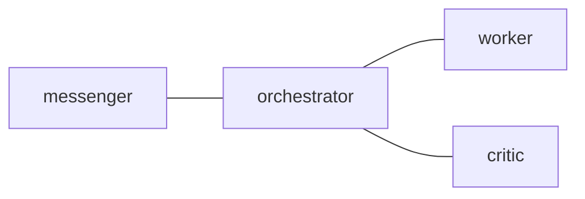

# CLI Command Reference

This page documents the supported public `tmux-a2a-postman` command surface.
The public surface is intentionally small: `start`, `stop`, `send`, `pop`,
`get-health`, `get-health-oneline`, `version`, `help`, and `--version`.

Use an explicit subcommand. Bare `tmux-a2a-postman` prints usage instead of
starting the daemon.

## 1. Command Overview

| Command              | Purpose                                 |
| -------------------- | --------------------------------------- |
| `start`              | Start the postman daemon                |
| `stop`               | Stop the running daemon                 |
| `send`               | Compose and send a message in one step  |
| `pop`                | Read and archive the next inbox message |
| `get-health`         | Print canonical session health JSON     |
| `get-health-oneline` | Print compact all-session health        |
| `version`            | Print the build version JSON            |
| `help [topic]`       | Print built-in help                     |
| `--version`          | Print the build version JSON            |

Legacy and diagnostic helpers are internal. They are not part of CLI dispatch
or the public operator contract.

## 2. Global Flags

The following flags are defined at the root level:

| Flag        | Type   | Default | Description                 |
| ----------- | ------ | ------- | --------------------------- |
| `--version` | bool   | false   | Print version JSON and exit |
| `--help`    | bool   | false   | Print help and exit         |
| `--config`  | string | ""      | Path to config file         |

Public flag tables omit internal dispatch and diagnostic flags.

## 3. Daemon Management

### 3.1. start

```text
tmux-a2a-postman start
```

Starts the daemon for the current Unix user. The public deployment model is one
daemon process per Unix user; the daemon owns the tmux sessions it observes.

### 3.2. stop

```text
tmux-a2a-postman stop
```

`stop` targets the current tmux session, is idempotent, and exits successfully
when no matching daemon is running. It prints JSON:

```text
{"status":"not_running","session":"review"}
{"status":"stopped","session":"review","context_id":"20240101-...","pid":12345}
```

## 4. Messaging

### 4.1. send

```text
tmux-a2a-postman send --to NODE --body TEXT
```

`send` is the primary command for agent-to-agent messaging. Sender and tmux
session are auto-detected from the current pane. It composes a message,
submits it to the daemon when possible, and reports the strongest outcome
observed during a short confirmation window.

Output is always JSON.

```text
{"sent":"20240101-120000-xxxx-from-worker.md","status":"processed","context_id":"...","session":"...","from":"worker","to":"critic","submit_path":"daemon-submit"}
{"sent":"20240101-120000-xxxx-from-worker.md","status":"queued","context_id":"...","session":"...","from":"worker","to":"critic","submit_path":"post"}
```

`submit_path=daemon-submit` means the CLI submitted the request to the running
daemon for a daemon-owned session. `submit_path=post` means the CLI handed the
message off by writing the session's `post/` queue directly.

| Flag     | Type   | Default | Description         |
| -------- | ------ | ------- | ------------------- |
| `--to`   | string | ""      | Recipient node name |
| `--body` | string | ""      | Message body        |

`processed` means the CLI observed daemon-side handling. `queued` means local
handoff succeeded, but daemon-side processing was not observed before the
confirmation window closed.

### 4.2. pop

```text
tmux-a2a-postman pop
```

`pop` reads the next unread inbox message for the current pane title and
archives the message after reading.

Output is always JSON. `content` preserves the stored message file exactly;
`body` is the parsed message body for convenience.

```text
{"status":"empty"}
{"status":"message","id":"filename.md","from":"...","to":"...","timestamp":"...","body":"...","content":"...","unread_before":1,"remaining":0}
```

Test for `status == "message"` before treating the response as a message.

## 5. Health and Status

### 5.1. get-health

```text
tmux-a2a-postman get-health
```

`get-health` prints the canonical status payload for the current tmux session.
This is the agent-readable shape for understanding peer state in that session.

```json
{
  "context_id": "20240101-...",
  "session_name": "review",
  "node_count": 4,
  "visible_state": "pending",
  "compact": "🔷",
  "queues": {
    "post_count": 0,
    "inbox_count": 2,
    "dead_letter_count": 0
  },
  "nodes": [
    {
      "name": "worker",
      "pane_id": "%11",
      "pane_state": "ready",
      "visible_state": "pending",
      "inbox_count": 2,
      "current_command": "claude"
    }
  ],
  "windows": [
    {"index": "0", "nodes": [{"name": "worker"}]}
  ]
}
```

Use `nodes[*].visible_state` for per-node state, `queues` for mailbox backlogs,
and `compact` for compact display tokens.

### 5.2. get-health-oneline

```text
tmux-a2a-postman get-health-oneline
```

`get-health-oneline` prints the compact all-session runtime line:

```text
[0]🔷:🟢 [1]🔴
```

Window groups are colon-separated emoji runs with no literal window labels.

## 6. Configuration

Configuration uses two file formats: TOML for structural settings and Markdown
for templates and topology notes. Both live in
`$XDG_CONFIG_HOME/tmux-a2a-postman/`, with optional project-local overrides in
`.tmux-a2a-postman/`.

`postman.toml` is optional. With no user TOML, embedded defaults from
`internal/config/postman.default.toml` are used. `postman.md` may contain only
a Mermaid `Edges` diagram; every node referenced by those edges is
materialized automatically.

Core public settings:

| Field                      | Purpose                                       |
| -------------------------- | --------------------------------------------- |
| `edges`                    | Bidirectional routes between nodes            |
| `ui_node`                  | Optional target filter for startup auto-PING  |
| `message_footer`           | Footer appended to stored `send` mail         |
| `notification_template`    | Pane hint rendered when mail arrives          |
| `min_delivery_gap_seconds` | Same-route delivery gap for duplicate control |
| `retention_period_days`    | Inactive runtime cleanup window               |

Edge syntax:

```toml
[postman]
edges = [
  "orchestrator -- worker",
  "orchestrator -- critic",
]
```

Markdown topology:

````markdown
## Edges


````

Embedded `postman.default.toml` is the SSOT for user-configurable defaults.
See [docs/design/config-ssot.md](design/config-ssot.md) for the policy.

## 7. Runtime Directory Lifecycle

Base directory resolution, in priority order:

1. `$POSTMAN_HOME`
2. `base_dir` in config
3. `$XDG_STATE_HOME/tmux-a2a-postman`

Runtime layout:

```text
{baseDir}/
  lock/                 # active coordination state
  {contextId}/
    postman.log
    pane-activity.json
    {sessionName}/
      postman.pid
      post/             # daemon input queue
      inbox/{node}/     # delivered unread messages
      read/             # archived messages
      dead-letter/      # unroutable messages
```

`retention_period_days` controls cleanup of inactive runtime state. Unknown
entries are preserved by default instead of being pruned by name.

## 8. Version

```text
tmux-a2a-postman version
tmux-a2a-postman --version
```

Both forms print the same JSON with the version embedded at build time. Nix
builds may show a version derived from the package metadata rather than from
the local Git tag.

```text
{"name":"tmux-a2a-postman","version":"dev","commit":"unknown"}
```

## 9. Help

```text
tmux-a2a-postman help
tmux-a2a-postman help send
tmux-a2a-postman help version
tmux-a2a-postman send --help
```

Help text is embedded from `internal/cli/helptext/*.txt`, so it ships inside
the binary while staying editable as plain text in the repository.
