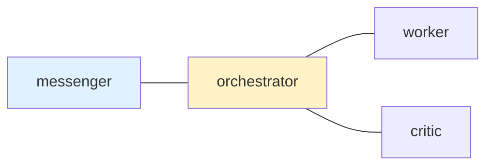

# Config SSOT

`internal/config/postman.default.toml` is the SSOT for user-configurable
defaults.

## 1. Policy

- `DefaultConfig()` initializes structural and derived containers only:
  `Edges`, `Nodes`, `NodeOrder`, `PingSkillCatalogs`, and
  `CompactionSkillCatalogs`.
- Non-zero defaults for public config fields belong in
  `internal/config/postman.default.toml`.
- `postman.toml` is optional. With no user TOML, embedded defaults are enough
  to run the daemon.
- A minimal `postman.md` may contain only a Mermaid `edges` section. Nodes
  referenced by those edges are materialized with empty `NodeConfig` values.
- The explicit human-facing startup PING target should normally be marked in
  Mermaid with the `ui_node` class, keeping topology-facing settings in one
  diagram.
- The execute-bash command approver should be marked in Mermaid with the
  `command_approver_node` class. This is a singleton topology-facing
  designation like `ui_node`; `[postman] command_approver_node` and per-policy
  `command_approver_node` keys in `postman.toml` are no longer user-facing
  config surfaces.
- `postman.md` frontmatter may set `skill_path` to generate an agent skill
  catalog from selected `SKILL.md` frontmatter without inlining skill bodies.
  Entries with omitted `inject` are appended to normal role context and remain
  runtime-agnostic.
- `postman.md` frontmatter `skill_path` entries with `inject: ping` generate
  catalogs for every daemon PING. Entries with `inject: compaction_ping`
  generate catalogs only for compaction-triggered daemon PINGs. Both stay out
  of normal role context. A YAML list containing `ping` and
  `compaction_ping` routes one selected catalog to multiple PING targets. These
  catalogs are runtime-agnostic; list explicit user-level skill tree paths for
  the catalogs to include.
- PING catalog paths must be global/user-level: `~/...` or absolute.
  Repo-local relative paths remain supported only for normal role catalogs and
  are invalid for PING catalogs.
- Rendered skill catalogs dedupe by frontmatter `name`. Later path entries
  override earlier entries with the same rendered name.
- Omitted `skills` means all skills under that path. A present `skills` value
  should be a YAML list of explicit skill directory names; `skills: [all]`
  selects a real skill named `all`. The scalar `skills: all` remains accepted
  as a legacy shorthand for existing configs.
- Runtime IDs, product names, and conventional skill-directory metadata are
  centralized in `internal/agentruntime`.
- XDG/global config and explicit `--config` files merge on top of embedded
  defaults. Implicit project-local `.tmux-a2a-postman/` overlays are not part
  of the runtime config surface.
- The daemon snapshots global/explicit config once during startup. Runtime
  filesystem watchers do not reload `postman.toml`, `postman.md`, or `nodes/*`;
  operators restart the daemon to apply config changes.
- Non-configurable implementation timings must be named constants in code, not
  inline literals or hidden public config fields.

## 2. Why

Operators should not need a large generated TOML file just to run postman. A
minimal setup can keep topology in Markdown and inherit all behavior from the
embedded default TOML.

Keeping defaults in one file also makes reviews easier: changing a public
default means changing `postman.default.toml`, docs, and tests together.

Claude Code and Codex CLI runtime differences are tracked separately in
[Agent Runtime Feature Differences](../agent-runtime-feature-differences.md).
Do not encode runtime-specific behavior in `postman.toml` defaults unless a
follow-up issue explicitly changes the public config surface.

## 3. Regression Guards

- `internal/config/config_test.go` asserts `DefaultConfig()` stays limited to
  structural containers.
- `internal/config/config_test.go` asserts each non-zero embedded default loaded
  into public TOML-tagged fields is declared in `postman.default.toml`.
- Config tests assert CWD-local `.tmux-a2a-postman/` files do not override XDG
  or explicit config.

## 4. Minimal Topology

````markdown
## `edges`


````

This creates `messenger`, `orchestrator`, `worker`, and `critic` nodes even
when no `[messenger]`, `[orchestrator]`, `[worker]`, or `[critic]` TOML sections
exist. The `ui_node` class explicitly marks `messenger` as the startup
auto-PING target. The `command_approver_node` class marks `orchestrator` as the
single execute-bash approver for all command approval policies.

## 5. Command Approver Migration

Legacy TOML-only command approver configs intentionally downgrade to fail-open
until migrated. During load, `command_approver_node` in `postman.toml` emits a
deprecation warning and is ignored. Because execute-bash only becomes
restrictive when a valid Mermaid `command_approver_node` resolves to a
configured node, blocking policies without the new class record
`auto_approved_no_reviewer` and run.

To migrate, move the approver designation into the `postman.md` Mermaid graph:


Restart the daemon after editing `postman.md`, then confirm `get-status` has no
`command_approval.unresolved_command_approvers` marker and no
`command_approval.deprecated_command_approvers` marker. The deprecated marker
lists ignored legacy TOML approver keys; its presence means stale TOML remains
in the effective config and the migration is not complete.
