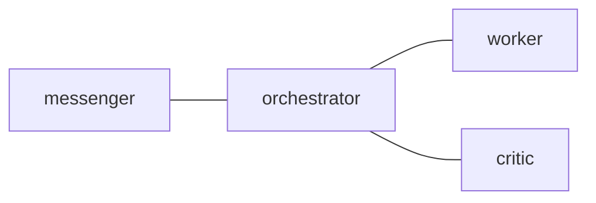

# Config SSOT

`internal/config/postman.default.toml` is the SSOT for user-configurable
defaults.

## Policy

- `DefaultConfig()` initializes structural containers only: `Edges`, `Nodes`,
  and `NodeOrder`.
- Non-zero defaults for public config fields belong in
  `internal/config/postman.default.toml`.
- `postman.toml` is optional. With no user TOML, embedded defaults are enough
  to run the daemon.
- A minimal `postman.md` may contain only a Mermaid `edges` section. Nodes
  referenced by those edges are materialized with empty `NodeConfig` values.
- `postman.md` frontmatter may set `skill_path` to generate an agent skill
  catalog from `*/SKILL.md` frontmatter without inlining skill bodies.
- Explicit XDG and project-local overrides merge on top of embedded defaults.
- Non-configurable implementation timings must be named constants in code, not
  inline literals or hidden public config fields.

## Why

Operators should not need a large generated TOML file just to run postman. A
minimal setup can keep topology in Markdown and inherit all behavior from the
embedded default TOML.

Keeping defaults in one file also makes reviews easier: changing a public
default means changing `postman.default.toml`, docs, and tests together.

## Minimal Topology

````markdown
## `edges`


````

This creates `messenger`, `orchestrator`, `worker`, and `critic` nodes even
when no `[messenger]`, `[orchestrator]`, `[worker]`, or `[critic]` TOML sections
exist.
