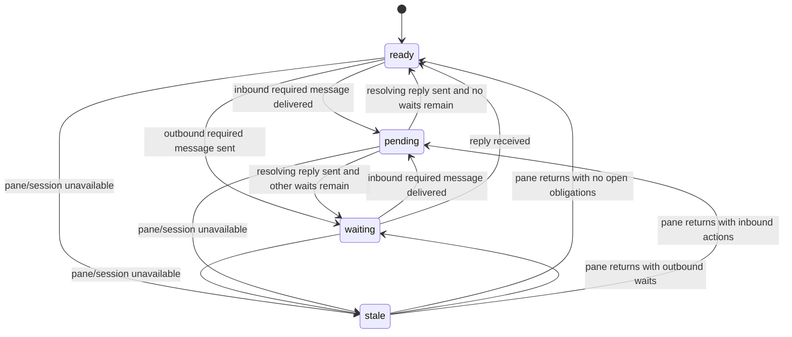

# Node State Machine

The visible node state model is intentionally small. It combines pane
availability with reply-obligation projection so agents can tell whether a node
has work, is blocked on another node, or is unavailable.

It is not a full conversation workflow model. Message files remain the source
of truth; health commands only replay their structured metadata and journal
events into a compact state.

## 1. Identity Hierarchy

The runtime protocol treats messages, threads, and obligations as separate
identities:

```text
thread_id
  message_id
    obligation_id
```

`message_id` is the immutable mailbox filename. Current generated frontmatter
keeps `messageId` for compatibility, while public JSON and journal payloads use
`message_id`. `thread_id` is optional for ordinary mail and required by
thread-bound approval/review events. `obligation_id` is generated only for
reply-required mail and identifies the exact reply unit opened for the
recipient.

Task identity is intentionally not transport metadata. A task may exist in an
external planner, issue, or markdown artifact, but the daemon does not generate
or interpret `task_id`.

### Naming Rationale

Identity names are chosen to make lifecycle size visible to a new operator:

| Name                  | Scale                         | Why it is not another name                                  |
| --------------------- | ----------------------------- | ----------------------------------------------------------- |
| `message_id`          | One delivered mailbox record  | A message is the smallest transport record, not a workflow. |
| `thread_id`           | Conversation or workflow line | A thread can contain many messages and obligations.         |
| `obligation_id`       | One required-reply action     | An obligation is action state opened by one required reply. |
| `obligation_group_id` | Multi-recipient aggregate     | A group can contain several obligation branches.            |
| `branch_id`           | One branch inside a group     | A branch is smaller than a group but still action-scoped.   |
| `task_id`             | External work item            | A task is broader than transport and has no daemon owner.   |

The names do not try to encode a strict parent/child hierarchy. They distinguish
scale: a single delivered message, a conversational thread, an actionable
required-reply obligation, and an optional aggregate for multi-recipient
completion rules. This keeps `task_id` and `obligation_id` from sounding like
same-scale runtime concepts: task identity belongs to an external planning
layer, while obligation identity belongs to daemon health and reply projection.

## 2. State Surfaces

| Surface                  | Values                                                 | Meaning                                                   |
| ------------------------ | ------------------------------------------------------ | --------------------------------------------------------- |
| `nodes[*].pane_state`    | `active`, `idle`, `stale`                              | Pane availability and activity fact                       |
| `nodes[*].visible_state` | `ready`, `waiting`, `pending`, `stale`                 | Operator-facing node state                                |
| session `visible_state`  | `ready`, `waiting`, `pending`, `stale`, `unavailable`  | Worst node state, or unavailable canonical session health |

`active` and `idle` pane facts normalize to `ready` unless reply obligations
override them. A live pane that has not changed for a long time remains `idle`
internally and stays `ready` visibly when there is no open action or wait.
Missing pane state normalizes to `stale` so unknown nodes do not look healthy
by accident.

`unavailable` is a session-level fallback, not a per-node state. It means this
daemon cannot provide canonical health for that tmux session.

## 3. Visible Node States

| State     | Meaning                                             | Source fact                            |
| --------- | --------------------------------------------------- | -------------------------------------- |
| `ready`   | Pane is live with no open action or wait            | tmux pane activity and obligations     |
| `waiting` | Node has sent reply-required mail still unresolved  | `waiting_on_reply_count > 0`           |
| `pending` | Node has inbound reply-required action unresolved   | `action_required_count > 0`            |
| `stale`   | Pane or session is missing, unavailable, or unknown | pane discovery/activity data           |

Unread no-reply mail is still counted as unread mail, but it does not make a
node `pending`. This keeps daemon PINGs, `ACK`, `DONE`, and status-only notices
from making healthy nodes look like they owe work.

## 4. Transitions



Projection priority is `stale`, `pending`, `waiting`, then `ready`. A stale
pane cannot be trusted live. Inbound action beats waiting because the node has
something it can do now.

## 5. Reply Policy

Normal `send` is no-reply unless the sender uses `--reply-required` or the
message carries a strict request class such as `status_request`,
`approval_request`, or `reply_request`. Use `--no-reply` as an explicit
override for terminal or informational mail.

A new reply-required message carries an exact `obligation_id`. A resolving
reply should include `--satisfies-obligation-id <obligation-id>` so health can
clear that obligation. The default footer includes `--reply-to <message-id>` as
compatibility and traceability; for legacy messages without an exact obligation
ID, `--reply-to` still closes the matching open obligation for the original
message and participant.

The resolver treats exact first-line terminal messages as no-reply:

| Body first line | Resolved policy |
| --------------- | --------------- |
| `ACK`           | `none`          |
| `DONE`          | `none`          |
| `PING`          | `none`          |
| `HEARTBEAT_OK`  | `none`          |

Daemon-originated PING, runtime notice mail, status updates, alerts, and pane
hints also resolve to `none`. Ambiguous content remains no-reply unless the
sender explicitly marks it reply-required.

## 6. Obligation Facts

Each delivered recipient gets its own obligation. New required messages use an
opaque `obligation_id`; legacy required messages without exact fields continue
to use the message ID plus participant as the fallback key.

| Fact                       | Meaning                                                       |
| -------------------------- | ------------------------------------------------------------- |
| `message_id`               | Stable message identifier used by inbox, read, and reply data |
| `thread_id`                | Optional workflow strand for related messages and events      |
| `reply_policy`             | `required` or `none`, resolved when the message is created    |
| `obligation_id`            | Exact required-reply unit opened by a required message        |
| `satisfies_obligation_id`  | Exact obligation ID this message resolves                     |
| `reply_to`                 | Optional legacy message ID that this message resolves         |
| `unread_count`             | All unread inbox mail, including no-reply notices             |
| `action_required_count`    | Inbound reply-required messages not yet resolved by a reply   |
| `waiting_on_reply_count`   | Outbound reply-required messages not yet resolved by a reply  |
| `info_unread_count`        | Unread no-reply mail that does not require action             |

`pop` only clears unread state. It does not clear reply-required action, because
reading a request is not the same as answering it. Sending a resolving reply
clears the recipient's action-required obligation and the sender's
waiting-on-reply obligation when `satisfies_obligation_id` names the exact
obligation. If both `satisfies_obligation_id` and `reply_to` are present and
`reply_to` names a different original message, projection fails closed and does
not clear an arbitrary obligation. If an older journal event does not contain
enough structured message content, projection skips that event and continues
from later complete events instead of inventing obligation state.

Grouped obligation fields are reserved for the next protocol layer:
`obligation_group_id`, `branch_id`, and `completion_rule`. They are parsed and
carried as metadata but do not affect L1 health counts until grouped completion
rules are implemented.

## 7. Health Projection

The canonical contract is shared by `get-health`, `get-health-oneline`, and the
default TUI. Per-node state is exposed as `nodes[*].visible_state`.
Session-level state is the worst visible state across nodes, ranked as:

1. `ready`
2. `waiting`
3. `pending`
4. `stale`

Queue facts are reported separately in `queues.post_count`,
`queues.inbox_count`, and `queues.dead_letter_count`. Reply-obligation facts are
reported per node.
