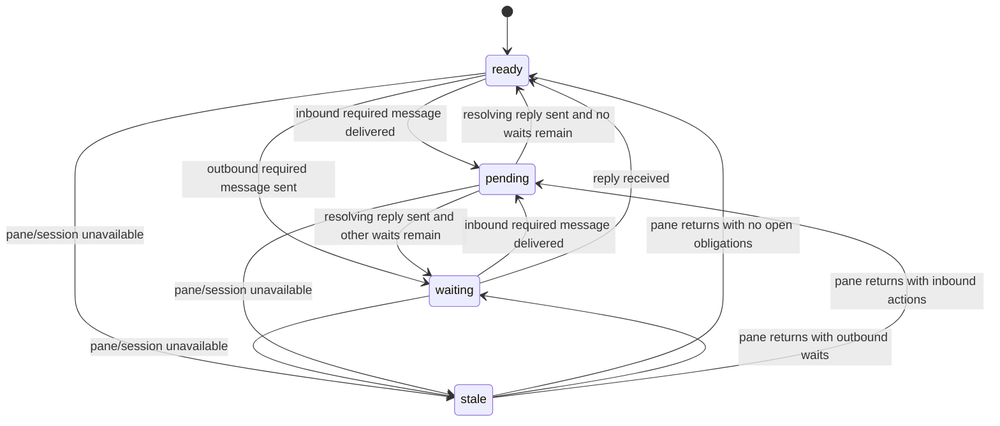

# Node State Machine

The visible node state model is intentionally small. It combines pane
availability with reply-obligation projection so agents can tell whether a node
has work, is blocked on another node, or is unavailable.

It is not a full conversation workflow model. Message files remain the source
of truth; health commands only replay their structured metadata and journal
events into a compact state.

## 1. State Surfaces

| Surface                  | Values                                                 | Meaning                                                   |
| ------------------------ | ------------------------------------------------------ | --------------------------------------------------------- |
| `nodes[*].pane_state`    | `active`, `idle`, `stale`                              | Pane availability and activity fact                       |
| `nodes[*].visible_state` | `ready`, `waiting`, `pending`, `stale`                 | Operator-facing node state                                |
| session `visible_state`  | `ready`, `waiting`, `pending`, `stale`, `unavailable`  | Worst node state, or unavailable canonical session health |

`active` and `idle` pane facts normalize to `ready` unless reply obligations
override them. A live pane that has not changed for a long time remains `idle`
internally and stays `ready` visibly when there is no open action or wait.
Missing pane state normalizes to `stale` so unknown nodes do not look healthy
by accident.

`unavailable` is a session-level fallback, not a per-node state. It means this
daemon cannot provide canonical health for that tmux session.

## 2. Visible Node States

| State     | Meaning                                             | Source fact                            |
| --------- | --------------------------------------------------- | -------------------------------------- |
| `ready`   | Pane is live with no open action or wait            | tmux pane activity and obligations     |
| `waiting` | Node has sent reply-required mail still unresolved  | `waiting_on_reply_count > 0`           |
| `pending` | Node has inbound reply-required action unresolved   | `action_required_count > 0`            |
| `stale`   | Pane or session is missing, unavailable, or unknown | pane discovery/activity data           |

Unread no-reply mail is still counted as unread mail, but it does not make a
node `pending`. This keeps daemon PINGs, `ACK`, `DONE`, and status-only notices
from making healthy nodes look like they owe work.

## 3. Transitions

Projection priority is `stale`, `pending`, `waiting`, then `ready`. A stale
pane cannot be trusted live. Inbound action beats waiting because the node has
something it can do now.

## 4. Reply Policy

Normal `send` is reply-required by default. Use `--no-reply` for terminal or
informational mail that should not start another turn. A reply should include
`--reply-to <message-id>` so health can clear the original obligation exactly.

The resolver also treats exact first-line terminal messages as no-reply:

| Body first line | Resolved policy |
| --------------- | --------------- |
| `ACK`           | `none`          |
| `DONE`          | `none`          |
| `PING`          | `none`          |

Daemon-originated PING and runtime notice mail also resolve to `none`.
Ambiguous content remains reply-required unless the sender explicitly uses
`--no-reply`.

## 5. Obligation Facts

Each delivered recipient gets its own obligation keyed by message ID and node,
so one message sent to multiple nodes can leave multiple pending replies.

| Fact                     | Meaning                                                       |
| ------------------------ | ------------------------------------------------------------- |
| `message_id`             | Stable message identifier used by inbox, read, and reply data |
| `reply_policy`           | `required` or `none`, resolved when the message is created    |
| `reply_to`               | Optional message ID that this message resolves                |
| `unread_count`           | All unread inbox mail, including no-reply notices             |
| `action_required_count`  | Inbound reply-required messages not yet resolved by a reply   |
| `waiting_on_reply_count` | Outbound reply-required messages not yet resolved by a reply  |
| `info_unread_count`      | Unread no-reply mail that does not require action             |

`pop` only clears unread state. It does not clear reply-required action, because
reading a request is not the same as answering it. Sending a resolving reply
clears the recipient's action-required obligation and the sender's
waiting-on-reply obligation. If the journal does not contain enough structured
message content for older events, health falls back to unread-count based
pending behavior instead of inventing obligation state.

## 6. Health Projection

The canonical contract is shared by `get-health`, `get-health-oneline`, and the
default TUI. Per-node state is exposed as `nodes[*].visible_state`.
Session-level state is the worst visible state across nodes, ranked as:

1. `ready`
2. `waiting`
3. `pending`
4. `stale`

Queue facts are reported separately in `queues.post_count`,
`queues.inbox_count`, and `queues.dead_letter_count`. Reply-obligation facts are
reported per node.
