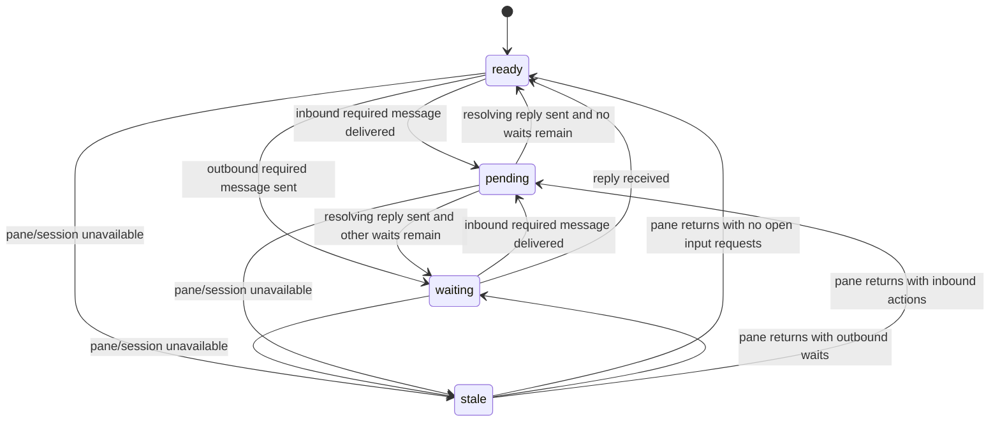

# Node State Machine

The visible node state model is intentionally small. It combines pane
availability with input-request projection so agents can tell whether a node
has work, is blocked on another node, or is unavailable.

It is not a full conversation workflow model. Message files remain the source
of truth; health commands only replay their structured metadata and journal
events into a compact state.

## 1. Identity Hierarchy

The runtime protocol treats messages, threads, and input requests as separate
identities:

```text
thread_id
  message_id
    input_request_id
```

`message_id` is the immutable mailbox filename. Generated frontmatter keeps
`messageId` as the stored archive key, while public JSON and journal payloads
use `message_id`. `thread_id` is optional for ordinary mail and required by
thread-bound approval/review events. `input_request_id` is generated only for
reply-required mail and identifies the exact per-recipient slot opened for a
future reply.

Task identity is intentionally not transport metadata. A task may exist in an
external planner, issue, or markdown artifact, but the daemon does not generate
or interpret `task_id`.

### Naming Rationale

Identity names are chosen to make lifecycle size visible to a new operator:

| Name                  | Scale                         | Why it is not another name                                  |
| --------------------- | ----------------------------- | ----------------------------------------------------------- |
| `message_id`          | One delivered mailbox record  | A message is the smallest transport record, not a workflow. |
| `thread_id`           | Conversation or workflow line | A thread can contain many messages and input requests.      |
| `input_request_id`    | One required recipient reply  | A request is opened by one required message and filled later. |
| `input_request_set_id` | Multi-recipient aggregate    | A set can contain several input-request branches.           |
| `branch_id`           | One branch inside a group     | A branch is smaller than a group but still action-scoped.   |
| `task_id`             | External work item            | A task is broader than transport and has no daemon owner.   |

The names do not try to encode a strict parent/child hierarchy. They distinguish
scale: a single delivered message, a conversational thread, an actionable
required-input request, and an optional aggregate for multi-recipient completion
rules. This keeps `task_id` and `input_request_id` from sounding like same-scale
runtime concepts: task identity belongs to an external planning layer, while
input-request identity belongs to daemon health and reply projection.

## 2. State Surfaces

| Surface                                   | Values                                                | Meaning                                                   |
| ----------------------------------------- | ----------------------------------------------------- | --------------------------------------------------------- |
| `nodes[*].pane_state`                     | `active`, `idle`, `stale`                             | Pane availability and activity fact                       |
| `nodes[*].visible_state`                  | `ready`, `waiting`, `pending`, `stale`                | Operator-facing node state                                |
| `nodes[*].screen_progress.evidence_state` | `missing`, `stale`, `changed`, `unchanged`            | Non-content pane progress evidence                        |
| session `visible_state`                   | `ready`, `waiting`, `pending`, `stale`, `unavailable` | Worst node state, or unavailable canonical session health |
| `severity`                                | See contextual severity table                         | Additive triage severity for operators                    |
| `compact_severity`                        | ASCII token                                           | One-line severity summary for opt-in compact scans        |

`active` and `idle` pane facts normalize to `ready` unless input requests
override them. A live pane that has not changed for a long time remains `idle`
internally and stays `ready` visibly when there is no open action or wait.
Missing pane state normalizes to `stale` so unknown nodes do not look healthy
by accident.

`screen_progress` carries timestamps and an opaque fingerprint from pane
capture state so operators can tell whether the pane is still changing without
reading raw pane text. It does not affect visible-state ranking.

`unavailable` is a session-level fallback, not a per-node state. It means this
daemon cannot provide canonical health for that tmux session.

`schema_version: 3` reports contextual severity alongside `visible_state` and
`compact`. Consumers that only need the compact operator view can read those
fields.

## 3. Visible Node States

| State     | Meaning                                             | Source fact                            |
| --------- | --------------------------------------------------- | -------------------------------------- |
| `ready`   | Pane is live with no open action or wait            | tmux pane activity and input requests  |
| `waiting` | Node has sent reply-required mail still unresolved  | `waiting_on_input_count > 0`           |
| `pending` | Node has inbound reply-required action unresolved   | `input_required_count > 0`             |
| `stale`   | Pane or session is missing, unavailable, or unknown | pane discovery/activity data           |

Unread no-reply mail is still counted as unread mail, but it does not make a
node `pending`. This keeps daemon PINGs, `ACK`, `DONE`, and status-only notices
from making healthy nodes look like they owe work.

## 4. Transitions



Projection priority is `stale`, `pending`, `waiting`, then `ready`. A stale
pane cannot be trusted live. Inbound action beats waiting because the node has
something it can do now.

## 5. Reply Policy

Normal `send-heredoc` mail is no-reply unless the sender uses
`--reply-required` or the message carries a strict request class such as
`status_request`,
`approval_request`, or `reply_request`. Use `--no-reply` as an explicit
override for terminal or informational mail.

A new reply-required message carries an exact `input_request_id`. A resolving
reply should include `--fills-input-request-id <input-request-id>` so health can
clear that slot. The default footer includes `--reply-to <message-id>` as
traceability; for messages without an exact input-request ID, `--reply-to` still
closes the matching open slot for the original message and participant.

The resolver treats exact first-line terminal messages as no-reply:

| Body first line | Resolved policy |
| --------------- | --------------- |
| `ACK`           | `none`          |
| `DONE`          | `none`          |
| `PING`          | `none`          |
| `HEARTBEAT_OK`  | `none`          |

Daemon-originated PING, runtime notice mail, status updates, alerts, and pane
hints also resolve to `none`. Ambiguous content remains no-reply unless the
sender explicitly marks it reply-required.

## 6. Input Request Facts

Each delivered recipient gets its own input request. Required messages with an
opaque `input_request_id` use exact closure; messages without exact fields use
the message ID plus participant as the fallback key.

| Fact                       | Meaning                                                       |
| -------------------------- | ------------------------------------------------------------- |
| `message_id`               | Stable message identifier used by inbox, read, and reply data |
| `thread_id`                | Optional workflow strand for related messages and events      |
| `reply_policy`             | `required` or `none`, resolved when the message is created    |
| `input_request_id`        | Exact required-input request opened by a required message        |
| `fills_input_request_id`  | Exact input request ID this message fills                        |
| `input_request_set_id`    | Optional aggregate of input requests                             |
| `reply_to`                 | Optional message ID this message references                   |
| `unread_count`             | All unread inbox mail, including no-reply notices             |
| `input_required_count`    | Inbound reply-required messages not yet resolved by a reply    |
| `waiting_on_input_count`   | Outbound reply-required messages not yet resolved by a reply  |
| `info_unread_count`        | Unread no-reply mail that does not require action             |

`pop` only clears unread state. It does not clear reply-required action, because
reading a request is not the same as answering it. Sending a resolving reply
clears the recipient's input-required request and the sender's waiting-on-input
request when `fills_input_request_id` names the exact input request. Required
messages without an exact slot still use `reply_to` fallback closure. If both
`fills_input_request_id` and `reply_to` are present and
`reply_to` names a different original message, projection fails closed and does
not clear an arbitrary slot. If an older journal event does not contain
enough structured message content, projection skips that event and continues
from later complete events instead of inventing input-request state.

Grouped input-request fields are reserved for the next protocol layer:
`input_request_set_id`, `branch_id`, and `completion_rule`. They are parsed and
carried as metadata but do not affect L1 health counts until grouped
completion rules are implemented.

## 7. Health Projection

The canonical contract is shared by `get-status`, `get-status-oneline`, and the
default TUI. Per-node state is exposed as `nodes[*].visible_state`.
Session-level state is the worst visible state across nodes, ranked as:

1. `ready`
2. `waiting`
3. `pending`
4. `stale`

Queue facts are reported separately in `queues.post_count`,
`queues.inbox_count`, and `queues.dead_letter_count`. Input-request facts are
reported per node.

## 8. Contextual Severity

Contextual severity is additive. It answers what an operator should triage
first without changing the visible-state model.

Severity ranks from least to most urgent:

1. `ok`
2. `working`
3. `expected_wait`
4. `needs_action`
5. `blocked`
6. `attention_stale`
7. `delivery_stuck`
8. `delivery_failure`

Tie-breaks prefer the most urgent delivery, node flow, or local pane signal.
Delivery failures outrank stale panes because mail may not be reaching any
recipient. A node that is waiting for an approval or other required reply is
`expected_wait`, not blocked. It becomes `blocked` only when an open blocked
report exists.

`get-status` exposes the evidence as:

| Field                  | Meaning                                      |
| ---------------------- | -------------------------------------------- |
| `severity`             | Worst contextual severity                    |
| `severity_source`      | Surface that produced the chosen severity    |
| `severity_reason`      | Short human-readable reason                  |
| `compact_severity`     | ASCII one-line summary token                 |
| `delivery`             | Session delivery health                      |
| `nodes[*].node_local`  | Pane-local activity/staleness health         |
| `nodes[*].flow`        | Input-request and blocked-report workflow state |
| `nodes[*].queues`      | Node-local queue counts                      |

Open input-request details include `opened_event_id` and `read_event_id` when
the corresponding journal events are known. These IDs are traceability
pointers for replay and inspection. They do not change completion semantics.

`get-status-oneline` prints compact visible-state marks by default. The opt-in
`--severity` flag prints `compact_severity` instead. A `?` suffix marks
inferred evidence, such as `blocked?:node=worker`.

## 9. Severity Examples

| Scenario            | Primary evidence                         | Severity             |
| ------------------- | ---------------------------------------- | -------------------- |
| Idle                | Live pane, no open action or wait        | `ok`                 |
| Active work         | Active pane or changed screen evidence   | `working`            |
| Approval wait       | Outbound required reply still open       | `expected_wait`      |
| Reply-required wait | Outbound required reply still open       | `expected_wait`      |
| Required action     | Inbound required reply open              | `needs_action`       |
| Blocked             | Structured blocked report or `BLOCKED:`  | `blocked`            |
| Stale pane          | Missing or stale pane evidence           | `attention_stale`    |
| Delivery stuck      | Oldest pending post is at least 180s old | `delivery_stuck`     |
| Dead letter         | One or more dead-letter files exist      | `delivery_failure`   |
