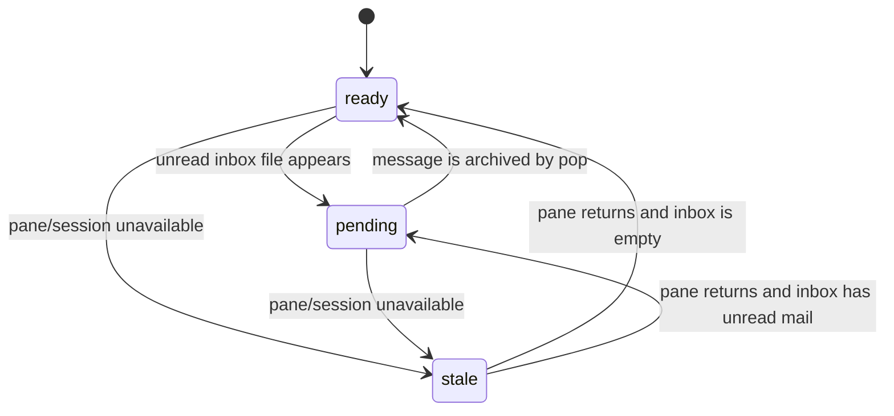

# Node State Machine

The visible node state model is intentionally small. It describes only facts
needed by agents and the operator TUI.

## 1. States

| State     | Meaning                                             | Source fact                  |
| --------- | --------------------------------------------------- | ---------------------------- |
| `ready`   | Pane is live and has no unread inbox mail           | tmux pane activity           |
| `pending` | Node has unread inbox mail                          | `inbox/{node}/` file count   |
| `stale`   | Pane or session is missing, unavailable, or unknown | pane discovery/activity data |

`active` and `idle` pane facts normalize to `ready`. A live pane that has not
changed for a long time remains `idle` internally. Missing state normalizes to
`stale` so unknown nodes do not look healthy by accident.

## 2. Transitions

## 3. Health Projection

The canonical contract is shared by `get-health`, `get-health-oneline`, and the
default TUI. Per-node state is exposed as `nodes[*].visible_state`.
Session-level state is the worst visible state across nodes, ranked as:

1. `ready`
2. `pending`
3. `stale`

Queue facts are reported separately in `queues.post_count`,
`queues.inbox_count`, and `queues.dead_letter_count`.
