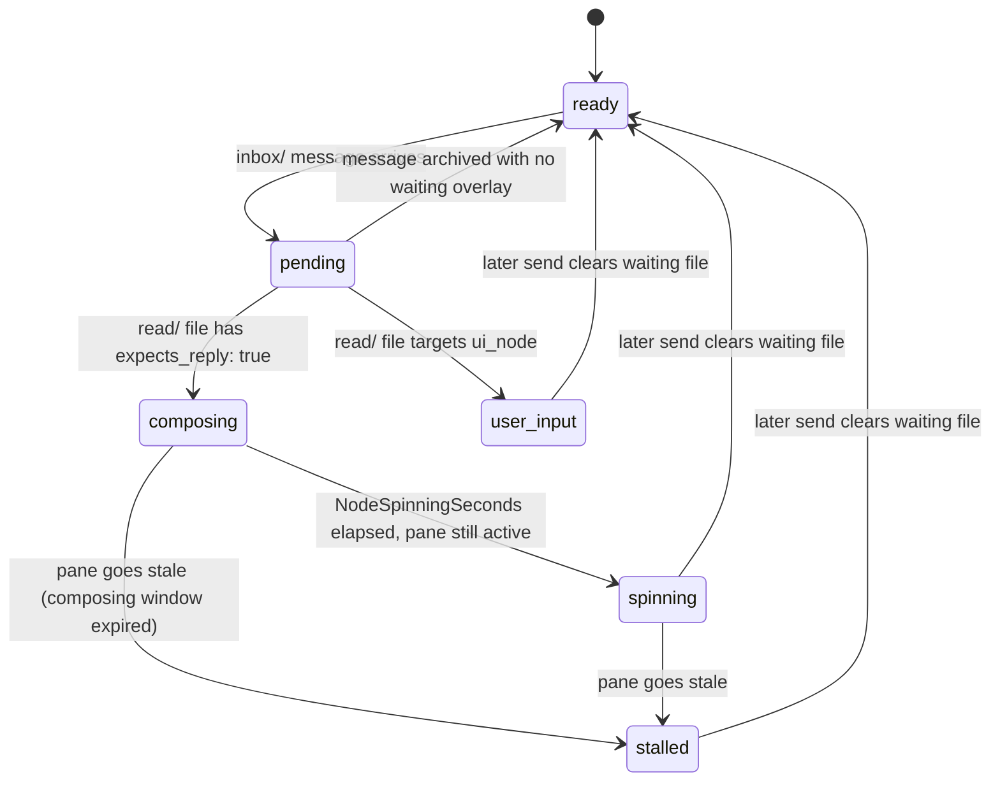

# Node State Machine

Design document for the per-node state machine introduced in Issue #286.

## States

| State       | Color  | ANSI | TTY | Non-TTY | Description                                        |
| ----------- | ------ | ---- | --- | ------- | -------------------------------------------------- |
| ready       | Green  | 10   | ●   | 🟢      | Node active, no pending inbox messages             |
| pending     | Cyan   | 51   | ●   | 🔷      | Inbox message waiting, not yet archived            |
| composing   | Blue   | 33   | ●   | 🔵      | Node has an explicit reply-tracked waiting file    |
| spinning    | Yellow | 226  | ●   | 🟡      | Node running long (past NodeSpinningSeconds)       |
| stalled     | Red    | 196  | ●   | 🔴      | Reply-tracked work went stale while composing or spinning |
| user_input  | Purple | 141  | ●   | 🟣      | Node waiting for human input                       |

## State Transitions

## Transition-To-Surface Inventory

| Transition             | Outward Effect                                                        | Surface(s)              | Current Overlap / Note                                                                 |
| ---------------------- | --------------------------------------------------------------------- | ----------------------- | -------------------------------------------------------------------------------------- |
| `[*] --> ready`        | Node appears as `ready` once discovered and no waiting overlay applies | TUI / oneline           | No inbox or pane notification is emitted for the ready baseline itself                |
| `ready --> pending`    | Unread file appears in `inbox/{node}/` and the recipient gets a pane hint | inbox + pane + TUI / oneline | One delivery creates both an inbox-visible unread item and an immediate pane notification |
| `pending --> ready`    | Unread file is archived and the node returns to `ready`               | inbox + TUI / oneline   | No dedicated follow-up message is emitted; the visible change is the cleared unread state |
| `pending --> composing` | Waiting state enters `composing` only when the archived message explicitly carries `expects_reply: true` | TUI / oneline | No separate daemon alert is emitted by the transition itself                          |
| `composing --> spinning` | Node crosses the spinning threshold, turns `spinning`, and emits an expected-reply overdue alert | inbox + pane + TUI / oneline | The alert is routed to `ui_node` inbox and therefore also causes the usual pane notification on delivery, while the yellow overlay stays visible on the awaited node |
| `composing --> stalled` | Node goes stale while composing and turns `stalled`                  | TUI / oneline           | No dedicated inbox alert is emitted by this transition alone                          |
| `spinning --> stalled` | Node goes stale after spinning and stays visible as `stalled`         | TUI / oneline           | The stalled transition itself is only a surface change; no dedicated inbox alert is emitted |
| `spinning --> ready`   | Later send activity clears `spinning` and returns the node to `ready` | TUI / oneline          | The send may create inbox-visible effects elsewhere, but this transition emits no separate notification |
| `stalled --> ready`    | Later send activity clears `stalled` and returns the node to `ready` | TUI / oneline           | No dedicated recovery alert is emitted by the transition itself                       |
| `pending --> user_input` | Human-facing prompt is active and the node turns `user_input`       | inbox + pane + TUI / oneline | Current overlap is intentional: the prompting message is inbox-visible while the purple dot suppresses inactivity alerts |
| `user_input --> ready` | Human-input wait clears and the node returns to `ready` after a later send | TUI / oneline      | No dedicated completion alert is emitted by the transition itself                     |

## Time-Based Parameters

| Parameter            | Default | Description                              |
| -------------------- | ------- | ---------------------------------------- |
| NodeActiveSeconds    | 300s    | Internal pane-activity threshold for `active`; after this boundary the pane becomes internally `idle`, but the display still collapses both `active` and `idle` to `ready` unless a waiting overlay wins |
| NodeIdleSeconds      | 900s    | Internal pane-activity threshold for `stale`; after `NodeActiveSeconds` and before this boundary the pane remains internally `idle` |
| NodeSpinningSeconds  | 0       | Seconds an explicit reply-tracked `composing` wait may remain active before transitioning to `spinning` (0 = disabled) |

## Implementation Files

| Layer        | File                            | Key Sections                                      |
| ------------ | ------------------------------- | ------------------------------------------------- |
| Shared contract | internal/status/contract.go  | VisibleState, SessionVisibleState, canonical payload types |
| Health payload | internal/cli/session_health.go | Session health snapshot with `visible_state` and `windows` |
| Daemon       | internal/daemon/daemon.go       | replaceWaitingState, worstStatePriority, collectPendingStates |
| TUI          | internal/tui/tui.go             | shared visible-state consumption, session worst-state rendering, updateNodeStatesFromActivity |
| Oneline      | internal/cli/session_status_oneline.go | statusDot plus pure formatting over the shared health payload |
| Config       | internal/config/config.go       | NodeSpinningSeconds                               |

## Design Decisions

### Internal vs. Display State

`statusForState()` in `internal/idle/idle.go` returns `"active"`, `"idle"`, or
`"stale"` for daemon transition logic. These internal values are preserved
unchanged. The display layer maps:

- `"active"` / `"idle"` from pane-activity.json -> `"ready"` via
  updateNodeStatesFromActivity
- waiting/ file states overlay the display layer via waitingStateRank /
  waitingOverlayRank, but `composing`, `spinning`, and `stalled` only surface
  when the waiting file explicitly carries `expects_reply: true`

The shared status contract now carries both sides of that split in the health
payload: per-node `pane_state` records the base fact, per-node `waiting_state`
records the reply-tracked overlay fact, and per-node `visible_state` records
the canonical renderer recommendation after unread and waiting overlays are
applied. `get-health-oneline` and the TUI both consume that same visible-state
resolution instead of maintaining separate overlay precedence.

### Backward Compatibility

- `pane-activity.json` still emits `"active"` and `"idle"` from the idle
  tracker; `statusDot()` and the TUI node render switch accept these as aliases
  for `"ready"`.
- Old waiting files containing `"state: stuck"` are accepted as aliases for
  `"stalled"` in all switch cases.
