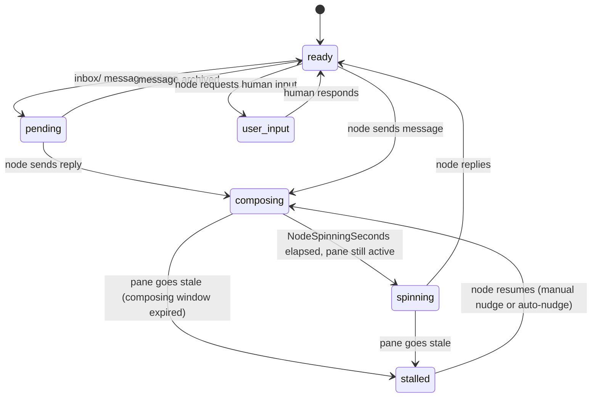

# Node State Machine

Design document for the per-node state machine introduced in Issue #286.

## States

| State       | Color  | ANSI | TTY | Non-TTY | Description                                        |
| ----------- | ------ | ---- | --- | ------- | -------------------------------------------------- |
| ready       | Green  | 10   | ●   | 🟢      | Node active, no pending inbox messages             |
| pending     | Cyan   | 51   | ●   | 🔷      | Inbox message waiting, not yet archived            |
| composing   | Blue   | 33   | ●   | 🔵      | Node actively composing a reply                    |
| spinning    | Yellow | 226  | ●   | 🟡      | Node running long (past NodeSpinningSeconds)       |
| stalled     | Red    | 196  | ●   | 🔴      | Node went stale while composing or spinning        |
| user_input  | Purple | 141  | ●   | 🟣      | Node waiting for human input                       |

## State Transitions

## Time-Based Parameters

| Parameter            | Default | Description                              |
| -------------------- | ------- | ---------------------------------------- |
| NodeActiveSeconds    | 300s    | Idle duration before node transitions from ready to stale (first threshold) |
| NodeIdleSeconds      | 900s    | Idle duration before node is marked stale (second threshold) |
| NodeSpinningSeconds  | 0       | Seconds composing before transitioning to spinning (0 = disabled) |

## Implementation Files

| Layer        | File                            | Key Sections                                      |
| ------------ | ------------------------------- | ------------------------------------------------- |
| Daemon       | internal/daemon/daemon.go       | replaceWaitingState, worstStatePriority, collectPendingStates |
| TUI          | internal/tui/tui.go             | waitingStateRank, getSessionWorstState, updateNodeStatesFromActivity, node render switch |
| Oneline      | main.go                         | statusDot, applyWaitingOverlay, applyPendingOverlay |
| Config       | internal/config/config.go       | NodeSpinningSeconds                               |

## Design Decisions

### Internal vs. Display State

`statusForState()` in `internal/idle/idle.go` returns `"active"`, `"idle"`, or
`"stale"` for daemon transition logic. These internal values are preserved
unchanged. The display layer maps:

- `"active"` / `"idle"` from pane-activity.json -> `"ready"` via
  updateNodeStatesFromActivity
- waiting/ file states overlay the display layer via waitingStateRank /
  waitingOverlayRank

### Backward Compatibility

- `pane-activity.json` still emits `"active"` and `"idle"` from the idle
  tracker; `statusDot()` and the TUI node render switch accept these as aliases
  for `"ready"`.
- Old waiting files containing `"state: stuck"` are accepted as aliases for
  `"stalled"` in all switch cases.
