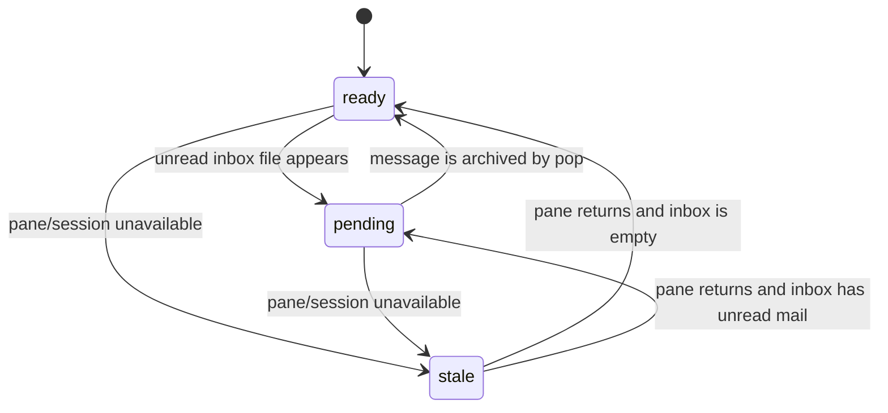

# Node State Machine

The visible node state model is intentionally small. It is an availability and
mailbox projection for agents and the operator TUI.

It is not a full conversation workflow model. Waiting for a reply, reply
required, and no-reply messages are message obligations. They should be modeled
separately instead of overloading `stale`.

## 1. State Surfaces

| Surface                  | Values                                      | Meaning                                                   |
| ------------------------ | ------------------------------------------- | --------------------------------------------------------- |
| `nodes[*].pane_state`    | `active`, `idle`, `stale`                   | Pane availability and activity fact                       |
| `nodes[*].visible_state` | `ready`, `pending`, `stale`                 | Operator-facing node state                                |
| session `visible_state`  | `ready`, `pending`, `stale`, `unavailable` | Worst node state, or unavailable canonical session health |

`active` and `idle` pane facts normalize to `ready`. A live pane that has not
changed for a long time remains `idle` internally and stays `ready` visibly.
Missing pane state normalizes to `stale` so unknown nodes do not look healthy
by accident.

`unavailable` is a session-level fallback, not a per-node state. It means this
daemon cannot provide canonical health for that tmux session.

## 2. Visible Node States

| State     | Meaning                                                       | Source fact                  |
| --------- | ------------------------------------------------------------- | ---------------------------- |
| `ready`   | Pane is live and has no unread inbox mail                     | tmux pane activity           |
| `pending` | Node has unread inbox mail, regardless of reply requirement   | `inbox/{node}/` file count   |
| `stale`   | Pane or session is missing, unavailable, or unknown           | pane discovery/activity data |

## 3. Transitions

## 4. Health Projection

The canonical contract is shared by `get-health`, `get-health-oneline`, and the
default TUI. Per-node state is exposed as `nodes[*].visible_state`.
Session-level state is the worst visible state across nodes, ranked as:

1. `ready`
2. `pending`
3. `stale`

Queue facts are reported separately in `queues.post_count`,
`queues.inbox_count`, and `queues.dead_letter_count`.

## 5. Target Message Obligations

The current health contract does not distinguish action-required unread mail
from informational unread mail. For example, an unread PING can make a node
`pending` even when the message body says no reply is needed.

Reply accuracy should be added as a separate message-obligation projection. That
projection should answer whether unread, read, or sent mail needs action, while
the existing pane state continues to answer whether the pane is available.

The target policy is:

| Message kind                         | Reply policy     | Reason                                      |
| ------------------------------------ | ---------------- | ------------------------------------------- |
| Normal `send`                        | reply required   | Default agent-to-agent traffic asks action  |
| Explicit terminal replies            | no reply needed  | `DONE`, `ACK`, and equivalent endings close |
| Status-only updates                  | no reply needed  | Informational updates should not loop       |
| Daemon-originated PING or health mail | no reply needed  | Runtime notices should not create chatter   |

Defaulting normal `send` to reply required keeps the coordination state useful.
The no-reply path exists to prevent infinite exchanges for terminal or
informational messages. Do not rely on agents choosing a send-time option as the
only source of truth; store the resolved reply policy in structured message
metadata so health projection can replay it.

A send flag should express reply intent, not directly set node state. Prefer a
single exception flag such as `--no-reply` over paired required and optional
flags, because normal `send` is already reply-required by default. The health
projection should derive action-required state from stored message metadata.

The resolver may also treat exact standardized terminal messages such as `ACK`,
`DONE`, and daemon `PING` as no-reply even when the sender omitted the flag.
Ambiguous content should remain reply-required unless the sender explicitly uses
the no-reply flag.

The target obligation projection needs these facts:

| Fact                     | Meaning                                                           |
| ------------------------ | ----------------------------------------------------------------- |
| `reply_policy`           | `required` or `none`, resolved when the message is created         |
| `message_id`             | Stable message identifier used by inbox, read, and reply records   |
| `reply_to`               | Optional message ID that this message resolves                     |
| `unread_count`           | All unread inbox mail, including no-reply notices                  |
| `action_required_count`  | Inbound reply-required messages not yet resolved by a reply        |
| `waiting_on_reply_count` | Outbound reply-required messages not yet resolved by a reply       |
| `info_unread_count`      | Unread no-reply mail; useful to show, but not action-required      |

With that projection, `pending` should eventually mean
`action_required_count > 0`, not merely `unread_count > 0`. Reading a
reply-required message with `pop` should clear unread mail, but it should not
clear the action-required obligation. Sending a resolving reply should clear
the recipient's action-required obligation and the sender's waiting-on-reply
obligation.

If `get-health-oneline` is the canonical quick view of node state,
`waiting_on_reply_count` cannot remain only a side fact. The target visible
projection should be:

| Target `visible_state` | Condition                                       | Meaning                         |
| ---------------------- | ----------------------------------------------- | ------------------------------- |
| `stale`                | Pane or session unavailable                     | The node cannot be trusted live |
| `pending`              | `action_required_count > 0`                     | The node has action to take     |
| `waiting`              | `waiting_on_reply_count > 0`                    | The node is waiting on others   |
| `ready`                | No open action or waiting obligation, pane live | The node is available           |

The projection order should be `stale`, `pending`, `waiting`, then `ready`.
Without `waiting`, a node that has nothing to do and a node blocked on another
reply both look `ready`, so `get-health-oneline` cannot be an accurate state
view.
