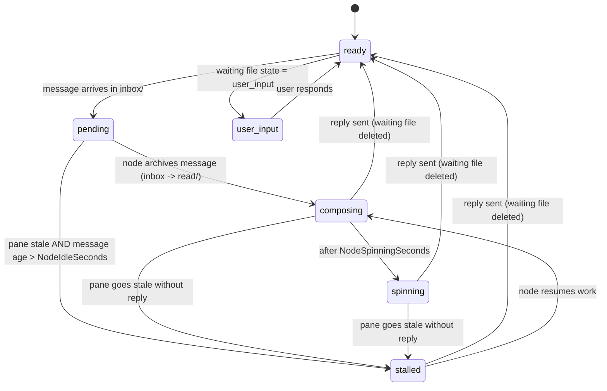

# Plan: Unified Per-Node State Machine (Issue #286)

## Purpose

Replace the inconsistent 4-state model (active/composing/idle/stale + stuck as
a dead-end) with a unified 6-state machine (ready/pending/composing/spinning/
stalled/user_input) used consistently across the daemon, TUI, and oneline
output. This resolves dead-end stall states, enables pending message detection,
and gives every node a clear action-required signal when stalled.

## Source

- Type: issue
- Reference: i9wa4/tmux-a2a-postman#286

## Context

Repository: /home/uma/ghq/github.com/i9wa4/tmux-a2a-postman-issue-286
Branch: issue-286-compl...
Current HEAD: 0ec44d11

## Glossary

| Term              | Definition |
| ----------------- | ---------- |
| pane capture state | Internal status computed by idle.go from screen content changes: "active"/"idle"/"stale" |
| waiting file      | YAML+MD file in `waiting/` created when a message is archived; tracks composing→spinning→stalled transitions |
| nodeStates        | TUI in-memory map (session:node → state string) computed from pane activity timestamps |
| waitingStates     | TUI in-memory map (session:node → state string) received via daemon waiting_state_update events |
| effectiveNodeState | Merge of nodeStates + waitingStates: higher waitingStateRank wins |
| pane title        | tmux pane title = node name (e.g., "worker", "orchestrator") |
| inbox             | `{sessionDir}/inbox/{node}/` directory of unread message files |
| read              | `{sessionDir}/read/` directory; node "archives" by moving file from inbox to here |
| post              | `{sessionDir}/post/` directory; outgoing messages before delivery |
| inboxCheckTicker  | Daemon timer (30s) that runs stagnation checks and state transitions |
| UINode            | The supervisor/human-in-loop node specified by `cfg.UINode` |

## Plain-Language Background

Each agent (node) in a tmux-a2a-postman session has a visual status indicator
(colored dot) in the tmux status bar. Currently:

- Green = active (pane recently changed)
- Blue = composing (agent is writing a reply)
- Yellow = idle (pane quiet for 5-15 min)
- Red = stale (pane quiet 15+ min) or stuck (agent never replied)

The problem: "stuck" is a dead-end — the system detects it but does nothing.
Also, a message sitting unread in the inbox has no visual state ("pending").
And all color/state definitions are scattered, making them inconsistent.

The fix: unify to 6 states with a consistent priority model, add pending
detection, rename stuck→stalled with an active notification, and add cyan (🔷)
for pending messages.

## Prerequisites

- Tools: Go, Nix
- Commands:

  ```bash
  go build ./...    # verify build
  nix flake check   # verify Nix packaging
  nix build         # verify binary
  ```

- Access: write access to
  /home/uma/ghq/github.com/i9wa4/tmux-a2a-postman-issue-286

## Acceptance Criteria

1. `grep -rn '"stuck"' internal/ main.go` returns 0 matches outside
   backward-compat strings (Backward-compat detail: `"state: stuck"` inside
   `strings.Contains()` does NOT match `"stuck"` because the grep pattern looks
   for the exact 7-char sequence `"stuck"` with surrounding quotes, which is not
   present in `"state: stuck"`. So this AC is clean after M1.)
2. `grep -n '"active"' internal/tui/tui.go` returns 0 matches (NOTE: Hits in
   main.go:statusDot() are intentional backward-compat aliases per Decision #1 —
   do not remove them to satisfy this AC.)
3. `grep -n '"idle"' internal/tui/tui.go` returns 0 matches
   (NOTE: Same as AC #2 — main.go hits are intentional.)
4. TUI renders 6 distinct colors: green/cyan/blue/yellow/red/purple for
   ready/pending/composing/spinning/stalled/user_input
5. `statusDot` in main.go handles all 6 new state strings and backward-compat
   aliases for "active" and "idle"
6. Non-TTY output uses 🔷 for pending, 🟣 for user_input
7. `nix flake check` exits 0
8. `nix build` exits 0
9. `docs/design/node-state-machine.md` exists and contains the Mermaid state
   diagram
10. Daemon `collectPendingStates` function exists and is called from
    inboxCheckTicker

## Complete Code Inventory

Full enumeration of every file and every location that needs modification.

### Files NOT modified

- `internal/idle/idle.go`: `statusForState()` returns "active"/"idle"/"stale"
  for daemon transition logic at daemon.go:973,985,991. These strings drive
  state transitions and must not be renamed. See Decision #1.
- `internal/config/config.go`: no state-related changes needed.

### internal/daemon/daemon.go

| Location | Current | Change | Milestone |
| -------- | ------- | ------ | --------- |
| Line 974: replaceWaitingState arg | `"stuck"` | `"stalled"` | M1 |
| Line 987: replaceWaitingState arg | `"stuck"` | `"stalled"` | M1 |
| Lines 999-1004: worstStatePriority map | `"stuck": 4`, no "pending" | `"stalled": 4`, add `"pending": 1`, bump `"composing"` to 2 | M1 (stuck→stalled), M3 (pending + composing bump) |
| Lines 1022-1023: string comparison switch | `case strings.Contains(cs, "state: stuck"):` / `fileState = "stuck"` | backward-compat case + `fileState = "stalled"` | M1 |
| NEW: `collectPendingStates` function | does not exist | scan inbox/ for pending states | M3 |
| NEW: merge pendingStates into waitingStates | does not exist | after second-pass waiting file scan | M3 |

### internal/tui/tui.go

| Location | Current | Change | Milestone |
| -------- | ------- | ------ | --------- |
| Lines 40-67: var() style block | no pendingNodeStyle/userInputNodeStyle | add `pendingNodeStyle` (cyan 51) and `userInputNodeStyle` (purple 141) | M2 |
| Lines 72-80: `waitingStateRank` | `"active":0`, `"idle":2`, `"stuck":4`; no "stale" rank gap; "composing":1 | remove "active"/"idle"; rename "stuck"→"stalled"; add "stale":3; bump "composing":1→2; add "pending":1 | M1 (stuck→stalled), M2 (active/idle removal, stale fix, composing bump), M3 (pending) |
| Lines 246-255: `getSessionWorstState` switch | `"stuck"→"stale"`, `"spinning"→"idle"`, `"user_input"→"active"` | `"stalled"→"stalled"`, `"spinning"→"spinning"`, `"user_input"→"user_input"`; update default comment | M1 (stuck→stalled), M2 (spinning/user_input normalization) |
| Lines 306-344: `updateNodeStatesFromActivity` | `state = "idle"` (line 313), `state = "idle"` (line 337), `state = "active"` (line 339) | all three → `state = "ready"` | M2 |
| Lines 912-923: session header color switch | 4 cases: "stale","idle","composing","active" | 7 cases: "stalled","stale","spinning","pending","composing","user_input","ready" | M2 |
| Lines 974-978: routing legend | Active/Composing/Idle/Stale | Ready/Pending/Composing/Spinning/Stalled/User Input | M2 |
| Lines 1019-1028: node render switch | `"active","user_input"` merged; `"idle","spinning"` merged; `"stale","stuck"` | Distribute: M1 renames stuck→stalled; M2 renames active→ready and splits user_input; M3 adds pending case; M4 gives user_input purple | M1, M2, M3, M4 |

### main.go

| Location | Current | Change | Milestone |
| -------- | ------- | ------ | --------- |
| Lines 1011-1038: `statusDot` | `"active","user_input"` merged; `"idle","spinning"` merged; no pending | Add "pending"/"user_input" as separate cases; add compat aliases per Decision #1 | M2 |
| Lines 1235-1240: `waitingOverlayRank` (local var) | `:=` local; `"stuck":4`; no "pending" | hoist to package-level `var`; rename "stuck"→"stalled"; add "pending":1; bump "composing":1→2 | M1 (stuck→stalled), M3 (hoist + pending) |
| Lines 1263-1264: `applyWaitingOverlay` string comparison | `"state: stuck"` → `fileState = "stuck"` | backward-compat + `fileState = "stalled"` | M1 |
| Line 1142: call site | `applyWaitingOverlay(...)` | add `applyPendingOverlay(...)` call immediately after | M3 |
| NEW: `applyPendingOverlay` function | does not exist | scan inbox/ dirs, overlay "pending"/"stalled" | M3 |

### docs/design/node-state-machine.md

| Location | Current | Change | Milestone |
| -------- | ------- | ------ | --------- |
| New file | does not exist | create design document with Mermaid diagram | M5 |

---

## Implementation Plan

### Milestone 1: Rename stuck → stalled [status: pending]

**Scope**: Replace every emission of the string `"stuck"` in all three
subsystems. Add backward compatibility for existing waiting files that contain
`state: stuck`.

**Files**: `internal/daemon/daemon.go`, `internal/tui/tui.go`, `main.go`

**Changes**:

**daemon.go:**

1. Line 974: `replaceWaitingState(contentStr, "spinning", "stuck")` →
   `"stalled"`
2. Line 987: `replaceWaitingState(contentStr, "composing", "stuck")` →
   `"stalled"`
3. Lines 999-1004 `worstStatePriority` map: `"stuck": 4` → `"stalled": 4`
   (Leave "composing" at 1 for now; M3 bumps it to 2 when "pending":1 is added.)

   ```go
   worstStatePriority := map[string]int{
       "user_input": 0,
       "composing":  1,
       "spinning":   3,
       "stalled":    4,  // was "stuck"
   }
   ```

4. Lines 1022-1023: Replace `case strings.Contains(cs, "state: stuck"):` /
   `fileState = "stuck"` with a backward-compat OR case:

   ```go
   case strings.Contains(cs, "state: stalled") || strings.Contains(cs, "state: stuck"):
       fileState = "stalled"
   ```

   NOTE: `grep '"stuck"'` searches for the exact 7-char sequence `"stuck"`

   (with surrounding double-quote characters). The string `"state: stuck"` in Go
   source does NOT contain this sequence — the closing `"` follows `stuck` but
   there is no opening `"` immediately before `stuck`. So this backward-compat
   string does NOT trigger AC #1.

**tui.go:**

5. Line 79 `waitingStateRank`: `"stuck": 4` → `"stalled": 4`
6. Line 247 `getSessionWorstState`: `case "stuck": return "stale"` →
   `case "stalled": return "stalled"` (stalled is now a real display state; it
   no longer aliases to "stale")
7. Line 1026 node render switch: `case "stale", "stuck":` →
   `case "stale", "stalled":` The TUI never receives "stuck" from the daemon
   after M1 (daemon normalizes old waiting files to "stalled" via the
   backward-compat case above). No "stuck" compat needed in the TUI switch.

**main.go:**

8. Line 1239 `waitingOverlayRank` (local): `"stuck": 4` → `"stalled": 4`
   (Still a local `:=` at this point; hoisted to package-level in M3.)
9. Lines 1263-1264 `applyWaitingOverlay`: replace
   `case strings.Contains(cs, "state: stuck"):` / `fileState = "stuck"` with
   backward-compat:

   ```go
   case strings.Contains(cs, "state: stalled") || strings.Contains(cs, "state: stuck"):
       fileState = "stalled"
   ```

**Cross-check**: After M1, the node render switch (tui.go:1019-1028) is:

```go
case "active", "user_input":
    nodeStyle = activeNodeStyle
case "composing":
    nodeStyle = composingNodeStyle
case "idle", "spinning":
    nodeStyle = ballHolderStyle
case "stale", "stalled":
    nodeStyle = droppedNodeStyle
```

**Verification**:

- Command: `grep -rn '"stuck"' internal/ main.go`
- Expected: 0 matches (all `"stuck"` standalone string literals removed;
  backward-compat uses `"state: stuck"` embedded strings which do not match)

---

### Milestone 2: Rename active/idle → ready in display layer [status: pending]

**Scope**: Update external display state strings from "active" and "idle" to
"ready". Internal `statusForState()` pane capture states remain unchanged
(Decision #1). Declare new style vars. Update all display switches to 6-state
model.

**Files**: `internal/tui/tui.go`, `main.go`

**Critical constraint**: `updateNodeStatesFromActivity` computes states from
activity timestamps — it NEVER reads from pane-activity.json. So tui.go
node render switch NEVER receives "active" or "idle" from any source after M2.
No backward-compat aliases needed in tui.go. Only main.go:statusDot() reads
pane-activity.json and needs compat aliases (Decision #1).

**Changes**:

**tui.go:**

1. Add to `var (...)` block at lines 40-67:

   ```go
   pendingNodeStyle   = lipgloss.NewStyle().Foreground(lipgloss.Color("51"))  // cyan
   userInputNodeStyle = lipgloss.NewStyle().Foreground(lipgloss.Color("141")) // purple
   ```

   CRITICAL: These must be declared in M2 (not M3/M4) so the session header
   switch and node render switch compile at end of M2.

2. `waitingStateRank` (lines 72-80): replace entirely:

   ```go
   var waitingStateRank = map[string]int{
       "user_input": 0,   // human attention needed; ranks same as ready (default 0)
       "composing":  2,   // actively composing; bumped from 1 (M3 adds "pending":1)
       "spinning":   3,
       "stale":      3,   // pane quiet; same urgency as spinning
       "stalled":    4,   // was "stuck"
   }
   // NOTE: "ready" absent → defaults to 0. "pending" added in M3 at rank 1.
   // "active"/"idle" absent → default 0 (safe: pane-activity.json states never
   // reach tui.go waitingStateRank; only waiting/ file states do).
   ```

   NOTE on "composing" bump: M3 inserts "pending":1 below composing. To keep
   "pending" below "composing" in priority, composing is pre-bumped to 2 here.
   This does not change observable behavior between M2 and M3 (no "pending"
   state exists yet).

3. `updateNodeStatesFromActivity` (lines 306-344): change all three assignments:
   - Line 313: `state = "idle"` → `state = "ready"` (ball possession case)
   - Line 337: `state = "idle"` → `state = "ready"` (time-based idle)
   - Line 339: `state = "active"` → `state = "ready"` (time-based active)
   All three become "ready". The "stale" paths remain unchanged.

4. `getSessionWorstState` normalization switch (lines 246-255): replace all
   three cases:

   ```go
   switch worstState {
   case "stalled":
       return "stalled"  // was: "stuck" → "stale"; now: stalled is a real display state
   case "spinning":
       return "spinning" // was: "spinning" → "idle"; now: spinning has its own color
   case "user_input":
       return "user_input" // was: "user_input" → "active"; now: user_input has its own color
   default:
       return worstState // "ready", "composing", "stale", "pending" pass through
   }
   ```

   CRITICAL: Without this fix, `getSessionWorstState` maps user_input → "active"
   → (after M2) "ready", making the session header `case "user_input":` dead
   code and AC #4 failing (session header shows green instead of purple).

5. Session header color switch (lines 912-923): replace the 4-case switch with 7
   cases:

   ```go
   switch worstState {
   case "stalled":
       sessionStyle = droppedNodeStyle    // red — node blocked, action required
   case "stale":
       sessionStyle = droppedNodeStyle    // red — pane inactive, no message
   case "spinning":
       sessionStyle = ballHolderStyle     // yellow — composing too long
   case "pending":
       sessionStyle = pendingNodeStyle    // cyan — inbox has unread message (added in M3)
   case "composing":
       sessionStyle = composingNodeStyle  // blue — actively composing
   case "user_input":
       sessionStyle = userInputNodeStyle  // purple — awaiting human input
   case "ready":
       sessionStyle = activeNodeStyle     // green — no pending messages
   default:
       sessionStyle = lipgloss.NewStyle() // no style (unknown state)
   }
   ```

   NOTE: `case "pending":` is dead code until M3 adds pending to waitingStateRank.

   Dead code is not a compile error; it will become live in M3.

6. Node render switch (lines 1019-1028): update to split "active","user_input"
   and rename "idle","active" to "ready" (NO compat aliases needed — tui.go
   never sees "active"/"idle" from any source after this milestone):

   ```go
   case "ready":
       nodeStyle = activeNodeStyle         // green
   case "user_input":
       nodeStyle = activeNodeStyle         // temporarily green; M4 changes to purple
   case "composing":
       nodeStyle = composingNodeStyle      // blue
   case "spinning":
       nodeStyle = ballHolderStyle         // yellow
   case "stale", "stalled":
       nodeStyle = droppedNodeStyle        // red
   ```

   NOTE: `"pending"` case added in M3. `"idle"` and `"active"` removed — the TUI

   computes its states from activity timestamps and emits "ready"/"stale" only.

7. Routing legend (lines 974-978): update to reflect 6 new states:

   ```go
   legend := "Legend: " +
       activeNodeStyle.Render("Ready") + " | " +
       pendingNodeStyle.Render("Pending") + " | " +
       composingNodeStyle.Render("Composing") + " | " +
       ballHolderStyle.Render("Spinning") + " | " +
       droppedNodeStyle.Render("Stalled") + " | " +
       userInputNodeStyle.Render("User Input")
   ```

**main.go:**

8. `statusDot()` (lines 1011-1038): CRITICAL — `pane-activity.json` still
   contains "active" and "idle" from `idle.go:statusForState()` (Decision #1
   keeps idle.go unchanged). `statusDot` must accept BOTH old strings AND new
   display strings, or all panes without a waiting-file override regress to 🔴
   (default/stale). Add backward-compat aliases and new cases:

   ```go
   if isTerminal {
       pendingStyle    := lipgloss.NewStyle().Foreground(lipgloss.Color("51"))  // cyan
       userInputStyle  := lipgloss.NewStyle().Foreground(lipgloss.Color("141")) // purple
       activeStyle     := lipgloss.NewStyle().Foreground(lipgloss.Color("10"))
       composingStyle  := lipgloss.NewStyle().Foreground(lipgloss.Color("33"))
       idleStyle       := lipgloss.NewStyle().Foreground(lipgloss.Color("226"))
       staleStyle      := lipgloss.NewStyle().Foreground(lipgloss.Color("196"))
       switch status {
       case "ready", "active":      // "active": pane-activity.json backward-compat alias
           return activeStyle.Render("●")
       case "user_input":
           return userInputStyle.Render("●")
       case "pending":
           return pendingStyle.Render("●")
       case "composing":
           return composingStyle.Render("●")
       case "spinning", "idle":     // "idle": pane-activity.json backward-compat alias
           return idleStyle.Render("●")
       default:                     // stalled, stale, unknown
           return staleStyle.Render("●")
       }
   }
   switch status {
   case "ready", "active":
       return "🟢"
   case "user_input":
       return "🟣"
   case "pending":
       return "🔷"
   case "composing":
       return "🔵"
   case "spinning", "idle":
       return "🟡"
   default:
       return "🔴"
   }
   ```

   NOTE: `case "pending":` is dead code until M3. No compile error.

**Cross-check after M2**: node render switch (tui.go:1019-1028) state:

```go
case "ready":                   // renamed from "active"
    nodeStyle = activeNodeStyle
case "user_input":              // split from "active","user_input"; still green; M4 makes purple
    nodeStyle = activeNodeStyle
case "composing":
    nodeStyle = composingNodeStyle
case "spinning":                // "idle" removed; TUI never receives "idle" from any source
    nodeStyle = ballHolderStyle
case "stale", "stalled":        // "stalled" added in M1
    nodeStyle = droppedNodeStyle
// "pending" case to be added in M3
```

**Verification**:

- Command: `grep -n '"active"\|"idle"' internal/tui/tui.go`
- Expected: 0 matches (all "active"/"idle" references removed from tui.go)
- NOTE: `grep -n '"active"\|"idle"' main.go` WILL have hits — these are
  intentional backward-compat aliases in `statusDot()` per Decision #1. Do not
  remove them.
- Command:
  `grep -n '"ready"\|"stalled"\|"spinning"\|"user_input"' internal/tui/tui.go`
- Expected: hits in waitingStateRank, getSessionWorstState, session header
  switch, node render switch, legend
- Command: `grep -n 'pendingNodeStyle\|userInputNodeStyle' internal/tui/tui.go`
- Expected: declaration in var() block + usage in session header switch + legend

---

### Milestone 3: Add pending state detection [status: pending]

**Scope**: Detect nodes with unarchived inbox messages and emit "pending" state.
Add `collectPendingStates` in daemon. Add `applyPendingOverlay` in main.go
oneline path. Hoist `waitingOverlayRank` to package-level for cross-function
access.

**Files**: `internal/daemon/daemon.go`, `internal/tui/tui.go`, `main.go`

**Architectural note**: Waiting files are created on **archive** (inbox →
read/), not on delivery. So "pending" (unarchived inbox message) has NO waiting
file and cannot be detected by `applyWaitingOverlay` or the waiting file scan.
New scanning functions are required for both daemon (TUI path) and main.go
(oneline path).

**Changes**:

**daemon.go:**

1. Update `worstStatePriority` (lines 999-1004): add "pending":1 and bump
   "composing":1→2:

   ```go
   worstStatePriority := map[string]int{
       "user_input": 0,
       "pending":    1,  // NEW: inbox message detected
       "composing":  2,  // bumped from 1
       "spinning":   3,
       "stalled":    4,
   }
   ```

   NOTE: This is the second edit to this map (M1 renamed stuck→stalled). The final

   state after M3 is as shown above.

2. Add `collectPendingStates` function (new, after `replaceWaitingState`
   function):

   ```go
   // collectPendingStates scans inbox/ for each node and returns nodes with
   // unarchived messages. Nodes with messages older than NodeIdleSeconds on a
   // stale pane are upgraded to "stalled".
   func collectPendingStates(
       nodes map[string]discovery.NodeInfo,
       paneStatus map[string]string,
       cfg *config.Config,
   ) map[string]string { // "sessionName:nodeName" → "pending" or "stalled"
       result := make(map[string]string)
       idleThreshold := time.Duration(cfg.NodeIdleSeconds * float64(time.Second))
       for nodeKey, nodeInfo := range nodes {
           parts := strings.SplitN(nodeKey, ":", 2)
           if len(parts) != 2 {
               continue
           }
           nodeName := parts[1]
           inboxDir := filepath.Join(nodeInfo.SessionDir, "inbox", nodeName)
           entries, err := os.ReadDir(inboxDir)
           if err != nil {
               continue
           }
           var oldest time.Time
           for _, e := range entries {
               if !strings.HasSuffix(e.Name(), ".md") {
                   continue
               }
               fi, err := e.Info()
               if err != nil {
                   continue
               }
               if oldest.IsZero() || fi.ModTime().Before(oldest) {
                   oldest = fi.ModTime()
               }
           }
           if oldest.IsZero() {
               continue // no inbox messages
           }
           paneState := paneStatus[nodeInfo.PaneID]
           if paneState == "stale" && time.Since(oldest) > idleThreshold {
               result[nodeKey] = "stalled"
           } else {
               result[nodeKey] = "pending"
           }
       }
       return result
   }
   ```

3. In the `inboxCheckTicker` loop body (after the second-pass waiting file scan
   that populates `waitingStates`, around line 1042, before
   `events <- tui.DaemonEvent{...}`):

   ```go
   // Overlay pending states from inbox/ onto waitingStates
   pendingStates := collectPendingStates(nodes, paneStatus, cfg)
   for nodeKey, pendingState := range pendingStates {
       prev := waitingStates[nodeKey]
       if worstStatePriority[pendingState] >= worstStatePriority[prev] {
           waitingStates[nodeKey] = pendingState
       }
   }
   ```

**tui.go:**

4. `waitingStateRank` (lines 72-80): add `"pending": 1`:

   ```go
   var waitingStateRank = map[string]int{
       "user_input": 0,
       "pending":    1,   // NEW: inbox has unarchived message
       "composing":  2,
       "spinning":   3,
       "stale":      3,
       "stalled":    4,
   }
   ```

   NOTE: This is the third edit to this map (M1: stuck→stalled; M2: remove active/idle,

   add stale, bump composing; M3: add pending). This is the final state.

5. Node render switch (lines 1019-1028): add `"pending"` case (insert before
   "composing"):

   ```go
   case "ready":
       nodeStyle = activeNodeStyle
   case "user_input":
       nodeStyle = activeNodeStyle   // still green; M4 changes to purple
   case "pending":
       nodeStyle = pendingNodeStyle  // cyan (declared in M2)
   case "composing":
       nodeStyle = composingNodeStyle
   case "spinning":
       nodeStyle = ballHolderStyle
   case "stale", "stalled":
       nodeStyle = droppedNodeStyle
   ```

**main.go:**

6. Hoist `waitingOverlayRank` from local (`:=` inside `applyWaitingOverlay`) to
   package-level `var`. Add `"pending": 1` and bump `"composing"` to 2. Remove
   the local `:=` declaration at `main.go:1235`.

   Package-level declaration (before `applyWaitingOverlay` function):

   ```go
   // waitingOverlayRank mirrors daemon.go:worstStatePriority.
   // Package-level so both applyWaitingOverlay and applyPendingOverlay can reference it.
   var waitingOverlayRank = map[string]int{
       "user_input": 0,
       "pending":    1,  // NEW
       "composing":  2,  // bumped from 1
       "spinning":   3,
       "stalled":    4,
   }
   ```

   Inside `applyWaitingOverlay`: remove the `waitingOverlayRank :=` line at line
   1235. The function body now references the package-level
   `waitingOverlayRank`.

7. Add `applyPendingOverlay` function (after `applyWaitingOverlay`):

   ```go
   // applyPendingOverlay scans inbox/ dirs in liveCtxSessionPairs and overlays
   // "pending" or "stalled" states onto paneActivity in-place.
   // Must be called AFTER applyWaitingOverlay so that higher-priority states from
   // waiting/ files are not lost.
   // Uses same liveCtxSessionPairs/sessionTitleToPaneID signature as applyWaitingOverlay.
   func applyPendingOverlay(
       liveCtxSessionPairs [][2]string,
       sessionTitleToPaneID map[string]string,
       paneActivity map[string]string,
       cfg *config.Config,
   ) {
       idleThreshold := time.Duration(cfg.NodeIdleSeconds * float64(time.Second))
       for _, pair := range liveCtxSessionPairs {
           ctxDir, sessionSubdir := pair[0], pair[1]
           inboxRoot := filepath.Join(ctxDir, sessionSubdir, "inbox")
           nodeDirs, err := os.ReadDir(inboxRoot)
           if err != nil {
               continue
           }
           for _, nd := range nodeDirs {
               if !nd.IsDir() {
                   continue
               }
               nodeName := nd.Name()
               entries, err := os.ReadDir(filepath.Join(inboxRoot, nodeName))
               if err != nil {
                   continue
               }
               var oldest time.Time
               for _, e := range entries {
                   if !strings.HasSuffix(e.Name(), ".md") {
                       continue
                   }
                   fi, _ := e.Info()
                   if fi != nil && (oldest.IsZero() || fi.ModTime().Before(oldest)) {
                       oldest = fi.ModTime()
                   }
               }
               if oldest.IsZero() {
                   continue
               }
               // Resolve pane ID via sessionTitleToPaneID (same as applyWaitingOverlay)
               recipientKey := sessionSubdir + ":" + nodeName
               paneID, ok := sessionTitleToPaneID[recipientKey]
               if !ok {
                   continue
               }
               newState := "pending"
               if paneActivity[paneID] == "stale" && time.Since(oldest) > idleThreshold {
                   newState = "stalled"
               }
               if waitingOverlayRank[newState] >= waitingOverlayRank[paneActivity[paneID]] {
                   paneActivity[paneID] = newState
               }
           }
       }
   }
   ```

   NOTE: `paneActivity` keys are pane IDs (e.g., `%24`), not node names. Iterating

   paneActivity and matching by suffix would be incorrect. The
   `sessionTitleToPaneID` map (`"sessionName:nodeTitle" → paneID`) resolves this
   correctly — same pattern as `applyWaitingOverlay`.

8. Call `applyPendingOverlay` immediately after `applyWaitingOverlay` (around
   line 1142):

   ```go
   applyWaitingOverlay(liveCtxSessionPairs, sessionTitleToPaneID, paneActivity)
   applyPendingOverlay(liveCtxSessionPairs, sessionTitleToPaneID, paneActivity, cfg)  // NEW
   ```

**Cross-check after M3**: node render switch (tui.go:1019-1028) state:

```go
case "ready":
    nodeStyle = activeNodeStyle
case "user_input":
    nodeStyle = activeNodeStyle   // still green; M4 changes to purple
case "pending":
    nodeStyle = pendingNodeStyle  // cyan
case "composing":
    nodeStyle = composingNodeStyle
case "spinning":
    nodeStyle = ballHolderStyle
case "stale", "stalled":
    nodeStyle = droppedNodeStyle
```

**Verification**:

- Command:
  `grep -n '"pending"' internal/daemon/daemon.go internal/tui/tui.go main.go`
- Expected: hits in daemon.go (worstStatePriority + collectPendingStates),
  tui.go (waitingStateRank + node render switch), main.go (waitingOverlayRank +
  applyPendingOverlay + statusDot)
- Command: `grep -n 'applyPendingOverlay' main.go`
- Expected: 2 hits (function definition + call site)
- Command: `grep -n 'waitingOverlayRank' main.go`
- Expected: package-level `var waitingOverlayRank` (no `:=` inside
  applyWaitingOverlay)

---

### Milestone 4: Give user_input purple color in TUI node rendering [status: pending]

**Scope**: Update TUI node render switch so "user_input" uses
`userInputNodeStyle` (purple, ANSI 141) instead of `activeNodeStyle` (green).
This is the single code change that completes the 6-color model in the TUI.

**Files**: `internal/tui/tui.go`

**Changes**:

1. Node render switch (lines 1019-1028): change `"user_input"` case from
   `activeNodeStyle` to `userInputNodeStyle`:

   ```go
   case "ready":
       nodeStyle = activeNodeStyle         // green
   case "user_input":
       nodeStyle = userInputNodeStyle      // purple (declared in M2, applied here)
   case "pending":
       nodeStyle = pendingNodeStyle        // cyan (declared in M2, added in M3)
   case "composing":
       nodeStyle = composingNodeStyle      // blue
   case "spinning":
       nodeStyle = ballHolderStyle         // yellow
   case "stale", "stalled":
       nodeStyle = droppedNodeStyle        // red
   ```

   This is the FINAL state of the node render switch. All 6 states have distinct
   colors.

   NOTE: `userInputNodeStyle` was declared in M2 (package-level var in

   tui.go's `var()` block). Do NOT re-declare it here — duplicate var
   declarations are a compile error.

**Cross-check**: main.go:statusDot() already has
`case "user_input": return userInputStyle.Render("●")` (added in M2). This
milestone only updates the TUI path, not the oneline path.

**Verification**:

- Command: `grep -n '"user_input"' internal/tui/tui.go`
- Expected: hits in waitingStateRank (rank 0), getSessionWorstState (return
  "user_input"), session header switch (userInputNodeStyle), node render switch
  (userInputNodeStyle)
- All "user_input" cases must use `userInputNodeStyle`, not `activeNodeStyle`

---

### Milestone 5: Add docs/design/node-state-machine.md [status: pending]

**Scope**: Create `docs/design/` directory and add the design document for
the unified state machine.

**Files**: `docs/design/node-state-machine.md` (new)

**Changes**:
Create `docs/design/node-state-machine.md`:

````markdown
# Node State Machine

## State Diagram



## State Definitions

| State      | Color  | ANSI | TTY | Non-TTY | Meaning                                       |
| ---------- | ------ | ---- | --- | ------- | --------------------------------------------- |
| ready      | Green  | 10   | ●   | 🟢      | No pending messages; pane active or quiet      |
| pending    | Cyan   | 51   | ●   | 🔷      | Message in inbox, not yet archived             |
| composing  | Blue   | 33   | ●   | 🔵      | Node archived message and is writing a reply   |
| spinning   | Yellow | 226  | ●   | 🟡      | Composing longer than NodeSpinningSeconds      |
| stalled    | Red    | 196  | ●   | 🔴      | Expected reply not received; pane went stale   |
| user_input | Purple | 141  | ●   | 🟣      | Node requires human input before proceeding    |

## Time-Based Transition Parameters

| Parameter           | Default      | Description                                       |
| ------------------- | ------------ | ------------------------------------------------- |
| NodeSpinningSeconds | 0 (off)      | Seconds before composing → spinning               |
| NodeIdleSeconds     | configurable | Seconds before pending+stale pane → stalled       |

## Actions on stalled Entry

1. Send alert to UINode via `sendAlertToUINode` (requires AlertMessageTemplate)
2. Optional auto-nudge: send prompt to node pane via `SendToPane`

## Current vs Proposed States

| Old State  | New State  | Notes                                         |
| ---------- | ---------- | --------------------------------------------- |
| active     | ready      | Renamed in display layer only                 |
| idle       | ready      | Absorbed; yellow dot removed                  |
| stale      | stale/ready | Unchanged when no pending message             |
| composing  | composing  | Unchanged                                     |
| spinning   | spinning   | Unchanged                                     |
| stuck      | stalled    | Renamed; now has notify action                |
| (none)     | pending    | New: inbox message detected                   |
| user_input | user_input | Unchanged; now purple instead of green        |
````

**Verification**:

- Command: `ls docs/design/node-state-machine.md`
- Expected: file exists, exit 0
- Command: `grep 'mermaid' docs/design/node-state-machine.md`
- Expected: at least one hit (Mermaid diagram present)

---

### Milestone 6: Build verification [status: pending]

**Scope**: Ensure the codebase compiles and Nix packaging succeeds after all
changes.

**Changes**: None (verification only)

**Steps**:

1. `git add docs/design/node-state-machine.md` (Nix flakes only see git-tracked
   files)
2. Run `nix flake check`
3. Run `nix build`

**Verification**:

- Command: `nix flake check && nix build`
- Expected: both exit 0, no compilation errors

---

## Decision Log

| # | Decision | Why | Alternatives Considered |
| - | -------- | --- | ----------------------- |
| 1 | Keep internal pane capture states as "active"/"idle"/"stale" | Daemon transition logic at daemon.go:973,985,991 depends on these strings; changing them requires updating all transition guards | Rename internal states too — rejected: higher risk, wider diff |
| 2 | Backward compat reader for "stuck" in waiting files | Existing running sessions may have waiting files with `state: stuck`; without fallback, they show as 🔴 (unknown) | Accept breakage — rejected: bad UX during upgrade |
| 3 | No "stuck" compat needed in tui.go node render switch | Daemon normalizes "stuck" waiting files to "stalled" before sending waiting_state_update; TUI never sees "stuck" after M1 | Add "stuck" compat to TUI switch — rejected: daemon is the single source of truth |
| 4 | Absorb "idle" into "ready" (no yellow for idle pane) | Per issue spec, "idle" pane without a pending message means the node is simply quiet | Keep "idle" as yellow — rejected: conflicts with issue spec |
| 5 | pending priority = 1 (below composing=2) | Once the node is composing, it has started working — composing should visually dominate | pending=2, composing=1 — rejected: composing means active work, more urgent visually |
| 6 | user_input priority = 0 (same as ready) | user_input is an explicit state set by the node; pending is an external inbox signal. Two separate concerns; user_input does not "cancel" pending. For visual priority, the worse (pending) wins | user_input > pending — rejected: pending represents actual unprocessed work |
| 7 | "stale" kept in waitingStateRank at rank 3 | If pane is stale (rank 3) but waiting file says "composing" (rank 2), stale should win — the pane is visually dead regardless of waiting file | Remove "stale" from waitingStateRank — rejected: composing (rank 2) would override stale (default 0), masking pane inactivity |
| 8 | Preserve existing "stale":3 in waitingStateRank | Confirmed present at HEAD (tui.go:78). Retained as-is: composing (rank 2) does not override stale (rank 3), which is correct — a stale pane should not be masked by a waiting file | Remove it — rejected: would cause composing to incorrectly override stale pane display |
| 9 | Pending detection uses file mtime | mtime is available via `os.DirEntry.Info()` without file I/O; reliable for local session files | Parse YAML frontmatter timestamp — rejected: O(n) file I/O on every 30s tick |

## Risks and Considerations

1. **State string breakage**: Waiting files with `state: stuck` become
   unrecognized unless backward compat fallback is added (M1).
2. **Yellow dot disappears**: Nodes that were yellow (idle pane) will now show
   green (ready). Intentional per spec.
3. **Stall notification silent no-op**: `sendAlertToUINode` does nothing if
   `cfg.AlertMessageTemplate` is not configured. Pre-existing behavior.
4. **composing bump side effect**: Bumping composing from 1 to 2 in
   `worstStatePriority` means a node with both a "composing" waiting file and a
   "pending" inbox state will show "composing" (composing priority 2 beats
   pending priority 1). This is intended — composing means work has started, so
   it wins over unstarted pending work (see Decision #5).

## Test Strategy

- `nix flake check` (Go tests + Nix eval) must pass
- `nix build` must produce a working binary
- Manual: start daemon, send a message, observe pending dot (🔷) in oneline
  output before archiving, then blue (🔵) after archiving
- Manual: let a message sit unarchived with pane idle → observe stalled (🔴)
  after NodeIdleSeconds

## Progress

Timestamped checkpoints updated during implementation:

- [ ] 2026-03-22 Milestone 1 started
- [ ] 2026-03-22 Milestone 1 completed
- [ ] 2026-03-22 Milestone 2 started
- [ ] 2026-03-22 Milestone 2 completed
- [ ] 2026-03-22 Milestone 3 started
- [ ] 2026-03-22 Milestone 3 completed
- [ ] 2026-03-22 Milestone 4 started
- [ ] 2026-03-22 Milestone 4 completed
- [ ] 2026-03-22 Milestone 5 started
- [ ] 2026-03-22 Milestone 5 completed
- [ ] 2026-03-22 Milestone 6 started
- [ ] 2026-03-22 Milestone 6 completed

## Surprises and Discoveries

- 2026-03-22: Waiting files are created on archive (not delivery). This means
  "pending" state has no waiting file and requires direct inbox/ scanning.
  Added collectPendingStates() function in M3 to handle this.
- 2026-03-22: Internal pane capture states must stay as "active"/"idle"/"stale"
  because daemon transition logic checks these strings directly.
  Only display-layer code gets the "ready" rename.
- 2026-03-22: TUI computes states from idle.NodeActivity timestamps internally.
  It never reads pane-activity.json. So tui.go node render switch needs NO
  "active"/"idle" compat aliases — only main.go:statusDot() does (Decision #1).
- 2026-03-22: "stale":3 was already present in waitingStateRank at HEAD
  (tui.go:78). Confirmed retained in M2's revised map. No bug — correct behavior
  was already in place (Decision #8).
- 2026-03-22: getSessionWorstState previously normalized spinning→"idle" and
  user_input→"active". After M2, these normalizations are removed so each state
  reaches the session header switch directly with its own case.
