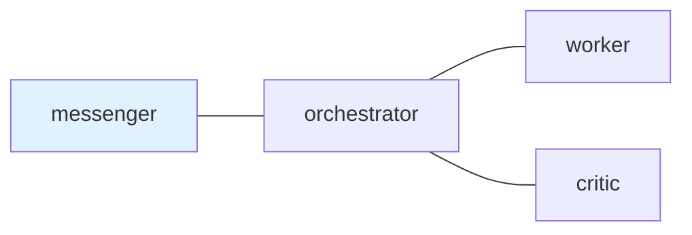
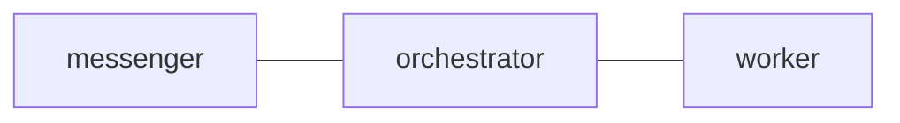

# postman.md Format Reference

This reference describes the Markdown format parsed by tmux-a2a-postman. It is
based on the implementation in `internal/config/markdown.go` and the load order
in `internal/config/config.go`.

Claude Code and Codex CLI runtime differences are tracked in
[Agent Runtime Feature Differences](../../../docs/agent-runtime-feature-differences.md).
Keep this file focused on `postman.md` syntax; do not duplicate the long-term
runtime comparison here.

## 1. Purpose

`postman.md` is a Markdown overlay for topology, shared templates, node role
text, and a small set of YAML frontmatter settings. It is not a general
Markdown configuration language.

Supported files:

| File type            | XDG path                                            |
| -------------------- | --------------------------------------------------- |
| Main Markdown config | `$XDG_CONFIG_HOME/tmux-a2a-postman/postman.md`      |
| Split node Markdown  | `$XDG_CONFIG_HOME/tmux-a2a-postman/nodes/{node}.md` |

Implicit project-local `.tmux-a2a-postman/` overlays are retired. Keep
workspace-specific alternatives explicit by passing `--config`.

## 2. Global Frontmatter

Only a leading `---` block is parsed. The main `postman.md` frontmatter is
YAML. Keep it small: scalar settings plus the `skill_path` catalog list are the
supported public surface.

Supported global keys in `postman.md`:

| Key             | Effect                                                              |
| --------------- | ------------------------------------------------------------------- |
| `ui_node`       | Sets `Config.UINode` as a frontmatter override                      |
| `reply_command` | Sets `Config.ReplyCommand` when non-empty                           |
| `skill_path`    | Appends catalogs to role context, daemon PINGs, or compaction PINGs |

Rules:

- Prefer marking the UI node in the Mermaid graph with `class <node> ui_node`.
  Inline `:::ui_node` also works. Frontmatter `ui_node` is still supported as an
  explicit override.
- Empty frontmatter `ui_node:` is meaningful and explicitly clears `ui_node`.
- `skill_path` may be a scalar path or a YAML list of path entries.
- `skill_path` list items may be scalar paths or mappings with `path`,
  `inject`, and `skills`.
- Only `skill_path` mappings accept `inject`.
- For `skill_path` mappings, omitted `inject` appends the generated catalog to
  normal role context.
- For `skill_path` mappings, `inject: ping` stores the generated catalog for
  every daemon PING role content and keeps it out of normal role context.
- For `skill_path` mappings, `inject: compaction_ping` stores the generated
  catalog for compaction-triggered daemon PING role content and keeps it out of
  normal role context.
- `runtime` is unsupported under `skill_path`; list explicit path entries for
  the skill catalogs that should be included.
- PING paths must be global/user-level:
  `~/...` or absolute. Repo-local relative paths are invalid for PING catalogs
  and remain valid only for normal role catalogs.
- Omitted `skills` means every skill under that path.
- When `skills` is present, use a YAML list of explicit skill directory names.
  A real skill named `all` is selected with `skills: [all]`.
- The scalar `skills: all` remains accepted as a legacy shorthand for existing
  configs, but new examples should omit `skills` for all-skills catalogs.
- Glob patterns such as `postman-*` are unsupported; list skill names
  explicitly.
- Rendered catalogs contain at most one entry per skill frontmatter `name`.
  Later path entries override earlier entries with the same name.
- An unclosed frontmatter block is an error.

Example:

```text
---
reply_command: tmux-a2a-postman send-heredoc --to {from_node}
skill_path:
  - path: skills
    skills:
      - repo-local
      - bash
      - github
      - markdown
  - path: ~/.config/tmux-a2a-postman/skills
    inject: ping
    skills:
      - postman-session-operator
  - path: ~/.config/tmux-a2a-postman/skills
    inject: compaction_ping
    skills:
      - postman-session-operator
  - path: ~/.claude/skills
    inject: compaction_ping
  - path: ~/.codex/skills
    inject: compaction_ping
    skills:
      - postman-config-auditor
      - postman-session-operator
---
```

Each `path` points to a directory containing one subdirectory per skill, each
with a `SKILL.md` file. For normal role catalogs, relative paths are resolved
from the directory containing the `postman.md` file. `~/...` expands to the
current user's home directory, and symlinked skill directories are followed.
Generated catalogs read `name` and `description` from selected `SKILL.md`
frontmatter and render a compact Markdown list. `skill_path` entries with
omitted `inject` append that list to `common_template`, which reaches normal
role context, so use them for compact runtime-agnostic catalogs only.
`skill_path` entries with `inject: ping` keep their list out of
`common_template` and append it to every daemon PING role content.
`skill_path` entries with `inject: compaction_ping` keep their list out of
`common_template` and append it only to daemon PING role content when pane
capture detects a context-compaction marker. PING catalog entries are not
selected by runtime; list explicit `~/...` or absolute skill tree paths for the
catalogs that should be included. Repo-local relative paths are invalid in this
mode.
Skill frontmatter may use single-line `description`, `description: |`, or
`description: >-`.

## 3. H2 Section Parsing

The main `postman.md` parser only recognizes h2 headings that contain a
backtick-wrapped name.

Parsed examples:

```text
## `edges`
## `worker`
## 1. `worker-alt` Node
```

Ignored examples:

```text
# `worker`
### `worker`
## Worker
## edges
```

Reserved h2 names:

| H2 name           | Meaning                        |
| ----------------- | ------------------------------ |
| `edges`           | Mermaid topology section       |
| `common_template` | Sets `Config.CommonTemplate`   |
| `message_footer`  | Sets or appends message footer |

All other h2 backtick names become node sections. The section body runs until
the next parsed h2 heading or end of file.

## 4. Edges Section

The `edges` h2 section must contain a fenced `mermaid` block. The parser reads
the first Mermaid fence in that section.

````text
## `edges`


````

Edge rules:

- Only `---` is parsed as an edge operator.
- The UI node may be marked with a `class messenger ui_node` statement, or with
  inline class syntax such as `messenger:::ui_node`.
- `graph`, `flowchart`, `subgraph`, `end`, `direction`, `classDef`, `class`,
  `style`, `click`, `linkStyle`, `accTitle`, and `accDescr` statements are
  skipped.
- `%%` Mermaid comments are stripped.
- Multiple statements on one line can be separated by `;`.
- Mermaid node decorations such as labels, shapes, classes, and quoted names
  are normalized to the node id.
- Arrows such as `-->` are not valid postman edges.
- Node ids are configuration-owned protocol names. The parser does not know
  that `critic`, `reviewer`, or other role-like words are synonyms.

Equivalent normalized edge output:

```text
messenger --- orchestrator
orchestrator --- worker
orchestrator --- critic
```

## 5. Node Sections

A node section is any non-reserved h2 backtick heading in main `postman.md`.
The node name is the first backtick-wrapped value, lowercased.

```text
## `worker`

### `role`

Primary task executor.

### Workflow

Execute tasks from orchestrator. Reply with DONE or BLOCKED.
```

Node role extraction:

- An h3 `role` section is preferred.
- The role body runs until the next h2 or h3 heading.
- The h3 `role` section is removed from the node template body.
- If no h3 `role` section exists, node-section frontmatter key `role` is used.
- After role extraction, leading frontmatter is stripped from the template.

Other h3 sections are kept in the node template.

Frontmatter fallback example:

```text
## `critic`

---
role: Reviewer
---

Review changes and reply with APPROVED or REJECTED.
```

## 6. Split Node Markdown

`nodes/{node}.md` defines one node. The node name comes from the filename
without `.md`.

The split-node parser supports the same role extraction as node sections:

- Prefer an h3 `role` section.
- Fall back to leading frontmatter key `role`.
- Strip role section and frontmatter from the stored template.

Split node Markdown does not parse `edges`, `common_template`, or
`message_footer`.

## 7. Merge Behavior

Effective configuration is loaded from low to high priority:

1. Embedded defaults from `internal/config/postman.default.toml`
2. XDG `postman.toml`
3. XDG `nodes/*.toml`
4. XDG `nodes/*.md`
5. XDG `postman.md`

The daemon snapshots this effective configuration once at startup. Edits to
`postman.toml`, `postman.md`, or `nodes/*` require a daemon restart before they
affect routing, role templates, daemon defaults, or skill catalogs. Runtime
watchers remain for mail delivery, read/archive moves, and daemon submit queues;
they do not hot-reload global config.

Important rules:

- Main config files merge node fields rather than replacing whole nodes.
- Split `nodes/*.toml` files replace that node at their load layer.
- Split `nodes/*.md` files update only non-empty role and template fields.
- `postman.md` edges replace lower-layer edges only when the parsed edge list is
  non-empty.
- A Mermaid `ui_node` class in the `edges` graph sets `ui_node` when
  frontmatter does not set it. Frontmatter `ui_node` wins within the same
  Markdown file.
- XDG `postman.md` `message_footer` replaces the lower-layer footer.
- `skill_path` is applied within the Markdown layer that declares it. Entries
  with omitted `inject` append generated catalogs to that layer's
  `common_template` content; entries with `inject: ping` or
  `inject: compaction_ping` stay separate and append only to matching daemon
  PING role content.
- When multiple entries select the same skill frontmatter `name`, the later
  entry wins and the rendered catalog includes one body for that name.
- Nodes referenced by valid edges are materialized automatically.

## 8. Minimal Valid postman.md

````text
## `edges`


````

This is enough to define the topology. Node templates are optional.
