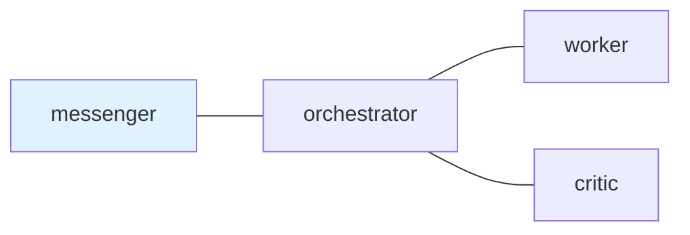
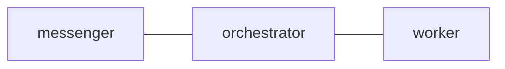

# postman.md Format Reference

This reference describes the Markdown format parsed by tmux-a2a-postman. It is
based on the implementation in `internal/config/markdown.go` and the load order
in `internal/config/config.go`.

Claude Code and Codex CLI runtime differences are tracked in
[Agent Runtime Feature Differences](../../../docs/agent-runtime-feature-differences.md).
Keep this file focused on `postman.md` syntax; do not duplicate the long-term
runtime comparison here.

## 1. Purpose

`postman.md` is a Markdown overlay for topology, shared templates, node role
text, and a small set of YAML frontmatter settings. It is not a general
Markdown configuration language.

Supported files:

| File type            | XDG path                                            | Project-local path                  |
| -------------------- | --------------------------------------------------- | ----------------------------------- |
| Main Markdown config | `$XDG_CONFIG_HOME/tmux-a2a-postman/postman.md`      | `.tmux-a2a-postman/postman.md`      |
| Split node Markdown  | `$XDG_CONFIG_HOME/tmux-a2a-postman/nodes/{node}.md` | `.tmux-a2a-postman/nodes/{node}.md` |

## 2. Global Frontmatter

Only a leading `---` block is parsed. The main `postman.md` frontmatter is
YAML. Keep it small: scalar settings plus the `skill_path` catalog list are the
supported public surface. `compaction_skill_path` remains accepted as a
compatibility form for ping-injected catalogs.

Supported global keys in `postman.md`:

| Key                     | Effect                                                                  |
| ----------------------- | ----------------------------------------------------------------------- |
| `ui_node`               | Sets `Config.UINode` as a frontmatter override                          |
| `reply_command`         | Sets `Config.ReplyCommand` when non-empty                               |
| `skill_path`            | Appends catalogs to context, or to compaction PINGs with `inject: ping` |
| `compaction_skill_path` | Compatibility form for compaction-triggered daemon PING catalogs        |

Rules:

- Prefer marking the UI node in the Mermaid graph with `class <node> ui_node`.
  Inline `:::ui_node` also works. Frontmatter `ui_node` is still supported as an
  explicit override.
- Empty frontmatter `ui_node:` is meaningful and explicitly clears `ui_node`.
- `skill_path` and `compaction_skill_path` may be a scalar path or a YAML list
  of path entries.
- A list item may be a scalar path or a mapping with `path`, `inject`,
  `runtime`, and `skills`.
- Omitted `inject` and `inject: context` append the generated catalog to normal
  role context.
- `inject: ping` stores the generated catalog for compaction-triggered daemon
  PING role content and keeps it out of normal role context.
- `skill_path` mappings with `inject: ping`, and all `compaction_skill_path`
  mappings, may include `runtime`; the currently supported exact runtime
  selectors are `claude` and `codex`.
- Omitted `runtime` means the catalog is shared: it is included in
  runtime-specific catalogs and in the fallback catalog used when no exact
  runtime catalog matches.
- `runtime` under `skill_path` requires `inject: ping`.
- Ping-injected paths, including runtime-specific entries and
  `compaction_skill_path`, must be global/user-level: `~/...` or absolute.
  Repo-local relative paths are invalid for ping catalogs and remain valid only
  for non-ping context catalogs.
- Omitted `skills` means every skill under that path.
- When `skills` is present, use a YAML list of explicit skill directory names.
  A real skill named `all` is selected with `skills: [all]`.
- The scalar `skills: all` remains accepted as a legacy shorthand for existing
  configs, but new examples should omit `skills` for all-skills catalogs.
- Glob patterns such as `postman-*` are unsupported; list skill names
  explicitly.
- Rendered catalogs contain at most one entry per skill frontmatter `name`.
  Later path entries override earlier entries with the same name. Runtime
  catalogs evaluate shared ping entries first and matching runtime entries
  second, so runtime-specific entries override shared entries without duplicate
  rendered skill bodies.
- An unclosed frontmatter block is an error.

Example:

```text
---
reply_command: tmux-a2a-postman send-heredoc --to {from_node}
skill_path:
  - path: skills
    skills:
      - repo-local
      - bash
      - github
      - markdown
  - path: ~/.config/tmux-a2a-postman/skills
    inject: ping
    skills:
      - postman-session-operator
  - path: ~/.claude/skills
    inject: ping
    runtime: claude
  - path: ~/.codex/skills
    inject: ping
    runtime: codex
    skills:
      - postman-config-auditor
      - postman-session-operator
---
```

Each `path` points to a directory containing one subdirectory per skill, each
with a `SKILL.md` file. For non-ping context catalogs, relative paths are
resolved from the directory containing the `postman.md` file. `~/...` expands
to the current user's home directory, and symlinked skill directories are
followed. Generated catalogs read `name` and `description` from selected
`SKILL.md` frontmatter and render a compact Markdown list. `skill_path` entries
with omitted `inject` or `inject: context` append that list to
`common_template`, which reaches normal role context, so use them for compact
runtime-agnostic catalogs only.
`skill_path` entries with `inject: ping` keep their list out of
`common_template` and append it only to daemon PING role content when pane
capture detects a context-compaction marker. Runtime-specific ping entries are
selected from the pane's current command. Entries without `runtime` are shared
catalogs included in all runtime-specific catalogs and in the fallback catalog.
Exact runtime-specific compaction handling is intentionally limited to Claude
Code and Codex CLI because those are the runtimes with pane compaction markers
today. `compaction_skill_path` has the same ping-injection behavior and remains
accepted as a compatibility form. Ping-injected paths must be `~/...` or
absolute; repo-local relative paths are invalid in this mode. For user-level
runtime skill trees, prefer `$HOME/.claude/skills` and `$HOME/.codex/skills`.
Skill frontmatter may use single-line `description`, `description: |`, or
`description: >-`.

## 3. H2 Section Parsing

The main `postman.md` parser only recognizes h2 headings that contain a
backtick-wrapped name.

Parsed examples:

```text
## `edges`
## `worker`
## 1. `worker-alt` Node
```

Ignored examples:

```text
# `worker`
### `worker`
## Worker
## edges
```

Reserved h2 names:

| H2 name           | Meaning                        |
| ----------------- | ------------------------------ |
| `edges`           | Mermaid topology section       |
| `common_template` | Sets `Config.CommonTemplate`   |
| `message_footer`  | Sets or appends message footer |

All other h2 backtick names become node sections. The section body runs until
the next parsed h2 heading or end of file.

## 4. Edges Section

The `edges` h2 section must contain a fenced `mermaid` block. The parser reads
the first Mermaid fence in that section.

````text
## `edges`


````

Edge rules:

- Only `---` is parsed as an edge operator.
- The UI node may be marked with a `class messenger ui_node` statement, or with
  inline class syntax such as `messenger:::ui_node`.
- `graph`, `flowchart`, `subgraph`, `end`, `direction`, `classDef`, `class`,
  `style`, `click`, `linkStyle`, `accTitle`, and `accDescr` statements are
  skipped.
- `%%` Mermaid comments are stripped.
- Multiple statements on one line can be separated by `;`.
- Mermaid node decorations such as labels, shapes, classes, and quoted names
  are normalized to the node id.
- Arrows such as `-->` are not valid postman edges.
- Node ids are configuration-owned protocol names. The parser does not know
  that `critic`, `reviewer`, or other role-like words are synonyms.

Equivalent normalized edge output:

```text
messenger --- orchestrator
orchestrator --- worker
orchestrator --- critic
```

## 5. Node Sections

A node section is any non-reserved h2 backtick heading in main `postman.md`.
The node name is the first backtick-wrapped value, lowercased.

```text
## `worker`

### `role`

Primary task executor.

### Workflow

Execute tasks from orchestrator. Reply with DONE or BLOCKED.
```

Node role extraction:

- An h3 `role` section is preferred.
- The role body runs until the next h2 or h3 heading.
- The h3 `role` section is removed from the node template body.
- If no h3 `role` section exists, node-section frontmatter key `role` is used.
- After role extraction, leading frontmatter is stripped from the template.

Other h3 sections are kept in the node template.

Frontmatter fallback example:

```text
## `critic`

---
role: Reviewer
---

Review changes and reply with APPROVED or REJECTED.
```

## 6. Split Node Markdown

`nodes/{node}.md` defines one node. The node name comes from the filename
without `.md`.

The split-node parser supports the same role extraction as node sections:

- Prefer an h3 `role` section.
- Fall back to leading frontmatter key `role`.
- Strip role section and frontmatter from the stored template.

Split node Markdown does not parse `edges`, `common_template`, or
`message_footer`.

## 7. Merge Behavior

Effective configuration is loaded from low to high priority:

1. Embedded defaults from `internal/config/postman.default.toml`
2. XDG `postman.toml`
3. XDG `nodes/*.toml`
4. XDG `nodes/*.md`
5. XDG `postman.md`
6. Project-local `postman.toml`
7. Project-local `nodes/*.toml`
8. Project-local `nodes/*.md`
9. Project-local `postman.md`

Important rules:

- Main config files merge node fields rather than replacing whole nodes.
- Split `nodes/*.toml` files replace that node at their load layer.
- Split `nodes/*.md` files update only non-empty role and template fields.
- `postman.md` edges replace lower-layer edges only when the parsed edge list is
  non-empty.
- A Mermaid `ui_node` class in the `edges` graph sets `ui_node` when
  frontmatter does not set it. Frontmatter `ui_node` wins within the same
  Markdown file.
- XDG `postman.md` `message_footer` replaces the lower-layer footer.
- Project-local `postman.md` `message_footer` appends to the effective base
  footer.
- `skill_path` is applied within the Markdown layer that declares it. Entries
  with omitted `inject` or `inject: context` append generated catalogs to that
  layer's `common_template` content; entries with `inject: ping` stay separate
  and append only to compaction-triggered daemon PING role content.
- When multiple entries select the same skill frontmatter `name`, the later
  entry wins and the rendered catalog includes one body for that name.
- `compaction_skill_path` is applied within the Markdown layer that declares it
  as a compatibility form for `skill_path` entries with `inject: ping`.
- Nodes referenced by valid edges are materialized automatically.

## 8. Minimal Valid postman.md

````text
## `edges`


````

This is enough to define the topology. Node templates are optional.
