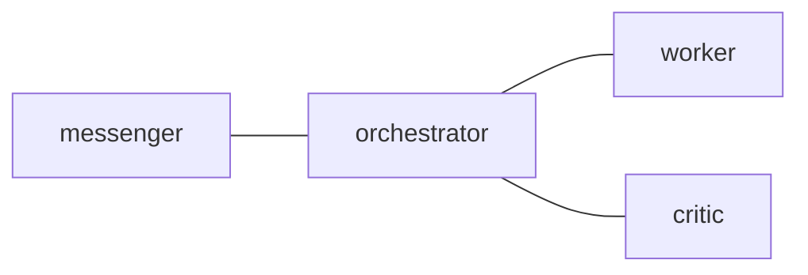
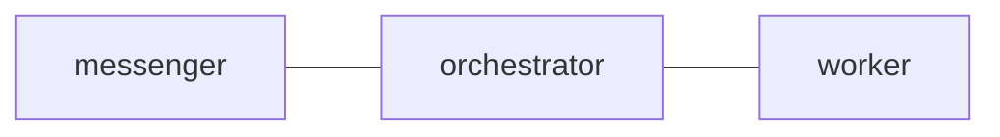

# postman.md Format Reference

This reference describes the Markdown format parsed by tmux-a2a-postman. It is
based on the implementation in `internal/config/markdown.go` and the load order
in `internal/config/config.go`.

## 1. Purpose

`postman.md` is a Markdown overlay for topology, shared templates, node role
text, and a small set of frontmatter settings. It is not a general Markdown
configuration language and its frontmatter is not YAML.

Supported files:

| File type            | XDG path                                            | Project-local path                  |
| -------------------- | --------------------------------------------------- | ----------------------------------- |
| Main Markdown config | `$XDG_CONFIG_HOME/tmux-a2a-postman/postman.md`      | `.tmux-a2a-postman/postman.md`      |
| Split node Markdown  | `$XDG_CONFIG_HOME/tmux-a2a-postman/nodes/{node}.md` | `.tmux-a2a-postman/nodes/{node}.md` |

## 2. Global Frontmatter

Only a leading `---` block is parsed. The parser supports one single-line
`key: value` pair per non-empty line.

Supported global keys in `postman.md`:

| Key             | Effect                                      |
| --------------- | ------------------------------------------- |
| `ui_node`       | Sets `Config.UINode`                        |
| `reply_command` | Sets `Config.ReplyCommand` when non-empty |

Rules:

- Parsing splits each entry on the first `:`.
- Leading and trailing whitespace around keys and values is trimmed.
- Keys are lowercased.
- Blank lines are allowed.
- Quotes are literal characters.
- Empty `ui_node:` is meaningful and explicitly clears `ui_node`.
- Lists, nested mappings, indented continuations, comments, and multiline
  values are unsupported.
- An unclosed frontmatter block is an error.

Example:

```text
---
ui_node: messenger
reply_command: tmux-a2a-postman send --to {from_node} --body
---
```

## 3. H2 Section Parsing

The main `postman.md` parser only recognizes h2 headings that contain a
backtick-wrapped name.

Parsed examples:

```text
## `edges`
## `worker`
## 1. `worker-alt` Node
```

Ignored examples:

```text
# `worker`
### `worker`
## Worker
## edges
```

Reserved h2 names:

| H2 name           | Meaning                        |
| ----------------- | ------------------------------ |
| `edges`           | Mermaid topology section       |
| `common_template` | Sets `Config.CommonTemplate`   |
| `message_footer`  | Sets or appends message footer |

All other h2 backtick names become node sections. The section body runs until
the next parsed h2 heading or end of file.

## 4. Edges Section

The `edges` h2 section must contain a fenced `mermaid` block. The parser reads
the first Mermaid fence in that section.

````text
## `edges`


````

Edge rules:

- Only `---` is parsed as an edge operator.
- `graph`, `flowchart`, `subgraph`, `end`, `direction`, `classDef`, `class`,
  `style`, `click`, `linkStyle`, `accTitle`, and `accDescr` statements are
  skipped.
- `%%` Mermaid comments are stripped.
- Multiple statements on one line can be separated by `;`.
- Mermaid node decorations such as labels, shapes, classes, and quoted names
  are normalized to the node id.
- Arrows such as `-->` are not valid postman edges.

Equivalent normalized edge output:

```text
messenger --- orchestrator
orchestrator --- worker
orchestrator --- critic
```

## 5. Node Sections

A node section is any non-reserved h2 backtick heading in main `postman.md`.
The node name is the first backtick-wrapped value, lowercased.

```text
## `worker`

### `role`

Primary task executor.

### Workflow

Execute tasks from orchestrator. Reply with DONE or BLOCKED.
```

Node role extraction:

- An h3 `role` section is preferred.
- The role body runs until the next h2 or h3 heading.
- The h3 `role` section is removed from the node template body.
- If no h3 `role` section exists, node-section frontmatter key `role` is used.
- After role extraction, leading frontmatter is stripped from the template.

Other h3 sections are kept in the node template.

Frontmatter fallback example:

```text
## `critic`

---
role: Reviewer
---

Review changes and reply with APPROVED or REJECTED.
```

## 6. Split Node Markdown

`nodes/{node}.md` defines one node. The node name comes from the filename
without `.md`.

The split-node parser supports the same role extraction as node sections:

- Prefer an h3 `role` section.
- Fall back to leading frontmatter key `role`.
- Strip role section and frontmatter from the stored template.

Split node Markdown does not parse `edges`, `common_template`, or
`message_footer`.

## 7. Merge Behavior

Effective configuration is loaded from low to high priority:

1. Embedded defaults from `internal/config/postman.default.toml`
2. XDG `postman.toml`
3. XDG `nodes/*.toml`
4. XDG `nodes/*.md`
5. XDG `postman.md`
6. Project-local `postman.toml`
7. Project-local `nodes/*.toml`
8. Project-local `nodes/*.md`
9. Project-local `postman.md`

Important rules:

- Main config files merge node fields rather than replacing whole nodes.
- Split `nodes/*.toml` files replace that node at their load layer.
- Split `nodes/*.md` files update only non-empty role and template fields.
- `postman.md` edges replace lower-layer edges only when the parsed edge list is
  non-empty.
- XDG `postman.md` `message_footer` replaces the lower-layer footer.
- Project-local `postman.md` `message_footer` appends to the effective base
  footer.
- Nodes referenced by valid edges are materialized automatically.

## 8. Minimal Valid postman.md

````text
## `edges`


````

This is enough to define the topology. Node templates are optional.
